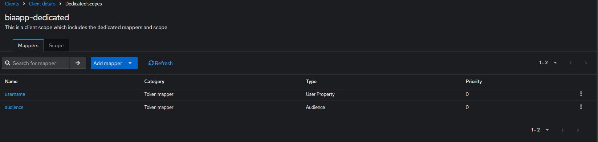

# Initialize Keycloak

This file explains how to initialize Keycloak for use with a BIA application.

We will take the connection with an LDAP as an example.

## Realm
Never modify the **Master** realm.

Create a new **Realm**, for example **BIA-Realm**

 ## Service Account

You must create a user in Keycloak which will be used to query the list of users in your realm.

In your realm, go to the **User** tab and create a user. Once created, create a non-temporary password.

Go to the **Role Mapping** tab and click on **Assign Role**

Select **Filter by clients** and select the following roles:

- **realm-management** query-users
- **realm-management** view-users

If you want to keep eMail, first name and last name as mandatory field for all user, complete them with dummy data for this user.
Else you can disable the mandatory on this fields : see chapter in this page "Simplify Authentication flow" > "Remove “Update Account Information” form after first login"


If you use the sample configuration file (bianetconfig.Example_Development.json) :
- This user should be parameter in your vault with the key BIA:KeycloakSearchUserAccount 
- Or in the environment variables : KC_SA_USERNAME and KC_SA_PASSWORD (it need to comment the line "VaultCredentialsKey": "BIA:KeycloakSearchUserAccount",)

## Client
Create a new client, for example, biaapp and fill **Root URL** and **Admin URL** with the root of your applications' URLs (example: https://myapp-int.mydomain/ or for development: http://localhost:4200/)
 
 
 

## Client Scopes
Go to the tab **Client scopes** and click on the link **biaapp-dedicated** contained in the table with the description: **Dedicated scope and mappers for this client**

 

 If they are missing, add them:
* User Property :
  Important Token Clain name should be : 
   ```
   http://schemas\.xmlsoap\.org/ws/2005/05/identity/claims/name
   ```
  

* Audience
  

* Group Membership (for an ldap authentication)
  


## User federation (for an ldap authentication)
Create a new **User federation**, configure it, example:


And check that everything is ok with the buttons **Test connection** and **Test authentication**


Among the fields requested in the **User** table in database, look at what the **User federation** contains. If any are missing, create the corresponding mappers.


configure groupldap as follows:

**LDAP Filter**: (&(objectCategory=CN=Group,CN=Schema,CN=Configuration,DC=your,DC=ad)(|(cn=GROUP_AD_PREFIX_TO_FILTER_*)(cn=GROUP_AD_TO_FILTER)))


At the top right, select from the list, **Sync all users**


# Simplify Authentication flow

## Remove “Update Account Information” form after first login
To remove “Update Account Information” form after first login
 

In Keycloak interface > menu "Realm settings" > tab "User profile" > edit the 3 field (email, firstName, lastName)
and switch Required field to off. 

 


## Remove the step "Review Profile"
To remove the step that propose to review the profile when account already exist
 

In Keycloak interface > menu "Authentication" > tab "Flow" > click on "first broker login"

<<<<<<< HEAD
=======
# Simplify Authentication flow

## Remove “Update Account Information” form after first login
To remove “Update Account Information” form after first login
 

In Keycloak interface > menu "Realm settings" > tab "User profile" > edit the 3 field (email, firstName, lastName)
and switch Required field to off. 

 


<<<<<<< HEAD
=======
# Simplify Authentication flow

## Remove “Update Account Information” form after first login
To remove “Update Account Information” form after first login
 

In Keycloak interface > menu "Realm settings" > tab "User profile" > edit the 3 field (email, firstName, lastName)
and switch Required field to off. 

 


>>>>>>> 654da63ffb2d1509efeaa04521212f4aef9c92d5

## Remove the step "Review Profile"
To remove the step that propose to review the profile when account already exist
 

In Keycloak interface > menu "Authentication" > tab "Flow" > click on "first broker login"

<<<<<<< HEAD
>>>>>>> 654da63ffb2d1509efeaa04521212f4aef9c92d5
=======
>>>>>>> 654da63ffb2d1509efeaa04521212f4aef9c92d5
Change the requirement of "Confirm link existing account" to "Disabled"
 