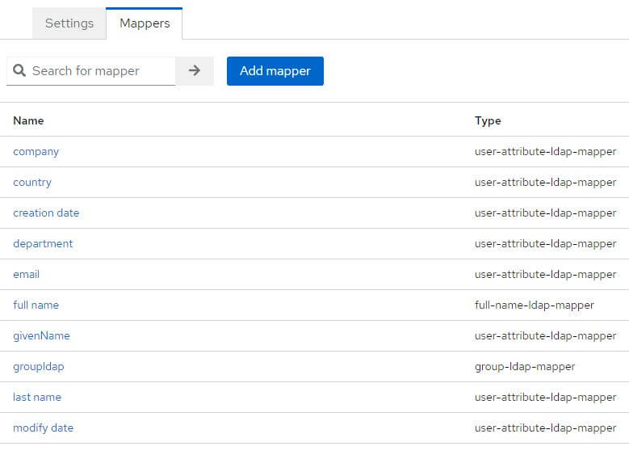
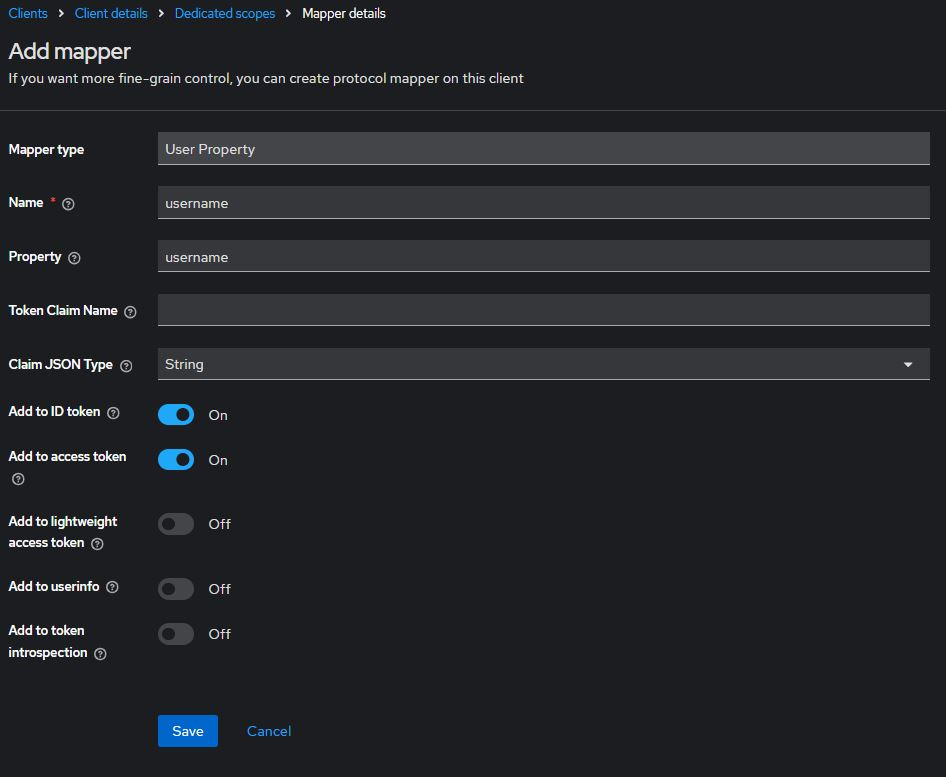
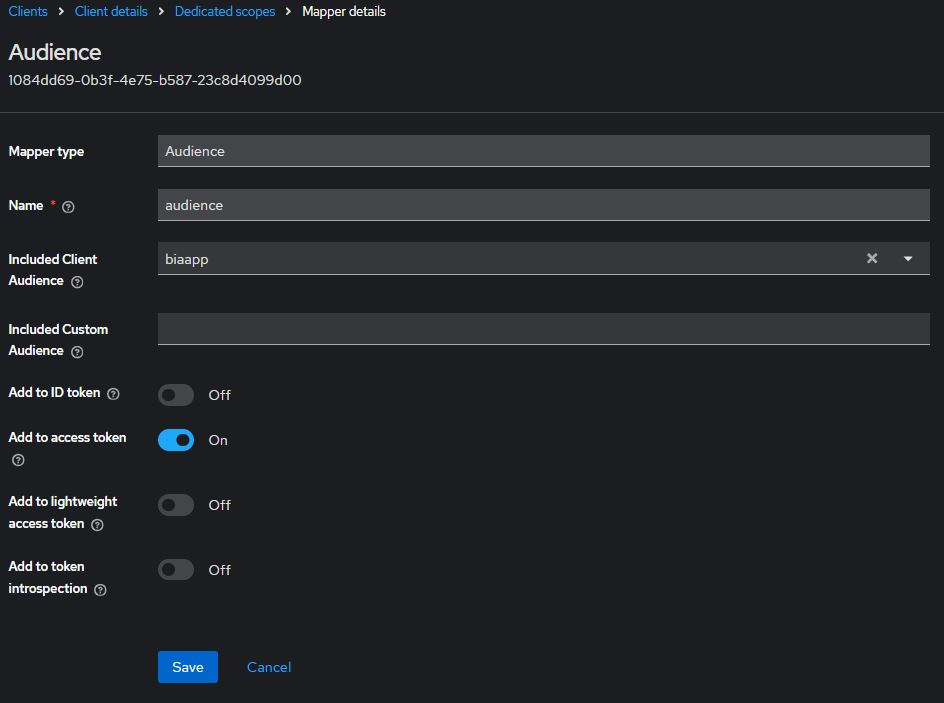

# Initialize Keycloak

This file explains how to initialize Keycloak for use with a BIA application.

We will take the connection with an LDAP as an example.

## Realm
Never modify the **Master** realm.

Create a new **Realm**, for example **BIA-Realm**

## User federation
Create a new **User federation**, configure it, example:

And check that everything is ok with the buttons **Test connection** and **Test authentication**

Among the fields requested in the **User** table in database, look at what the **User federation** contains. If any are missing, create the corresponding mappers.

configure groupldap as follows:

**LDAP Filter**: (&(objectCategory=CN=Group,CN=Schema,CN=Configuration,DC=your,DC=ad)(|(cn=GROUP_AD_PREFIX_TO_FILTER_*)(cn=GROUP_AD_TO_FILTER)))

At the top right, select from the list, **Sync all users**

## Client
Create a new client, for example, biaapp and fill **Root URL** and **Admin URL** with the root of your applications' URLs (example: https://myapp-int.mydomain/)

Go to the tab **Client scopes** and click on the link **biaapp-dedicated** contained in the table with the description: **Dedicated scope and mappers for this client**

 

 If they are missing, add them:

 

 

 

 ## Service Account

You must create a user in Keycloak which will be used to query the list of users in your realm.

In your realm, go to the **User** tab and create a user. Once created, create a non-temporary password.

Go to the **Role Mapping** tab and click on **Assign Role**

Select **Filter by clients** and select the following roles:

- **realm-management** query-users
- **realm-management** view-users

# Simplify Authentication flow

## Remove “Update Account Information” form after first login
To remove “Update Account Information” form after first login
 

In Keycloak interface > menu "Realm settings" > tab "User profile" > edit the 3 field (email, firstName, lastName)
and switch Required field to off. 

 

## Remove the step "Review Profile"
To remove the step that propose to review the profile when account already exist
 

In Keycloak interface > menu "Authentication" > tab "Flow" > click on "first broker login"

Change the requirement of "Confirm link existing account" to "Disabled"
 