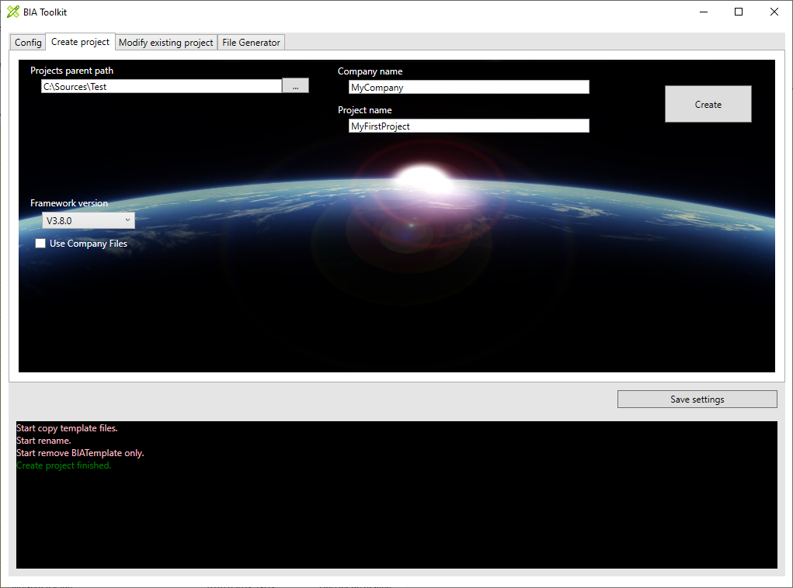
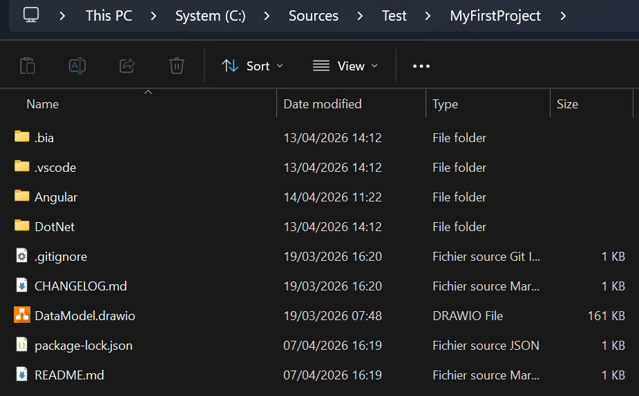
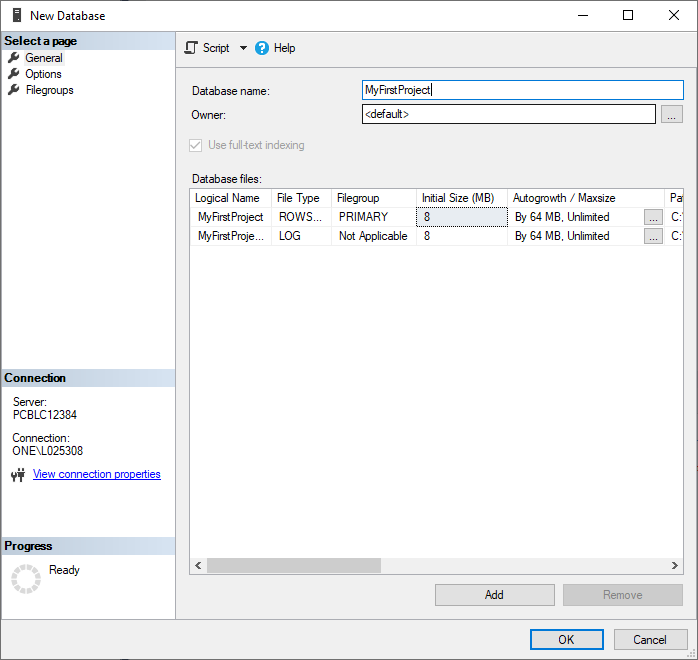
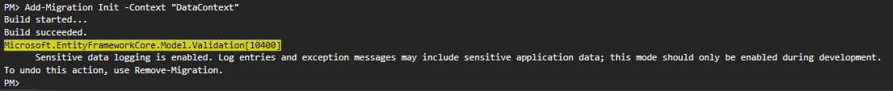
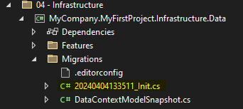
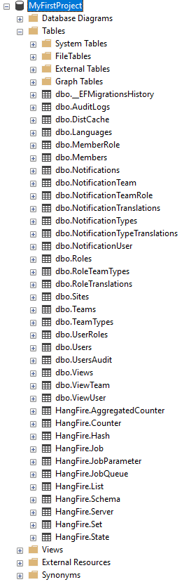
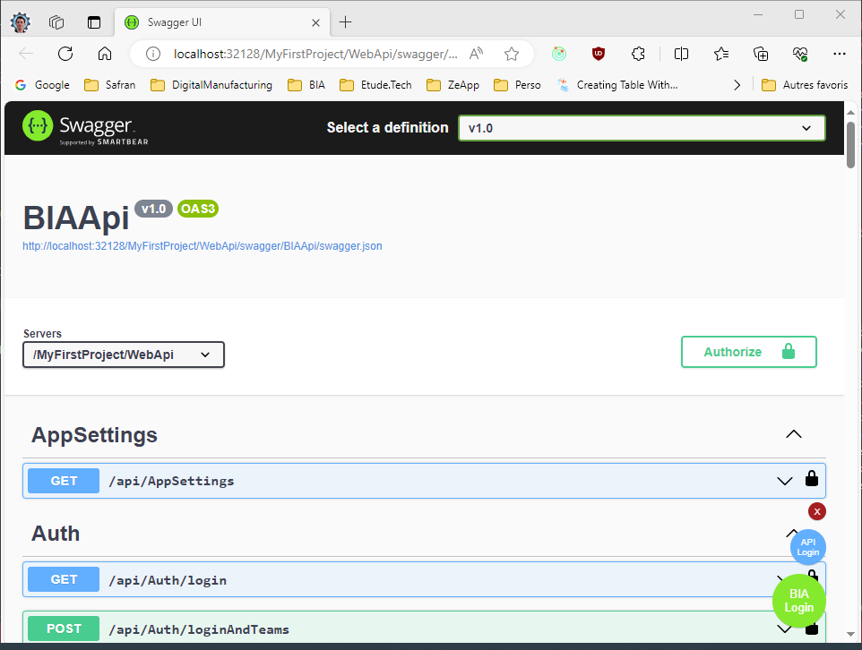
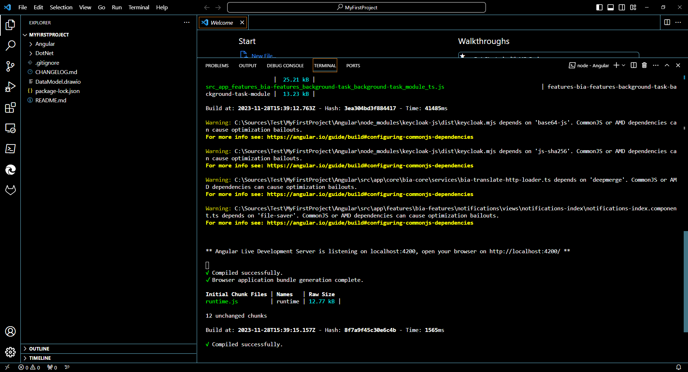
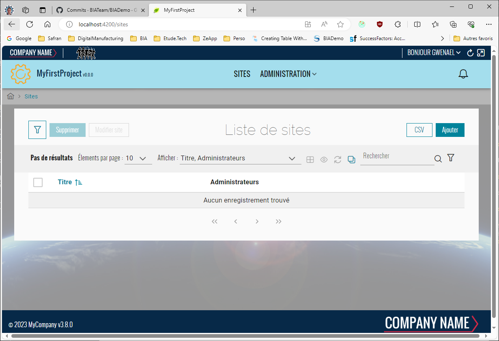

# Build your first project

1. Create a project "MyFirstProject" with company name "MyCompany" using the BIAToolKit in folder "C:\Sources\Test". [Step desribe here](../../30-DeveloperGuide/50-BIAToolKit/20-CreateProject.md).  
  

2. Open the folder "C:\Sources\Test\MyFirstProject"   
   

3. Open with Visual Studio 2022 the solution "C:\Sources\Test\MyFirstProject\DotNet\MyFirstProject.sln"
   
4. In project MyCompany.MyFirstProject.DeployDB remane files 
   1. appsettings.Example_Development.json => appsettings.Development.json

5. In project MyCompany.MyFirstProject.Presentation.Api remane files 
   1. appsettings.Example_Development.json => appsettings.Development.json
   2. bianetconfig.Example_Development.json => bianetconfig.Development.json
   3. in bianetconfig.Development.json, in LdapDomains section enter the short name and long name of your domain : Replace DOMAIN_BIA_1 by the short name and the-user-domain1-name.bia by the long name.

6. In project MyCompany.MyFirstProject.WorkerService remane files 
   1. appsettings.Example_Development.json => appsettings.Development.json
   2. bianetconfig.Example_Development.json => bianetconfig.Development.json
   
7. Open Sql Server Management Studio and create a database named "MyFirstProject"   
   

8. Launch the Package Manager Console in VS 2022 (Tools > Nuget Package Manager > Package Manager Console).

9.  Be sure to have the project **MyCompany.MyFirstProject.Infrastructure.Data** selected as the Default Project in the console and the project **MyCompany.MyFirstProject.Presentation.Api** as the Startup Project of your solution.

10. In the package manager console, run the **Add-Migration** command to initialize the migrations for the database project. 
    1.  Run the command: `Add-Migration Init -Context "DataContext"`
    2.  Console must display no error message   
         
    3.  Verify new file *'Init'* is created:    
        

11. In the package manager console, run the **Update-Database** command to create tables in the database . 
    1.  Run the command: `Update-Database -Context "DataContext"`
    2.  Console must display no error message
    3.  Verify tables are created in the database:   
    

12. Be sure startup project is "MyCompany.MyFirstProject.Presentation.Api".   
Run it. 
    
13. The swagger page will be open.  
Click on "BIA login" at bottom right.  
The button will be green.  
    
    
14. If the button is red it is probably an error in bianetconfig.Example_Development.json? You can debug the function LoginOnTeamsAsync in 02 - Application\MyCompany.MyFirstProject.Application\User\AuthAppService.cs to understand the problem.

15. Run VS code and open the folder "C:\Sources\Test\MyFirstProject"
    
16. Open a new terminal (Terminal > New Terminal) and enter the commande:
    ```ps
    cd .\Angular\
    npm install
    npm start
    ```
    

17. Open a browser at adress http://localhost:4200/ (IIS express in Visual sudio should be always running)  
    