# Build your first project

1. Create a project "MyFirstProject" with company name "MyCompany" using the BIAToolKit in folder **'C:\Sources\Test'**. [Step describe here](../../30-BIAToolKit/20-CreateProject.md). If you have company files used them to have correct settings.
   
  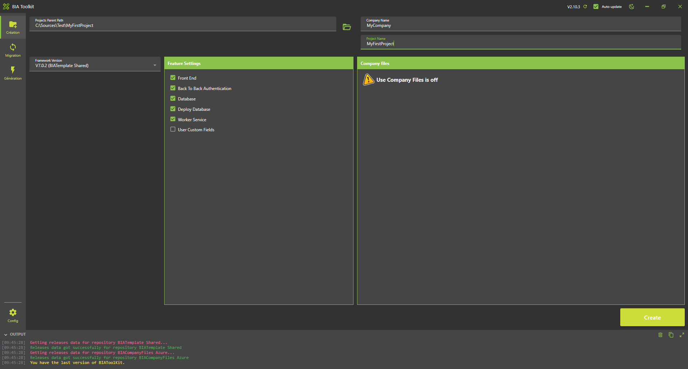

1. Open the folder **'C:\Sources\Test\MyFirstProject'** and verify the project is correctly created   

   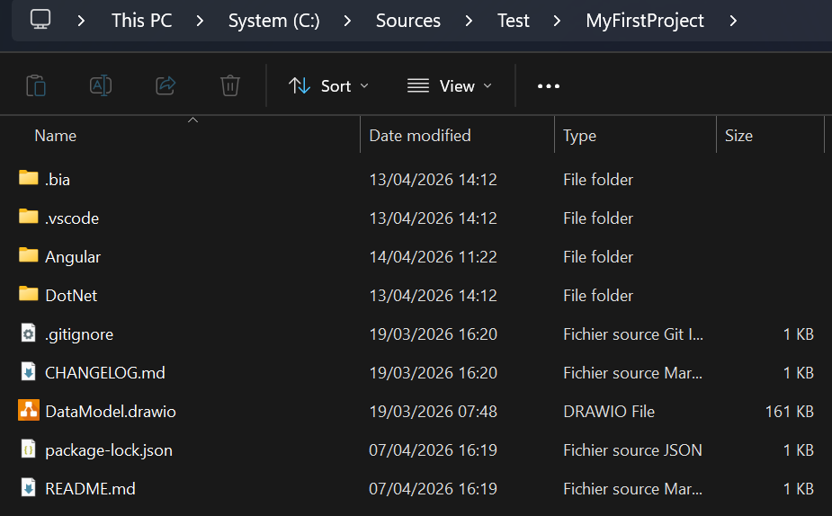

2. Create the database:
   1. If you use SqlServer:
      Open Sql Server Management Studio and create a database named "MyFirstProject" by right-clicking on the `Databases` folder in the Object Explorer.

   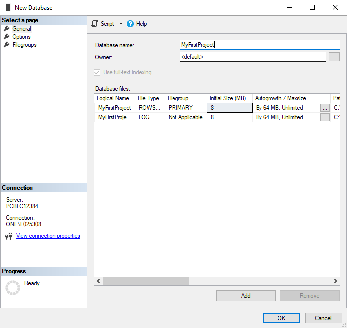
   
    2. If you use PostGreSQL :
      Use pgAdmin 4 to create your database. 
      
3. Open with Visual Studio code (VSCode) the folder **'C:\Sources\Test\MyFirstProject'**
   
4. ONLY If you have not company files containing configuration files
   1.  In project **'...\DotNet\MyCompany.MyFirstProject.DeployDB'** rename files 
       1. "appsettings.Example_Development.json" => "appsettings.Development.json"
       2. "bianetconfig.Example_Development.json" => "bianetconfig.Development.json"

   2. In project **'...\DotNet\MyCompany.MyFirstProject.Presentation.Api'** rename files 
      1. "appsettings.Example_Development.json" => "appsettings.Development.json"
      2. "bianetconfig.Example_Development.json" => "bianetconfig.Development.json"

   3. In project **'...\DotNet\MyCompany.MyFirstProject.WorkerService'** rename files 
      1. "appsettings.Example_Development.json" => "appsettings.Development.json"
      2. "bianetconfig.Example_Development.json" => "bianetconfig.Development.json"

5. Create the first database migration: 
    1. In VSCode (folder MyFirstProject) press F1
   
    2. Click "Tasks: Run Tasks".
      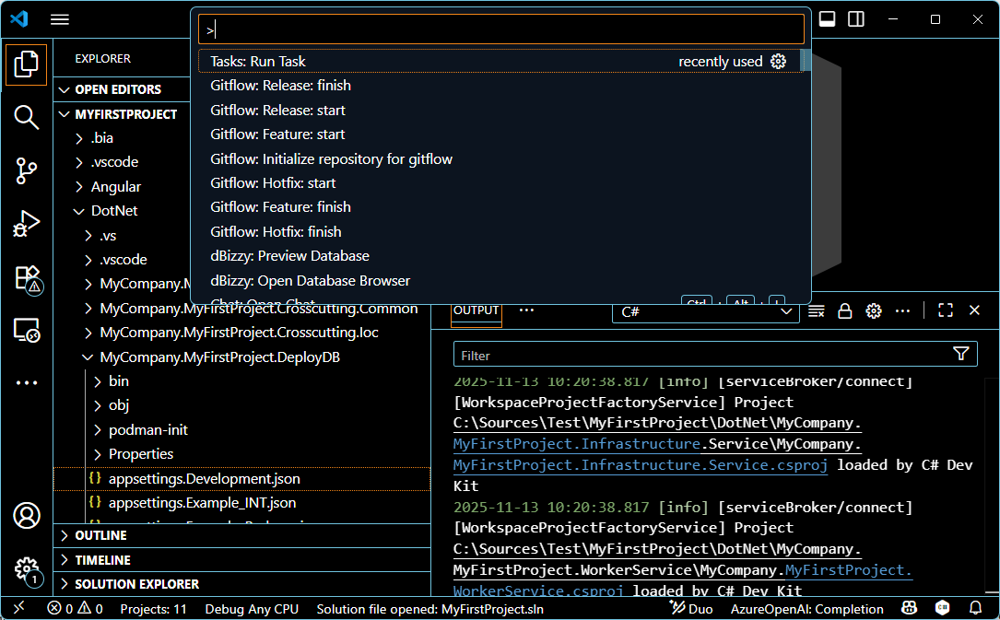

    3. Click "Database Add migration SqlServer" if you use SqlServer or "Database Add migration PostGreSql" if you use PostGerSql.
   
    4. Let the name "Initial" for this first migration and press enter.
   
    5. Console must display no error message and verify new file *'...Initial.cs'* is created:    
      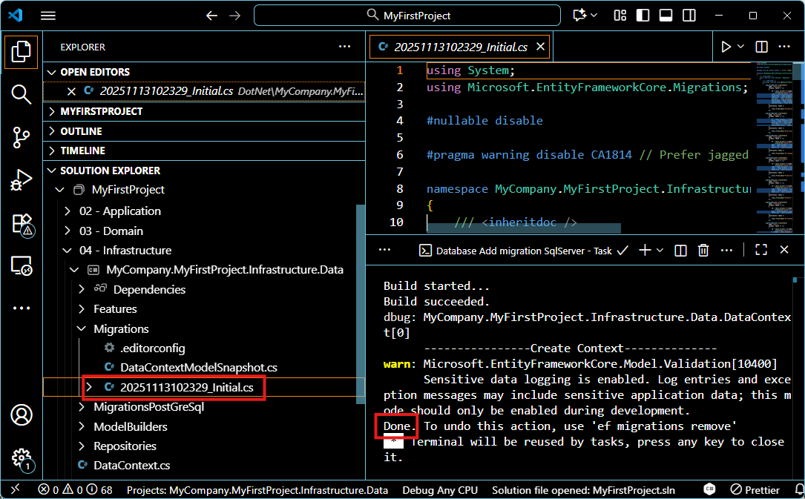  

6.  Deploy the base:
    1.  In VS Code Run and debug the "DotNet DeployDB"
      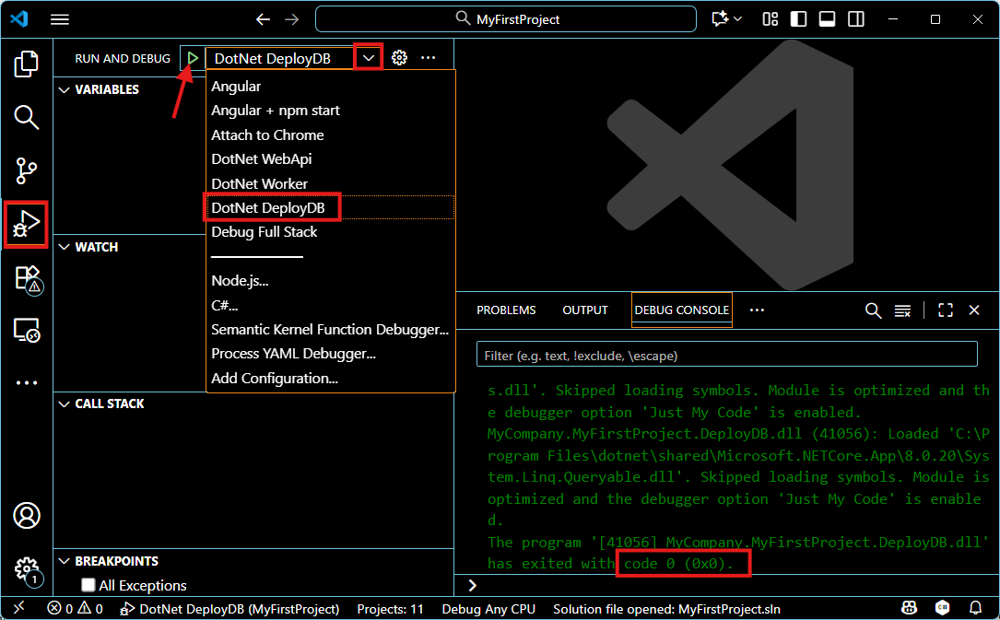

    2.  Verify tables are created in the database:   
      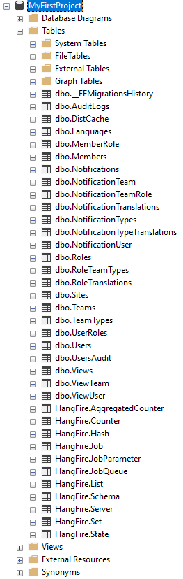

    3.  Run the WebApi:
   
    4.  In VSCode Run and debug "DotNet WebApi" 
      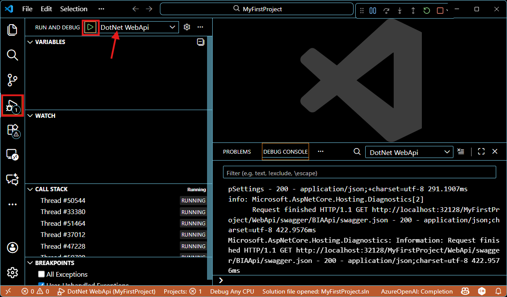

    5.  The swagger page will be open.  
      Click on "BIA login" at bottom right and wait (There is no need to type anything in the window that appeared).  
      The window should close and the "BIA login" button should be green.  
      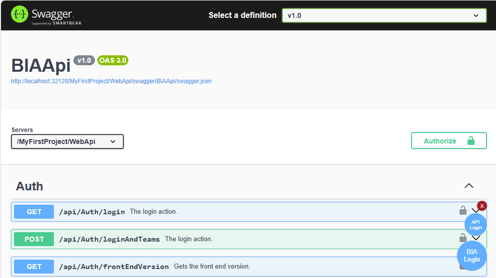
    
    6. If the button is red or if there is an error after you clicked on it, it is probably due to an error in **'...\MyFirstProject\DotNet\MyCompany.MyFirstProject.Presentation.Api\bianetconfig.Development.json'**. Look for `LdapDomains` and replace the values with the following ones.

    ```json title="bianetconfig.Development.json"
    "LdapDomains": [
      {
        "Name": "ONE",
        "LdapName": "one.ad",
        "ContainsGroup": true,
        "ContainsUser": true
      }
    ]
    ```

7.  Run the Front
    1.  Do not stop the Run of the "DotNet WebApi" launched in previous step
   
    2.  Install npm, if you use PrimeNg V6 :
  
        1.  You can buy a licence on [PrimeNG website](https://primeng.org/lts)
   
        2.  Or go back to a free no LTS version by deleting all licence manager mentions in **'...\MyFirstProject\Angular\package.json'** and install the latest PrimeNG version that doesn't use LTS (you can check the latest version on [PrimeNG's website](https://primeng.org/lts)).
        Go in the `Angular` repository : 

        ```ps
        cd Angular
        ```
        And run the command replacing LatestPrimeNGVersion by the current latest PrimeNG version :

        ```ps
        npm i primeng@LatestPrimeNGVersion
        ```

        Delete this two lines from **'...\Sources\Test\MyFirstProject\Angular\src\main.ts'**

        ```js
        import { LicenseManager } from 'primeng/api';
        ```

        ```js
        LicenseManager.verify(licensePayload.licenseKey, licensePayload.passKey);
        ```

    3.  In VSCode Run and debug "Angular + npm start" 
   
    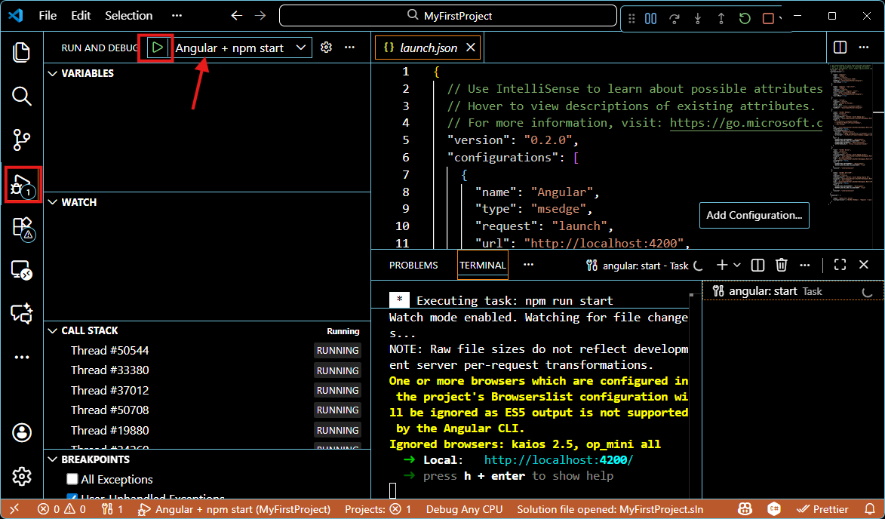


    4.  Open a browser at address http://localhost:4200/  
   
    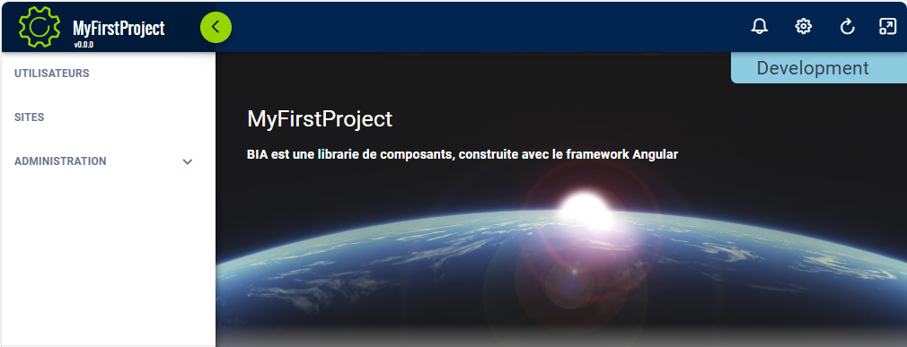