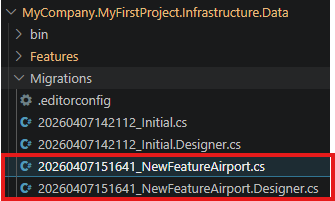
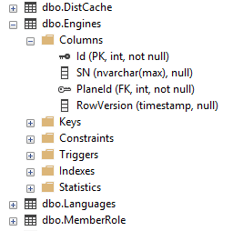
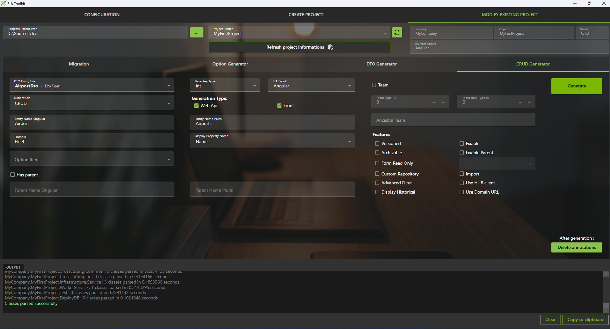
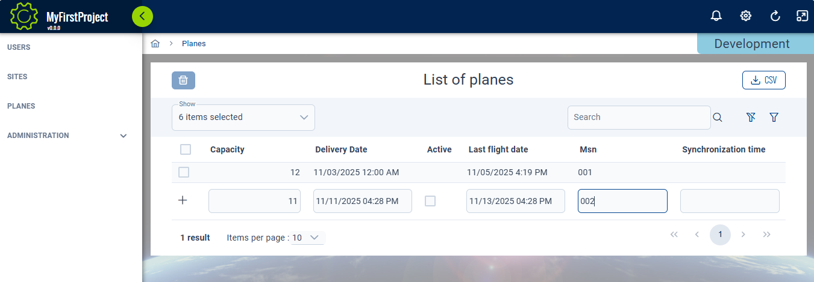

# Create your first CRUD
We will create in first the feature 'Airport'.

## Create the Entity
* Open with Visual Studio 2026 or VS Code the solution **'...\MyFirstProject\DotNet\MyFirstProject.sln'**.

* In **'...\MyFirstProject\DotNet\MyCompany.MyFirstProject.Domain\'** create 'Fleet' folder.
* Create 'Entities' subfolder.
* Create empty class 'Airport.cs' and add: 

```csharp
// <copyright file="Airport.cs" company="TheBIADevCompany">
// Copyright (c) TheBIADevCompany. All rights reserved.
// </copyright>

namespace MyCompany.MyFirstProject.Domain.Fleet.Entities
{
    using Audit.EntityFramework;
    using BIA.Net.Core.Domain.Entity;

    /// <summary>
    /// The airport entity.
    /// </summary>
    [AuditInclude]
    public class Airport : BaseEntity<int>
    {
        /// <summary>
        /// Gets or sets the name of the airport.
        /// </summary>
        public string Name { get; set; }

        /// <summary>
        /// Gets or sets the City where is the airport.
        /// </summary>
        public string City { get; set; }
    }
}
```

## Create the DTO
### Using BIAToolKit
For more informations about creating a DTO, see [Create a DTO with BIAToolkit documentation](../../30-BIAToolKit/30-CreateDTO.md)

* Open the BIAToolkit
* Go to "Modify existing project" tab
* Set the projects parent path and choose your project
* Go to tab 3 "DTO Generator"
* Select your entity **Airport** on the list


 Click on "Map to" button
* All the selected properties will be added to the mapping table that represents that properties that will be generated in your corresponding DTO
* Check the required checkbox for the Id mapping property


* Then click the "Generate" button
* The DTO and the mapper will be generated
* Check in the project solution if the DTO and mapper are present


## Update Data

### Create the Modelbuilder

* In **'...\MyFirstProject\DotNet\MyCompany.MyFirstProject.Infrastructure.Data\ModelBuilders'**, create empty class 'PlaneModelBuilder.cs' and add:

```csharp
// <copyright file="PlaneModelBuilder.cs" company="TheBIADevCompany">
// Copyright (c) TheBIADevCompany. All rights reserved.
// </copyright>

namespace MyCompany.MyFirstProject.Infrastructure.Data.ModelBuilders
{
    using Microsoft.EntityFrameworkCore;
    using MyCompany.MyFirstProject.Domain.Fleet.Entities;

    /// <summary>
    /// Class used to update the model builder for plane domain.
    /// </summary>
    public static class PlaneModelBuilder
    {
        /// <summary>
        /// Create the model for projects.
        /// </summary>
        /// <param name="modelBuilder">The model builder.</param>
        public static void CreateModel(ModelBuilder modelBuilder)
        {
            CreateAirportModel(modelBuilder);
        }

        /// <summary>
        /// Create the model for aiports.
        /// </summary>
        /// <param name="modelBuilder">The model builder.</param>
        private static void CreateAirportModel(ModelBuilder modelBuilder)
        {
            modelBuilder.Entity<Airport>().Property(p => p.Name).IsRequired().HasMaxLength(64);
            modelBuilder.Entity<Airport>().Property(p => p.City).IsRequired().HasMaxLength(64);
        }
    }
}
```


### Update DataContext file
* Open **'...\MyFirstProject\DotNet\MyCompany.MyFirstProject.Infrastructure.Data\DataContext.cs'** file and declare the DbSet associated to Plane:
  
```csharp
/// <summary>
/// Gets or sets the Airport DBSet.
/// </summary>
public DbSet<Airport> Airports { get; set; }
```
* On 'OnModelCreating' method add the 'PlaneModelBuilder.CreateModel':

```csharp
PlaneModelBuilder.CreateModel(modelBuilder);
```
### Update the DataBase
* In VSCode (folder MyFirstProject) press F1
* Click "Tasks: Run Tasks".
* Click "Database Add migration SqlServer" if you use SqlServer or "Database Add migration PostGreSql" if you use PostGerSql.
* Set the name "NewFeatureAirport" and press enter.
* Verify new file *'xxx_NewFeatureAirport.cs'* is created on **'...\MyFirstProject\DotNet\MyCompany.MyFirstProject.Infrastructure.Data\Migrations'** folder, and file is not empty.




* In VSCode Run and Debug  "DotNet DeployDB"
* Verify 'Airports' table is created in the database.


## Create the CRUD 
### Using BIAToolKit  
For more informations about creating a CRUD, see [Create a CRUD with BIAToolkit documentation](../../30-BIAToolKit/50-CreateCRUD.md)

* Start the BIAToolKit and go on "Modify existing project" tab*
* Set the projects parent path and choose your project
* Go to tab 4 "CRUD Generator"
* Choose Dto file: *AirportDto.cs*
* Check "WebApi" and "Front" for Generation
* Check "CRUD" for Generation Type
* Domain name should be "Fleet"
* Set Base key type as int
* Verify "Entity name (singular)" value: *Airport*
* Verify "Entity name (plural)" value: *Airports*
* Choose "Display item": *Name*



* Click on generate button

### Launch application generation
* In VSCode Stop all debug launched.
* Run and debug "Debug Full Stack" 
* The swagger page will be open. 
* Open a browser at address http://localhost:4200/ 
* Click on *"APP.AIRPORTS"* in menu to display 'Airports' page.

## Add traduction
* Open **'src/assets/i18n/app/en.json'** and add:
```json
  "app": {
    ...,
    "airports": "Airports"
  },
    ...,
  "airport": {
    "add": "Add airport",
    "city": "City",
    "edit": "Edit airport",
    "listOf": "List of airports",
    "name": "Name"
  }
```  

* Open **'src/assets/i18n/app/es.json'** and add:
```json
  "app": {
    ...,
    "airports": "Aeropuertos"
  },
    ...,
  "airports": {
    "add": "Añadir aeropuerto",
    "city": "Ciudad",
    "edit": "Editar aeropuerto",
    "listOf": "Lista de aeropuertos",
    "name": "Nombre"
  }
```  

* Open **'src/assets/i18n/app/fr.json'** and add:
```json
  "app": {
    ...,
    "airports": "Aéroports"
  },
    ...,
  "airports": {
    "add": "Ajouter aéroport",
    "city": "Ville",
    "edit": "Modifier aéroport",
    "listOf": "Liste des aéroports",
    "name": "Nom"
  }
```

## Test
* Open web navigator on address: *http://localhost:4200/* to display front page
* Verify 'Plane' page have the good name (name put on previous file).
* Open 'Plane' page and verify labels have been replaced too.
* To be able to add element in this table you need to be "administrator" of the current site:
  * Click on "site menu" and click on "+" button.
  * Enter a title like "Site 1" and click the button "+ Add"
  * Now click on the row "Site 1" to enter in the List of members of the "Site 1"
  * Click on "+"" button to open add member screen
  * Select you name in user combo and check the role "Site administrator"
  * Click on "+" button.
  => You are now "Site administrator" of the "Site 1"
  * Refresh the token with the round arrow in the upper right corner.
  * Navigate to the Airports menu.
  => you should be able to enter new value in the row beginning with "+"
  => when you leave the row the data will be record in the database.

