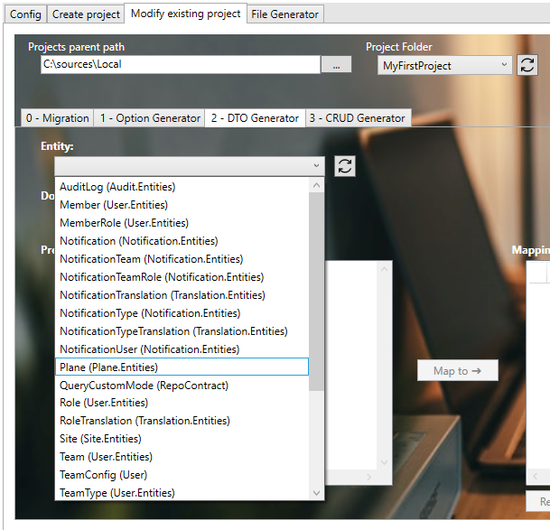
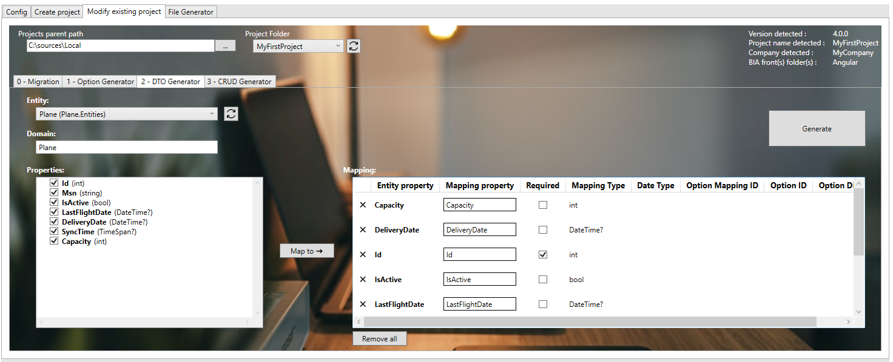
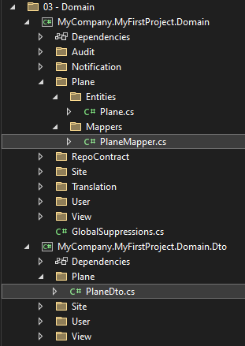
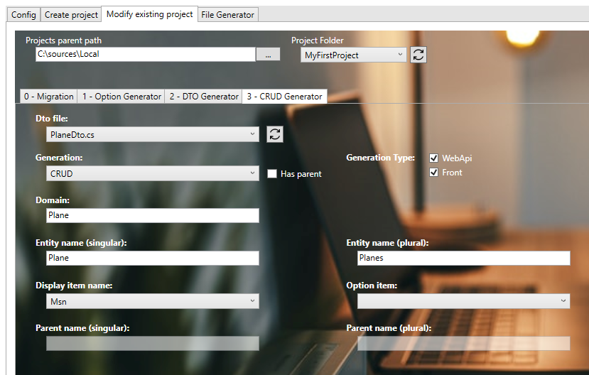

# Create your first CRUD
We will create in first the feature 'Plane'.

## Create the Entity
* Open with Visual Studio 2022 or VS Code the solution '...\MyFirstProject\DotNet\MyFirstProject.sln'.
* Create the entity 'Plane':
* In '...\MyFirstProject\DotNet\MyCompany.MyFirstProject.Domain\' create 'Fleet' folder.
* Create 'Entities' subfolder.
* Create empty class 'Plane.cs' and add: 

```csharp
// <copyright file="Plane.cs" company="MyCompany">
//     Copyright (c) MyCompany. All rights reserved.
// </copyright>

namespace MyCompany.MyFirstProject.Domain.Fleet.Entities
{
    using System;
    using System.Collections.Generic;
    using System.ComponentModel.DataAnnotations.Schema;
    using BIA.Net.Core.Domain.Entity;

    /// <summary>
    /// The plane entity.
    /// </summary>
    public class Plane : BaseEntity<int>
    {
        /// <summary>
        /// Gets or sets the id.
        /// </summary>
        public int Id { get; set; }

        /// <summary>
        /// Gets or sets the Manufacturer's Serial Number.
        /// </summary>
        public string Msn { get; set; }

        /// <summary>
        /// Gets or sets a value indicating whether the plane is active.
        /// </summary>
        public bool IsActive { get; set; }

        /// <summary>
        /// Gets or sets the last flight date.
        /// </summary>
        public DateTime? LastFlightDate { get; set; }

        /// <summary>
        /// Gets or sets the delivery date.
        /// </summary>
        [Column(TypeName = "date")]
        public DateTime? DeliveryDate { get; set; }

        /// <summary>
        /// Gets or sets the daily synchronization hour.
        /// </summary>
        [Column(TypeName = "time")]
        public TimeSpan? SyncTime { get; set; }

        /// <summary>
        /// Gets or sets the capacity.
        /// </summary>
        public int Capacity { get; set; }
    }
}
```

## Create the DTO
### Using BIAToolKit
For more informations about creating a DTO, see [Create a DTO with BIAToolkit documentation](../../30-BIAToolKit/30-CreateDTO.md)

* Open the BIAToolkit
* Go to "Modify existing project" tab
* Set the projects parent path and choose your project
* Go to tab "3 - DTO Generator"
* Select your entity Plane on the list



* Click on "Map to" button
* All the selected properties will be added to the mapping table that represents that properties that will be generated in your corresponding DTO
* Check the required checkbox for the Id mapping property



* Then click the "Generate" button
* The DTO and the mapper will be generated
* Check in the project solution if the DTO and mapper are present



## Update Data
### Create the Modelbuilder
* In '...\MyFirstProject\DotNet\MyCompany.MyFirstProject.Infrastructure.Data\ModelBuilders', create empty class 'PlaneModelBuilder.cs' and add:  

```csharp
// <copyright file="FleetModelBuilder.cs" company="MyCompany">
// Copyright (c) MyCompany. All rights reserved.
// </copyright>

namespace MyCompany.MyFirstProject.Infrastructure.Data.ModelBuilders
{
    using Microsoft.EntityFrameworkCore;
    using MyCompany.MyFirstProject.Domain.Fleet.Entities;

    /// <summary>
    /// Class used to update the model builder for plane domain.
    /// </summary>
    public static class FleetModelBuilder
    {
        /// <summary>
        /// Create the model for projects.
        /// </summary>
        /// <param name="modelBuilder">The model builder.</param>
        public static void CreateModel(ModelBuilder modelBuilder)
        {
            CreatePlaneModel(modelBuilder);
        }

        /// <summary>
        /// Create the model for planes.
        /// </summary>
        /// <param name="modelBuilder">The model builder.</param>
        private static void CreatePlaneModel(ModelBuilder modelBuilder)
        {
            modelBuilder.Entity<Plane>().HasKey(p => p.Id);
            modelBuilder.Entity<Plane>().Property(p => p.Msn).IsRequired().HasMaxLength(64);
            modelBuilder.Entity<Plane>().Property(p => p.IsActive).IsRequired();
            modelBuilder.Entity<Plane>().Property(p => p.LastFlightDate).IsRequired(false);
            modelBuilder.Entity<Plane>().Property(p => p.DeliveryDate).IsRequired(false);
            modelBuilder.Entity<Plane>().Property(p => p.SyncTime).IsRequired(false);
            modelBuilder.Entity<Plane>().Property(p => p.Capacity).IsRequired();
        }
    }
}
```

### Update DataContext file
* Open '...\MyFirstProject\DotNet\MyCompany.MyFirstProject.Infrastructure.Data\DataContext.cs' file and declare the DbSet associated to Plane:

```csharp
/// <summary>
/// Gets or sets the Plane DBSet.
/// </summary>
public DbSet<Plane> Planes { get; set; }
```
* On 'OnModelCreating' method add the 'FleetModelBuilder.CreateModel':

```csharp
  FleetModelBuilder.CreateModel(modelBuilder);
```

### Update the DataBase
1. Create the database migration:
* In VSCode (folder MyFirstProject) press F1
* Click "Tasks: Run Tasks".
* Click "Database Add migration SqlServer" if you use SqlServer or "Database Add migration PostGreSql" if you use PostGerSql.
* Set the name "NewFeaturePlane" and press enter.
* Verify new file *'xxx_NewFeaturePlane.cs'* is created on '...\MyFirstProject\DotNet\MyCompany.MyFirstProject.Infrastructure.Data\Migrations' folder, and file is not empty.

2. Create the database migration:
* In VSCode Run and Debug  "DotNet DeployDB"
* Verify 'Planes' table is created in the database.

## Create the CRUD 
### Using BIAToolKit  
For more informations about creating a CRUD, see [Create a CRUD with BIAToolkit documentation](../../30-BIAToolKit/50-CreateCRUD.md)

* Start the BIAToolKit and go on "Modify existing project" tab*
* Set the projects parent path and choose your project
* Go to tab 4 "CRUD Generator"
* Choose Dto file: *PlaneDto.cs*
* Check "WebApi" and "Front" for Generation
* Check "CRUD" for Generation Type
* Domain name should be "Fleet"
* Set Base key type as int
* Verify "Entity name (singular)" value: *Plane*
* Verify "Entity name (plural)" value: *Planes*
* Choose "Display item": *Msn*



* Click on generate button

### Finalize DotNet generation
* In VSCode Stop all debug launched.
* Run and debug "Debug Full Stack" 
* The swagger page will be open. 
* Open a browser at address http://localhost:4200/ 
* Click on *"APP.PLANES"* in menu to display 'Planes' page.

## Add traduction
* Open 'src/assets/i18n/app/en.json' and add:
```json
  "app": {
    ...,
    "planes": "Planes"
  },
  "plane": {
    "add": "Add plane",
    "capacity": "Capacity",
    "deliveryDate": "Delivery Date",
    "edit": "Edit plane",
    "isActive": "Active",
    "lastFlightDate": "Last flight date",
    "listOf": "List of planes",
    "msn": "Msn",
    "syncTime": "Synchronization time"
  },
```  
* Open 'src/assets/i18n/app/fr.json' and add:
```json
  "app": {
    ...,
    "planes": "Avions"
  },
  "plane": {
    "add": "Ajouter avion",
    "capacity": "Capacité",
    "deliveryDate": "Date de livraison",
    "edit": "Modifier avion",
    "isActive": "Actif",
    "lastFlightDate": "Date du dernier vol",
    "listOf": "Liste des avions",
    "msn": "Msn",
    "syncTime": "Heure de synchronisation"
  },
```
* Open 'src/assets/i18n/app/es.json' and add:
```json
  "app": {
    ...,
    "planes": "Planos"
  },
  "plane": {
    "add": "Añadir plano",
    "capacity": "Capacidad",
    "deliveryDate": "Fecha de entrega",
    "edit": "Editar plano",
    "isActive": "Activo",
    "lastFlightDate": "Última fecha de vuelo",
    "listOf": "Lista de planos",
    "msn": "Msn",
    "syncTime": "Tiempo de sincronización"
  },
```  
## Test
* Open web navigator on address: *http://localhost:4200/* to display front page
* Verify 'Plane' page have the good name (name put on previous file).
* Open 'Plane' page and verify labels have been replaced too.
* To be able to add element in this table you need to be "administrator" of the current site:
  * Click on "site menu" and click on "+" button.
  * Enter a title like "Site 1" and click the button "+ Add"
  * Now click on the row "Site 1" to enter in the List of members of the "Site 1"
  * Click on "+"" button to open add member screen
  * Select you name in user combo and check the role "Site administrator"
  * Click on "+" button.
  => You are now "Site administrator" of the "Site 1"
  * Refresh the token with the round arrow in the upper right corner.
  * Navigate to the Plane menu.
  => you should be able to enter new value in the row beginning with "+"
  => when you leave the row the data will be record in the database.

