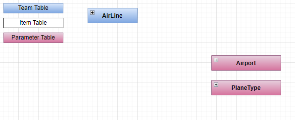
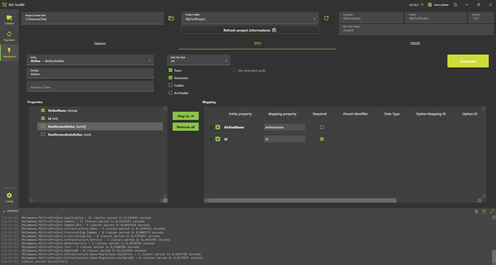
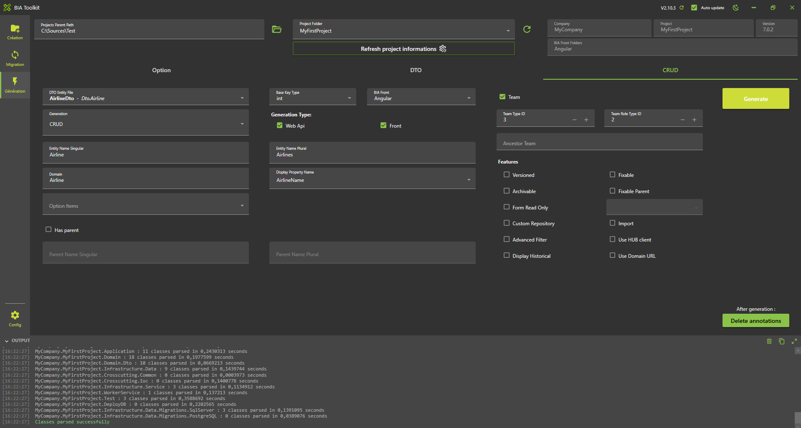

# Create Airline Team



### Create the Model

* In **'...\MyFirstProject\DotNet\MyCompany.MyFirstProject.Domain'** create `Airline` folder, then create a folder `Entities` into it. Use the parent's domain existing module folder if exists.
* Create empty class `Airline.cs` and add following:

```csharp title="Airline.cs"
// <copyright file="Airline.cs" company="MyCompany">
// Copyright (c) MyCompany. All rights reserved.
// </copyright>

namespace MyCompany.MyFirstProject.Domain.Airline.Entities
{
    using System.ComponentModel.DataAnnotations;
    using System.ComponentModel.DataAnnotations.Schema;
    using Audit.EntityFramework;
    using BIA.Net.Core.Common.Attributes;
    using BIA.Net.Core.Common.Enum;
    using BIA.Net.Core.Domain.User.Entities;
    using MyCompany.MyFirstProject.Domain.User.Entities;

    /// <summary>
    /// The airline entity.
    /// </summary>
    public class Airline : BaseEntityTeam
    {
        /// <summary>
        /// Gets or sets the Id.
        /// </summary>
        public int Id { get; set; }

        /// <summary>
        /// Gets or sets the airline name.
        /// </summary>
        public string AirlineName { get; set; }

        /// <summary>
        /// Add row version timestamp in table Airline.
        /// </summary>
        [BiaRowVersionProperty(DbProvider.SqlServer)]
        [AuditIgnore]
        public byte[] RowVersionAirline { get; set; }

        /// <summary>
        /// Add row version for Postgre in table Airline.
        /// </summary>
        [BiaRowVersionProperty(DbProvider.PostGreSql)]
        [AuditIgnore]
        public uint RowVersionXminAirline { get; set; }
    }
}
```

* In case of children team, ensure to have logical links between the parent and child entities.

Make sure to inherit from `Team` and expose : 
- a `byte[]` row version property with attribute `BiaRowVersionProperty` for provider `SqlServer`
- a `uint` row version property with attribute `BiaRowVersionProperty` for provider `PostGreSql`

## Update Data
### Create the ModelBuilder

* In folder `ModelBuilders`, create class `AirlineModelBuilder.cs` or use parent's model builder, and add :
   
```csharp title="AirlineModelBuilder.cs"
namespace MyCompany.MyFirstProject.Infrastructure.Data.ModelBuilders
{
    using Microsoft.EntityFrameworkCore;
    using MyCompany.MyFirstProject.Domain.Airline.Entities;

    /// <summary>
    /// Class used to update the model builder for Airline domain.
    /// </summary>
    public static class AirlineModelBuilder
    {
        /// <summary>
        /// Create the model for projects.
        /// </summary>
        /// <param name="modelBuilder">The model builder.</param>
        public static void CreateModel(ModelBuilder modelBuilder)
        {
            CreateAirlineModel(modelBuilder);
        }

        /// <summary>
        /// Create the model for airlines.
        /// </summary>
        /// <param name="modelBuilder">The model builder.</param>
        private static void CreateAirlineModel(ModelBuilder modelBuilder)
        {
            // Use ToTable() to create the inherited relation with Team in database
            modelBuilder.Entity<Airline>().ToTable("Airlines");
        }
    }
}
```

* If added to existing parent's model builder, add only the method `CreateAirlineModel` and make a call inside the `CreateModel` method. 

### Update DataContext

* Go in **'...\MyFirstProject\DotNet\MyCompany.MyFirstProject.Infrastructure.Data'** folder.
* Open `DataContext.cs` and add your new `DbSet<Airline>` :

```csharp title="DataContext.cs"
        /// <summary>
        /// Gets or sets the Airline DBSet.
        /// </summary>
        public DbSet<Airline> Airlines { get; set; }
```

* Also ensure to have a call to your model builder's method `CreateModel` :

```csharp title="DataContext.cs"
    public class DataContext : BiaDataContext
    {
        /// <inheritdoc cref="DbContext.OnModelCreating"/>
        protected override void OnModelCreating(ModelBuilder modelBuilder)
        {
            // Existing model builders
            
            AirlineModelBuilder.CreateModel(modelBuilder);
            this.OnEndModelCreating(modelBuilder);
        }
    }
```

* In case of children team, ensure to specify logical links between the parent and child entities.

### Update the database

* In VSCode (folder MyFirstProject) press F1
* Click "Tasks: Run Tasks".
* Click "Database Add migration SqlServer" if you use SqlServer or "Database Add migration PostGreSql" if you use PostGerSql.
* Set the name "NewFeatureAirport" and press enter.
* Verify new file `xxx_NewFeatureAirport.cs` is created on **'...\MyFirstProject\DotNet\MyCompany.MyFirstProject.Infrastructure.Data\Migrations'** folder, and file is not empty.

## Generate DTO

### Using BIAToolKit

* Launch the BIAToolKit, go to the tab "Modify existing project".
* Set your parent project path, then select your project folder.
* Go to "DTO Generator" tab.
* Fill the form as following
* Then click on Generate button
   


In a Children Team case, complete the generated DTO : 
* ensure to set the first `AncestorTeam` parent's type into `BiaDtoClass` class annotation
* set `IsParent` to true in `BiaDtoField` field annotation for parent's id property

```csharp title="AirlineChildDto.cs"
/// <summary>
/// The DTO used to represent a company child.
/// </summary>
[BiaDtoClass(AncestorTeam = "Airline")]
public class AirlineChildDto : TeamDto
{
    [...]

    /// <summary>
    /// Gets or sets the parent's airline id.
    /// </summary>
    [BiaDtoField(IsParent = true, Required = true)]
    public int AirlineId { get; set; }
}
```

## Generate CRUD 

### Using BIAToolKit

* Launch the BIAToolKit, go to the tab "Modify existing project".
* Set your parent project path, then select your project folder.
* Go to "CRUD Generator" tab.
* Fill the form as following 
* If your Team inherits from parent, click on the "Has Parent" checkbox and complete the parent's name singular and plural.
* Then click on Generate button
   


### Customize generated files
After the files are generated, there might be some errors. Follow the instructions to correct them if there are any.

#### Back

Open your DotNet project solution in **'...\MyFirstProject\DotNet'** and complete the following files.

##### TeamConfig.cs

Add the following line in the configuration of the Airline team : 

```csharp
DisplayInHeader = true
```

##### RoleId.cs

* Go in **'MyCompany.MyFirstProject.Crosscutting.Common\Enum'** folder and open **RoleId.cs** file.
* Adapt the enum value of the generated value `AirlineAdmin`.
* In case of children team, review the `TeamLeader` created value. Delete new generated value if already exists and in use by other teams.
   
##### TeamTypeId.cs

* Stay in **'MyCompany.MyFirstProject.Crosscutting.Common\Enum'** folder and open `TeamTypeId.cs` file.
* Adapt the enum value of the generated value `Airline`.

#### Front

Open your Angular project folder **'...\MyFirstProject\Angular'** and complete the following files.

##### constants.ts

* Go in **'src\app\shared'** folder and open `constants.ts` file.
* Go in `TeamTypeId` enum declaration.
* Adapt the enum value of the generated value `Airline`.

##### navigation.ts

* Stay in **'src\app\shared'** folder and open `navigation.ts` file.
* Adapt the path of the generated navigation for companies :
   
```typescript title="navigation.ts"
    {
        labelKey: 'app.airlines',
        permissions: [Permission.Airline_List_Access],
        /// TODO after creation of CRUD Team Airline : adapt the path
        path: ['/airlines'],
      },
```

* In case of children team, you can move if needed the generated content into the children's array of parent `BiaNavigation` :
   
```typescript title="navigation.ts"
  {
    labelKey: 'app.companies',
    permissions: [Permission.Company_List_Access],
    path: ['/companies'],
    children: [
      /// BIAToolKit - Begin Partial Navigation CompanyMaintenance
      {
        labelKey: 'app.company-maintenances',
        permissions: [Permission.CompanyMaintenance_List_Access],
        /// TODO after creation of CRUD Team Company : adapt the path
        path: ['/company-maintenances'],
      },
      /// BIAToolKit - End Partial Navigation CompanyMaintenance
    ],
  },
```

##### model.ts

* Go in **'src\app\features\companies\model'** or the children parent's path of the generated feature `airlines` and open the `airline.ts` file.
* Adapt the field configuration if needed.
* Remove all unused imports from the generated file.

## Complete traductions

* Go in **'...\MyFirstProject\Angular\src\assets\i18n\app'**
* Complete each available language traduction JSON file with the correct values : 
   
```json
"app": {
    ...,
    "airlines": "Airlines"
  },
    ...,
"airline": {
    "add": "Add airline",
    "admins": "Administrators",
    "edit": "Edit airline",
    "listOf": "List of airlines",
    "title": "Title",
    "airlineName": "Identifier"
  }
  ```

* Open **'src/assets/i18n/app/es.json'** and add:
  
```json
"app": {
    ...,
    "airlines": "Aerolíneas"
  },
    ...,
"airline": {
    "add": "Añadir aerolínea",
    "admins": "Administradores",
    "edit": "Editar aerolínea",
    "listOf": "Lista de aerolíneas",
    "title": "Título",
    "airlineName": "Identificador"
  }
```  

* Open **'src/assets/i18n/app/fr.json'** and add:
  
```json
"app": {
    ...,
    "airlines": "Compagnies aériennes"
  },
    ...,
"airline": {
    "add": "Ajouter compagnie aérienne",
    "admins": "Administrateurs",
    "edit": "Modifier compagnie aérienne",
    "listOf": "Liste des compagnies aériennes",
    "title": "Titre",
    "airlineName": "Identifiant"
  }
```

## Test

* Run the DotNet solution.
* Launch `npm start` in Angular folder.
* Go to *http://localhost:4200/*
* Navigate to the airline team list.
  
