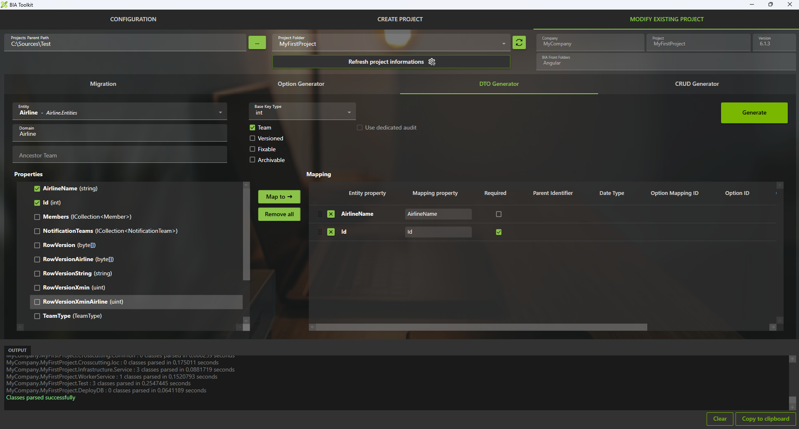
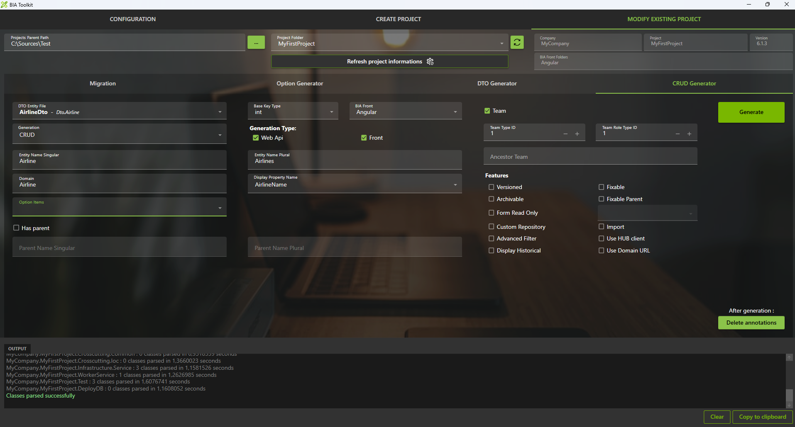
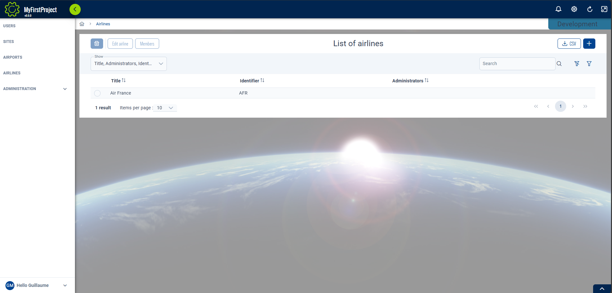

# Create your first Team
This page will explains how to create a team inside your project.

## Prerequisites
Make sure to have your project created by following the steps on [this page](./20-CreateYourFirstProject.md).

### Create the Model
1. In **'...\MyFirstProject\DotNet\MyCompany.MyFirstProject.Domain'** create **'Airline'** folder, then create a folder **'Entities'** into it. Use the parent's domain existing module folder if exists.
2. Create empty class **'Airline.cs'** and add following:
```csharp title="Airline.cs"
// <copyright file="Airline.cs" company="MyCompany">
// Copyright (c) MyCompany. All rights reserved.
// </copyright>

namespace MyCompany.MyFirstProject.Domain.Airline.Entities
{
    using System.ComponentModel.DataAnnotations;
    using System.ComponentModel.DataAnnotations.Schema;
    using MyCompany.MyFirstProject.Domain.User.Entities;

    /// <summary>
    /// The airline entity.
    /// </summary>
    public class Airline : BaseEntityTeam
    {
        /// <summary>
        /// Gets or sets the Id.
        /// </summary>
        public int Id { get; set; }

        /// <summary>
        /// Gets or sets the airline name.
        /// </summary>
        public string AirlineName { get; set; }

        /// <summary>
        /// Add row version timestamp in table Airline.
        /// </summary>
        [BiaRowVersionProperty(DbProvider.SqlServer)]
        [AuditIgnore]
        public byte[] RowVersionAirline { get; set; }

        /// <summary>
        /// Add row version for Postgre in table Airline.
        /// </summary>
        [BiaRowVersionProperty(DbProvider.PostGreSql)]
        [AuditIgnore]
        public uint RowVersionXminAirline { get; set; }
    }
}
```
1. In case of children team, ensure to have logical links between the parent and child entities.

Make sure to inherit from `Team` and expose : 
- a `byte[]` row version property with attribute `BiaRowVersionProperty` for provider `SqlServer`
- a `uint` row version property with attribute `BiaRowVersionProperty` for provider `PostGreSql`
  
Complete with all necessary properties.
:::tip  
You must expose the `Id` property even if it's hide the inherited property of `Team`
:::

### Complete DataContext
1. Go in **'...\MyFirstProject\DotNet\MyCompany.MyFirstProject.Infrastructure.Data'** folder.
2. Open **DataContext.cs** and add your new `DbSet<Airline>` :

```csharp title="DataContext.cs"
    public class DataContext : BiaDataContext
    {
        // Existing DbSet<T>

        /// <summary>
        /// Gets or sets the Airline DBSet.
        /// </summary>
        public DbSet<Airline> Airlines { get; set; }
    }
```
3. In folder **ModelBuilders**, create class **AirlineModelBuilder.cs** or use parent's model builder, and add :
```csharp title="CompanyModelBuilder.cs"
namespace MyCompany.MyFirstProject.Infrastructure.Data.ModelBuilders
{
    using Microsoft.EntityFrameworkCore;
    using MyCompany.MyFirstProject.Domain.Airline.Entities;

    /// <summary>
    /// Class used to update the model builder for Airline domain.
    /// </summary>
    public static class AirlineModelBuilder
    {
        /// <summary>
        /// Create the model for projects.
        /// </summary>
        /// <param name="modelBuilder">The model builder.</param>
        public static void CreateModel(ModelBuilder modelBuilder)
        {
            CreateAirlineModel(modelBuilder);
        }

        /// <summary>
        /// Create the model for airlines.
        /// </summary>
        /// <param name="modelBuilder">The model builder.</param>
        private static void CreateAirlineModel(ModelBuilder modelBuilder)
        {
            // Use ToTable() to create the inherited relation with Team in database
            modelBuilder.Entity<Airline>().ToTable("Airlines");
        }
    }
}
```
4. If added to existing parent's model builder, add only the method `CreateAirlineModel` and make a call inside the `CreateModel` method. 
5. Back to **DataContext.cs**, ensure to have a call to your model builder's method `CreateModel` :
```csharp title="DataContext.cs"
    public class DataContext : BiaDataContext
    {
        /// <inheritdoc cref="DbContext.OnModelCreating"/>
        protected override void OnModelCreating(ModelBuilder modelBuilder)
        {
            // Existing model builders
            
            AirlineModelBuilder.CreateModel(modelBuilder);
            this.OnEndModelCreating(modelBuilder);
        }
    }
```
6. In case of children team, ensure to specify logical links between the parent and child entities.

## Generate DTO
### Using BIAToolKit
1. Launch the **BIAToolKit**, go to the tab **"Modify existing project"**.
2. Set your parent project path, then select your project folder.
3. Go to **"DTO Generator"** tab.
4. Fill the form as following : 

5. Then, click on **Generate** button !

#### Children Team case
Complete the generated DTO : 
* ensure to set the first `AncestorTeam` parent's type into `BiaDtoClass` class annotation
* set `IsParent` to true in `BiaDtoField` field annotation for parent's id property
```csharp title="AirlineChildDto.cs"
/// <summary>
/// The DTO used to represent a company child.
/// </summary>
[BiaDtoClass(AncestorTeam = "Airline")]
public class AirlineChildDto : TeamDto
{
    [...]

    /// <summary>
    /// Gets or sets the parent's airline id.
    /// </summary>
    [BiaDtoField(IsParent = true, Required = true)]
    public int AirlineId { get; set; }
}
```

## Generate CRUD 
### Using BIAToolKit

1. Launch the **BIAToolKit**, go to the tab **"Modify existing project"**.
2. Set your parent project path, then select your project folder.
3. Go to **"CRUD Generator"** tab.
4. Fill the form as following : 

1. If your Team inherits from parent, click on the **"Has Parent"** checkbox and complete the parent's name singular and plural 
2. Then, click on **Generate** button !

### Customize generated files
After the files generation, some customization is needed.
#### Back
Open your DotNet project solution in **'...\MyFirstProject\DotNet'** and complete the following files.
##### RoleId.cs
1. Go in **'MyCompany.MyFirstProject.Crosscutting.Common\Enum'** folder and open **RoleId.cs** file.
2. Adapt the enum value of the generated value `AirlineAdmin`.
3. In case of children team, review the `TeamLeader` created value. Delete new generated value if already exists and in use by other teams.
##### TeamTypeId.cs
1. Stay in **'MyCompany.MyFirstProject.Crosscutting.Common\Enum'** folder and open **TeamTypeId.cs** file.
2. Adapt the enum value of the generated value `Airline`.

#### Front
Open your Angular project folder **'...\MyFirstProject\Angular'** and complete the following files.
##### constants.ts
1. Go in **'src\app\shared'** folder and open **constants.ts** file.
2. Go in `TeamTypeId` enum declaration.
3. Adapt the enum value of the generated value `Airline`.
##### navigation.ts
1. Stay in **'src\app\shared'** folder and open **navigation.ts** file.
2. Adapt the path of the generated navigation for companies :
```typescript title="navigation.ts"
    {
        labelKey: 'app.airlines',
        permissions: [Permission.Airline_List_Access],
        /// TODO after creation of CRUD Team Airline : adapt the path
        path: ['/airlines'],
      },
```
3. In case of children team, you can move if needed the generated content into the children's array of parent `BiaNavigation` :
```typescript title="navigation.ts"
  {
    labelKey: 'app.companies',
    permissions: [Permission.Company_List_Access],
    path: ['/companies'],
    children: [
      /// BIAToolKit - Begin Partial Navigation CompanyMaintenance
      {
        labelKey: 'app.company-maintenances',
        permissions: [Permission.CompanyMaintenance_List_Access],
        /// TODO after creation of CRUD Team Company : adapt the path
        path: ['/company-maintenances'],
      },
      /// BIAToolKit - End Partial Navigation CompanyMaintenance
    ],
  },
```
##### model.ts
1. Go in **'src\app\features\companies\model'** or the children parent's path of the generated feature `airlines` and open the **airline.ts** file.
2. Adapt the field configuration if needed.
3. Remove all unused imports from the generated file.

### Additionnal configuration
The additionnal configuration for the teams is based on the `TeamConfig.cs` from the **domain layer** in the back-end.

#### Role mode
You can set the role mode for your team.
``` csharp title="TeamConfig.cs"
new BiaTeamConfig<Team>()
{
    // [...]
    RoleMode = BIA.Net.Core.Common.Enum.RoleMode.AllRoles,
},
```
- `AllRoles` : all roles are selected
- `SingleRole` : you can select only one role
- `MultiRoles` : you can select multiple roles

#### Automatic team selection mode
You can choose the selection mode if not default team has been set by the user.
``` csharp title="TeamConfig.cs"
new BiaTeamConfig<Team>()
{
    // [...]
    TeamAutomaticSelectionMode = BIA.Net.Core.Common.Enum.TeamSelectionMode.None,
},
```
- `None` : leave empty team selection
- `First` : the first team available (ordered by ID)
#### Clear and choose no team in selector
You can set if the users can clear and select empty team in the team selector.
``` csharp title="TeamConfig.cs"
new BiaTeamConfig<Team>()
{
    // [...]
    TeamSelectionCanBeEmpty = true,
},
```
#### Display mode
You can configure how to display your Team into your front-end.
``` csharp title="TeamConfig.cs"
new BiaTeamConfig<Team>()
{
    // [...]

    // Display the Team selector into the header of your application
    DisplayInHeader = true,
    // Always display the Team selector or only if there is more than one team choice
    DisplayAlways = true,
    // Display the label (Team Title) of the Team selector
    DisplayLabel = true,
},
```

### Complete traductions
1. Go in **'...\MyFirstProject\Angular\src\assets\i18n\app'**
2. Complete each available language traduction JSON file with the correct values : 
```json
"app": {
    ...,
    "airlines": "Airlines"
  },
    ...,
"airline": {
    "add": "Add airline",
    "admins": "Administrators",
    "edit": "Edit airline",
    "listOf": "List of airlines",
    "title": "Title",
    "airlineName": "Identifier"
  }
  ```
* Open **'src/assets/i18n/app/es.json'** and add:
```json
"app": {
    ...,
    "airlines": "Aerolíneas"
  },
    ...,
"airline": {
    "add": "Añadir aerolínea",
    "admins": "Administradores",
    "edit": "Editar aerolínea",
    "listOf": "Lista de aerolíneas",
    "title": "Título",
    "airlineName": "Identificador"
  }
```  

* Open **'src/assets/i18n/app/fr.json'** and add:
```json
"app": {
    ...,
    "airlines": "Compagnies aériennes"
  },
    ...,
"airline": {
    "add": "Ajouter compagnie aérienne",
    "admins": "Administrateurs",
    "edit": "Modifier compagnie aérienne",
    "listOf": "Liste des compagnies aériennes",
    "title": "Titre",
    "airlineName": "Identifiant"
  }
```
### Update the database
1. Open the solution **'...\MyFirstProject\DotNet\MyFirstProject.sln'**.
2. Open a new Package Manager Console.
3. Set default project to **MyCompany.MyFirstProject.Infrastructure.Data**.
4. Run command `add-migration -context "DataContext" AddTeamAirline`
5. Verify the generated migration.
6. Run command `update-database -context "DataContext"`
7. Verify your database.

## Testing your Team
1. Run the DotNet solution.
2. Launch `npm start` in Angular folder.
3. Go to *http://localhost:4200/*
4. Navigate to the airline team list.
