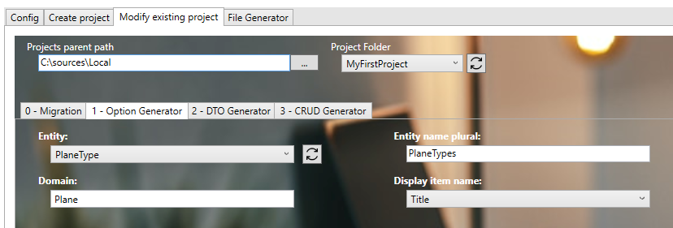

# Create your first Option
We will create the feature 'PlaneType'.

1. Open with Visual Studio 2022 the solution '...\MyFirstProject\DotNet\MyFirstProject.sln'.

2. Create the entity 'PlaneType':
* In '...\MyFirstProject\DotNet\MyCompany.MyFirstProject.Domain\PlaneModule\Aggregate' folder, create empty class 'PlaneType.cs' and add: 

```csharp
namespace MyCompany.MyFirstProject.Domain.Plane.Entities
{
    using System;
    using BIA.Net.Core.Domain;

    /// <summary>
    /// The plane entity.
    /// </summary>
    public class PlaneType : VersionedTable, IEntity<int>
    {
        /// <summary>
        /// Gets or sets the id.
        /// </summary>
        public int Id { get; set; }

        /// <summary>
        /// Gets or sets the Manufacturer's Serial Number.
        /// </summary>
        public string Title { get; set; }

        /// <summary>
        /// Gets or sets the first flight date.
        /// </summary>
        public DateTime? CertificationDate { get; set; }
    }
}
```

3. Create the Option with BIAToolKit :
* Start the BIAToolKit and go on "Modify existing project" tab*
* Set the projects parent path and choose your project
* Go to tab "1 - Option Generator"
* Choose Entity: *PlaneType.cs*
* Fill the plural name: *PlaneTypes*
* Choose the display item: *Title*
* Set the Domain: *Plane*



* Click on generate button

4. Create the ModelBuilder
* In '...\MyFirstProject\DotNet\MyCompany.MyFirstProject.Infrastructure.Data\ModelBuilders', open class 'PlaneModelBuilder.cs' and add:  

```csharp
public static void CreateModel(ModelBuilder modelBuilder)
{
  ...
    CreatePlaneTypeModel(modelBuilder);
}

/// <summary>
/// Create the model for planes.
/// </summary>
/// <param name="modelBuilder">The model builder.</param>
private static void CreatePlaneTypeModel(ModelBuilder modelBuilder)
{
    modelBuilder.Entity<PlaneType>().HasKey(p => p.Id);
    modelBuilder.Entity<PlaneType>().Property(p => p.Title).IsRequired().HasMaxLength(64);
    modelBuilder.Entity<PlaneType>().Property(p => p.CertificationDate).IsRequired(false);
}
```

6. Update DataContext file
* Open '...\MyFirstProject\DotNet\MyCompany.MyFirstProject.Infrastructure.Data\DataContext.cs' file and declare the DbSet associated to PlaneType:

```csharp
/// <summary>
/// Gets or sets the Plane DBSet.
/// </summary>
public DbSet<PlaneType> PlanesTypes { get; set; }
```

7. Update the DataBase
* Launch the Package Manager Console (Tools > Nuget Package Manager > Package Manager Console).
* Be sure to have the project **MyCompany.MyFirstProject.Infrastructure.Data** selected as the Default Project in the console and the project **MyCompany.MyFirstProject.Presentation.Api** as the Startup Project of your solution
* Run first command:    
```ps
Add-Migration 'new_feature_PlaneType' -Context DataContext 
```
* Verify new file *'xxx_new_feature_PlaneType.cs'* is created on '...\MyFirstProject\DotNet\MyCompany.MyFirstProject.Infrastructure.Data\Migrations' folder, and file is not empty.
* Update the database when running this command: 
```ps
Update-DataBase -Context DataContext
```
* Verify 'PlanesTypes' table is created in the database.

8. Automatically Option generation     
We will use the BIAToolkit to finalize 'PlaneType' feature generation back-end + front-end.
* Start the BIAToolKit and go on "Modify existing project" tab*
* Choose:
  * Projects parent path to "C:\Sources\Test"
  * Project folder to *MyFirstProject*
* Open "Add CRUD" tab
* Generation:
  * Choose Dto file: *PlaneTypeDto.cs*
  * Check "WebApi" and "Front" for Generation
  * Check "CRUD' and "Option" for Generation Type
  * Verify "Entity name (singular)" value: *PlaneType*
  * Set "Entity name (plural)" value: *PlanesTypes*
  * Choose "Display item": *Title*
  * Click on "Generate" button

9. Finalize DotNet generation
* Return to Visual Studio 2022 on the solution '...\MyFirstProject\DotNet\MyFirstProject.sln'.
* Rebuild solution
* Project will be run, launch IISExpress to verify it. 
  
10.   Finalize Angular generation
* Run VS code and open the folder 'C:\Sources\Test\MyFirstProject\Angular'
* Launch command on terminal 
```ps
npm start
```
* Errors can occurred like *'OptionDto' is declared but its value is never read.*, 
  * go to the file 'src/app/features/planes-types/model/plane-type.ts' 
  * delete *imports* in errors
* Open 'src/app/shared/navigation.ts' file and update path value to *'/planesTypes'* for block with "labelKey" value is *'app.planesTypes'*   
(see 'src/app/app-routing.module.ts' file to get the corresponding path)
* Open web navigator on address: *http://localhost:4200/* to display front page
* Click on *"APP.PLANESTYPES"* tab to display 'PlaneType' page.

11.   Add traduction
* Open 'src/assets/i18n/app/en.json' and add:
```json
  "app": {
    ...
    "planesTypes": "Planes types",
  },
 "planeType": {
    "add": "Add type of planes",
    "certificationDate": "Certification date",
    "edit": "Edit type of planes",
    "listOf": "List of types of planes",
    "title" : "Title"
  },
```  
* Open 'src/assets/i18n/app/fr.json' and add:
```json
  "app": {
    ...
    "planesTypes": "Types d'avions",
  },
  "planeType": {
    "add": "Ajouter type d'avions",
    "certificationDate": "Date de certification",
    "edit": "Modifier type d'avions",
    "listOf": "Liste des types d'avions",
    "title": "Titre"
  },
```
* Open 'src/assets/i18n/app/es.json' and add:
```json
  "app": {
    ...
    "planesTypes": "Tipos de planos",
  },
 "planeType": {
    "add": "Añadir tipos de planos",
    "certificationDate": "Fecha de certificación",
    "edit": "Editar tipos de planos",
    "listOf": "Lista de tipos de planos",
    "title": "Título"
  },
```  
* Open web navigator on adress: *http://localhost:4200/* to display front page
* Verify 'PlaneType' page have the good name (name put on previous file).
* Open 'PlaneType' page and verify labels have been replaced too.