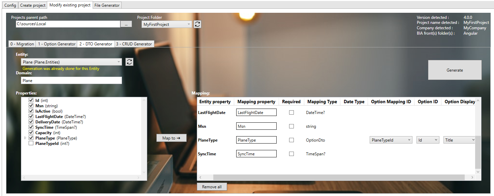
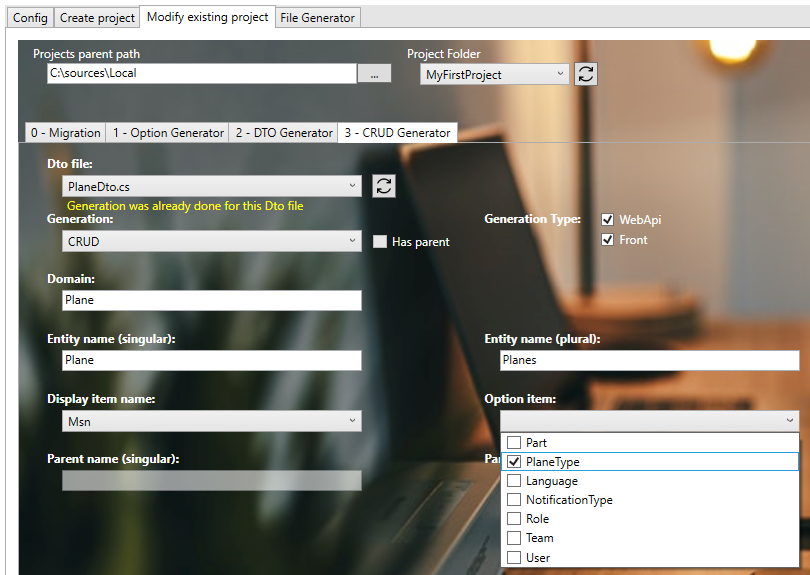

# Create your first Relation
We will create a relation between CRUD 'Plane' and option 'PlaneType' (previously created).

## Create the Entity
* Open with Visual Studio 2022 the solution '...\MyFirstProject\DotNet\MyFirstProject.sln'.
* Open the entity 'Plane':
* In '...\MyFirstProject\DotNet\MyCompany.MyFirstProject.Domain\Plane\Entities' open class 'Plane.cs' and add 'PlaneType' declaration: 
  
```csharp
/// <summary>
/// Gets or sets the  plane type.
/// </summary>
public virtual PlaneType PlaneType { get; set; }

/// <summary>
/// Gets or sets the plane type id.
/// </summary>
public int? PlaneTypeId { get; set; }
```
## Update Data
### Update the ModelBuilder
* In '...\MyFirstProject\DotNet\MyCompany.MyFirstProject.Infrastructure.Data\ModelBuilders', open class 'PlaneModelBuilder.cs' and add 'PlaneType' relationship: 
 
```csharp
/// <summary>
/// Create the model for planes.
/// </summary>
/// <param name="modelBuilder">The model builder.</param>
private static void CreatePlaneModel(ModelBuilder modelBuilder)
{
    ...
    modelBuilder.Entity<Plane>().Property(p => p.PlaneTypeId).IsRequired(false); // relationship 0..1-*
    modelBuilder.Entity<Plane>().HasOne(x => x.PlaneType).WithMany().HasForeignKey(x => x.PlaneTypeId);
}
```

### Update the DataBase
* Launch the Package Manager Console (Tools > Nuget Package Manager > Package Manager Console).
* Be sure to have the project **MyCompany.MyFirstProject.Infrastructure.Data** selected as the Default Project in the console and the project **MyCompany.MyFirstProject.Presentation.Api** as the Startup Project of your solution
* Run first command:    
```ps
Add-Migration 'update_feature_Plane' -Context DataContext 
```
* Verify new file *'xxx_update_feature_Plane.cs'* is created on '...\MyFirstProject\DotNet\MyCompany.MyFirstProject.Infrastructure.Data\Migrations' folder, and file is not empty.
* Update the database when running this command: 
```ps
Update-DataBase -Context DataContext
```
* Verify 'Planes' table is updated in the database (column *'PlaneTypeId'* was added).
  
## Create the DTO
### Using BIAToolKit
* Start the BIAToolKit and go on "Modify existing project" tab*
* Set the projects parent path and choose your project
* Open "DTO Generator" tab
* Generation:
  * Choose entity: *Plane*
  * Information message appear: "Generation was already done for this Entity"
  * Verify "Domain" value is *Plane*
  * Verify all properties are correctly selected and mapped
  * Check the property *PlaneType* and click on "Map To" button
  * New mapping PlaneType with mapping Type "Option" should be added on the list 



* ***WARNING :* Make sure to have a backup of your previous Mapper before generating**
* Click on generate button

## Generate CRUD
### Using BIAToolKit
* Start the BIAToolKit and go on "Modify existing project" tab*
* Set the projects parent path and choose your project
* Open "CRUD Generator" tab
* Generation:
  * Choose Dto file: *PlaneDto.cs*
  * Information message appear: "Generation was already done for this Dto file"
  * Verify "WebApi" and "Front" Generation are checked
  * Verify "CRUD" Generation Type is choosen
  * Verify "Entity name (singular)" value is *Plane*
  * Verify "Entity name (plural)" value is *Planes*
  * Verify "Display item"  value is *Msn*
  * On option item list, check "PlaneType" value



  * Click on "Generate" button

### Complete generated files
* Update the Mapper 'PlaneMapper':
  * In '...\MyFirstProject\DotNet\MyCompany.MyFirstProject.Domain\Plane\Mappers' folder, open class 'PlaneMapper'
  * Re-add the ExpressionCollection override and HeaderName struct into your file using your backup
  * Complete the class with these data :
 
```csharp
public override ExpressionCollection<Plane> ExpressionCollection
{
    ...
    { HeaderName.PlaneType, plane => plane.PlaneType != null ? plane.PlaneType.Title : null },
}

[...]

public override Func<PlaneDto, object[]> DtoToRecord(List<string> headerNames = null)
{
    return x => (new object[]
    {
        ...
        CSVString(x.PlaneType.Display),
    });
}

public struct HeaderName
{
    ...
    /// <summary>
    /// Header Name PlaneType.
    /// </summary>
    public const string PlaneType = "planeType";
}
```

## Check DotNet generation
* Return to Visual Studio 2022 on the solution '...\MyFirstProject\DotNet\MyFirstProject.sln'.
* Rebuild solution
* Project will be run, launch IISExpress to verify it. 

## Check Angular generation
* Run VS code and open the folder 'C:\Sources\Test\MyFirstProject\Angular'
* Launch command on terminal 
```ps
npm start
```

## Test
* Open 'src/app/shared/navigation.ts' file and update path value to *'/planes'* for block with "labelKey" value is *'app.planes'*   
(see 'src/app/app-routing.module.ts' file to get the corresponding path)
* Open web navigator on address: *http://localhost:4200/* to display front page
* Click on *"PLANES"* tab to display 'Planes' page.

1.    Add traduction
* Open 'src/assets/i18n/app/en.json' and add:
```json
  "plane": {
    ...
    "planeType": "Plane Type",
  },
```  
* Open 'src/assets/i18n/app/fr.json' and add:
```json
  "app": {
    ...
    "planes": "Avions",
  },
  "plane": {
    ...
    "planeType": "Type d'avions",
  },
```
* Open 'src/assets/i18n/app/es.json' and add:
```json
  "app": {
    ...
    "planes": "Planos",
  },
  "plane": {
    ...
    "planeType": "Tipos de planos",
  },
```  
* Open web navigator on address: *http://localhost:4200/* to display front page
* Open 'Plane' page and verify label has been replaced and PlaneType option is available on the list