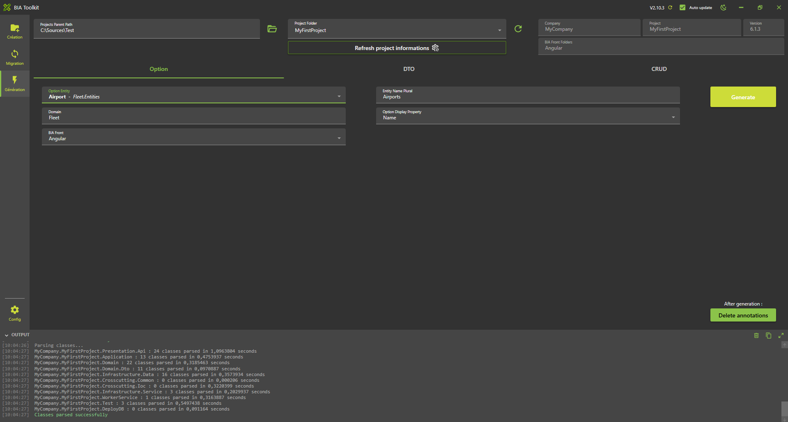
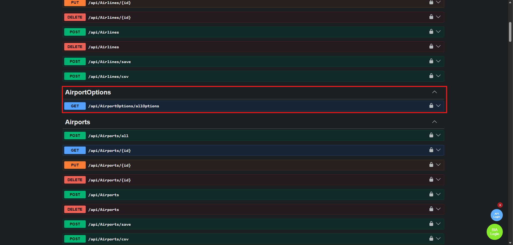
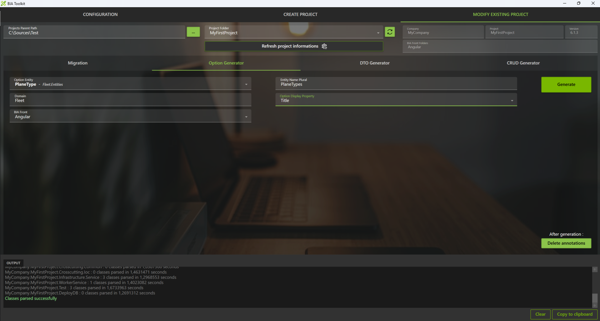
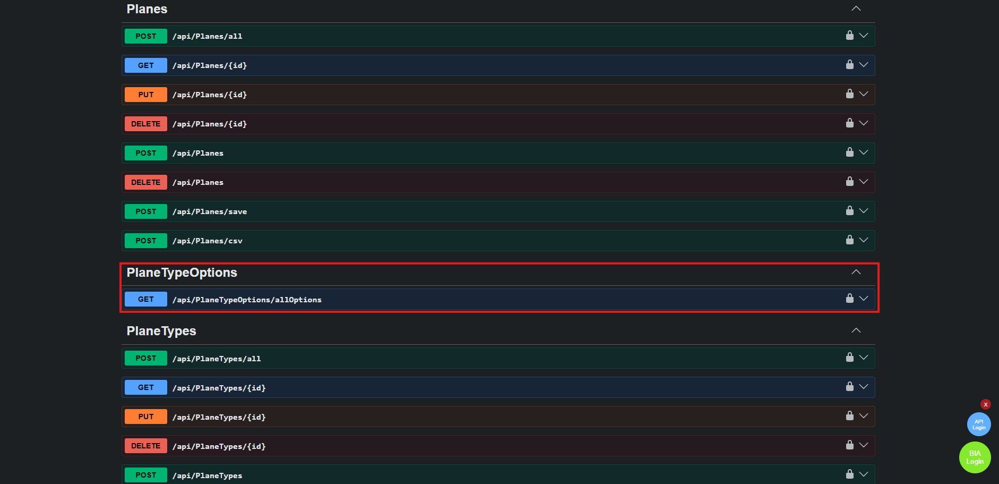

# Create Airport and PlaneType Options

## Create Airport's Option

### Using BIAToolKit
* Start the BIAToolKit and go on "Modify existing project" tab*
* Set the projects parent path and choose your project
* Go to tab 1 "Option Generator"
* Select your entity **Airport** on the list
* Verify the plural name: **Airports**
* Choose the display item: **Name**
* Set the Domain: **Fleet**
* Click on generate button

### Launch application generation
* In VSCode Stop all debug launched.
* Run and debug "Debug Full Stack" 
* Verify you have no error.
* You can see in swagger the "AirportOptions-Get" WebApi.
* For the moment you can't see other in the Front.

## Create PlaneType's Option

### Launch application generation

### Using BIAToolKit
Follow the same steps as for Airport's option but change the values selected on the fields : 
* Select your entity **PlaneType** on the list
* Verify the plural name: **PlaneTypes**
* Choose the display item: **Title**
* Set the Domain: **Fleet**
* Click on generate button

  
### Launch application generation
* In VSCode Stop all debug launched.
* Run and debug "Debug Full Stack" 
* Verify you have no error.
* You can see in swagger the "PlaneTypeOptions-Get" WebApi.
* For the moment you can't see other in the Front.
  
