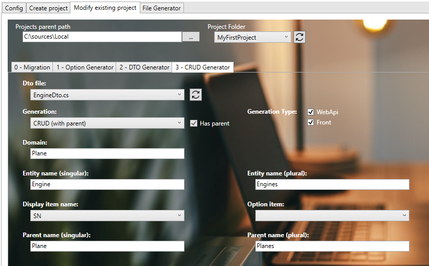

# Create your first Child
We will create in first the child feature 'Engines'.

## Prerequisites
### CRUD Parent creation
Follow steps from the section [Create your first CRUD](./30-CreateYourFirstCRUD.md) to create the parent's child.

We will assume that the parent is a Plane for this documentation.

### Create the Model
1. In **'...\MyFirstProject\DotNet\MyCompany.MyFirstProject.Domain\PlaneModule\Aggregate'**
2. Create empty class **'Engine.cs'** and add following:
```csharp title="Engine.cs"
// <copyright file="Engine.cs" company="MyCompany">
// Copyright (c) MyCompany. All rights reserved.
// </copyright>

namespace MyCompany.MyFirstProject.Domain.Plane.Entities
{
    using BIA.Net.Core.Domain;

    /// <summary>
    /// The engine entity.
    /// </summary>
    public class Engine : VersionedTable, IEntity<int>
    {
        /// <summary>
        /// Gets or sets the engine Id.
        /// </summary>
        public int Id { get; set; }

        /// <summary>
        /// Gets or sets the engine serial number.
        /// </summary>
        public string SN { get; set; }

        /// <summary>
        /// Gets or sets the plane Id.
        /// </summary>
        public int PlaneId { get; set; }

        /// <summary>
        /// Gets or sets the plane.
        /// </summary>
        public virtual Plane Plane { get; set; }
    }
}

```
3. In **Plane.cs**, add a new `ICollection<Engine>` to the model:
```csharp title="Plane.cs"
// <copyright file="Plane.cs" company="MyCompany">
// Copyright (c) MyCompany. All rights reserved.
// </copyright>

namespace MyCompany.MyFirstProject.Domain.PlaneModule.Aggregate
{
    public class Plane : VersionedTable, IEntity<int>
    {
        [...]

        /// <summary>
        /// Gets or sets the list of engines.
        /// </summary>
        public ICollection<Engine> Engines { get; set; }
    }
}
```

### Complete DataContext
1. Go in **'...\MyFirstProject\DotNet\MyCompany.MyFirstProject.Infrastructure.Data'** folder.
2. Open **DataContext.cs** and add your new `DbSet<Engine>` :

```csharp title="DataContext.cs"
    public class DataContext : BiaDataContext
    {
        // Existing DbSet<T>

        /// <summary>
        /// Gets or sets the Engine DBSet.
        /// </summary>
        public DbSet<Engine> Engines { get; set; }
    }
```
3. In folder **ModelBuilders**, create class **EngineModelBuilder.cs** or use parent's model builder, and add :
```csharp title="EngineModelBuilder.cs"
namespace MyCompany.MyFirstProject.Infrastructure.Data.ModelBuilders
{
    using Microsoft.EntityFrameworkCore;
    using MyCompany.MyFirstProject.Domain.CompanyModule.Aggregate;

    /// <summary>
    /// Class used to update the model builder for Engine domain.
    /// </summary>
    public static class EngineModelBuilder
    {
        /// <summary>
        /// Create the model for projects.
        /// </summary>
        /// <param name="modelBuilder">The model builder.</param>
        public static void CreateModel(ModelBuilder modelBuilder)
        {
            CreateEngineModel(modelBuilder);
        }

        /// <summary>
        /// Create the model for engines.
        /// </summary>
        /// <param name="modelBuilder">The model builder.</param>
        private static void CreateEngineModel(ModelBuilder modelBuilder)
        {
            modelBuilder.Entity<Engine>().HasOne(x => x.Plane).WithMany(x => x.Engines).HasForeignKey(x => x.PlaneId);
        }
    }
}
```
4. Back to **DataContext.cs**, ensure to have a call to your model builder's method `CreateModel` :
```csharp title="DataContext.cs"
    public class DataContext : BiaDataContext
    {
        /// <inheritdoc cref="DbContext.OnModelCreating"/>
        protected override void OnModelCreating(ModelBuilder modelBuilder)
        {
            // Existing model builders
            
            EngineModelBuilder.CreateModel(modelBuilder);
            this.OnEndModelCreating(modelBuilder);
        }
    }
```

### Update the database
1. Open a new Package Manager Console.
2. Set default project to **MyCompany.MyFirstProject.Infrastructure.Data**.
3. Run command `add-migration -context "DataContext" AddEngines`.
4. Verify the generated migration.
5. Run command `update-database -context "DataContext"`
6. Verify your database.

## Generate DTO
### Using BIAToolKit
1. Launch the **BIAToolKit**, go to the tab **"Modify existing project"**.
2. Set your parent project path, then select your project folder.
3. Go to **"CRUD Generator"** tab.
4. Fill the form as following : 

5. Then, click on **Generate** button !
6. Complete **MyCompany.MyFirstProject.Domain.Dto.Plane.EngineDto.cs** by adding property's attribute `IsParent = true` for the `PlaneId` property :
```csharp title="EngineDto.cs"
/// <summary>
/// Gets or sets the PlaneId.
/// </summary>
[BiaDtoField(IsParent = true, Required = true)]
public int PlaneId { get; set; }
```

## Generate CRUD
### Using BIAToolKit
1. Launch the **BIAToolKit**, go to the tab **"Modify existing project"**.
2. Set your parent project path, then select your project folder.
3. Go to **"CRUD Generator"** tab.
4. Fill the form as following : 

    Based on this informations, the BIAToolKit will detect automatically the parent's folders to generate the new CRUD child. Make sure to fill the correct informations without misspelling.
5. Then, click on **Generate** button !

### Customize generated files
#### Front
##### model.ts
1. Go in **'src\app\features\planes\children\engines\model'** and open the **engine.ts** file.
2. Adapt the field configuration if needed.
3. Remove all unused imports from the generated file.
   
##### engine-item.component.ts
1. Go in **'src\app\features\planes\children\engines\views'** and open the **engine-item.component.ts** file.
2. Adapt the field of the item to display in the breadcrump.

### Complete traductions
1. Go in **'...\MyFirstProject\Angular\src\assets\i18n\app'**
2. Complete each available language traduction JSON file with the correct values : 
```json title="en.json"
"app": {
    //...
    "engines": "engines"
  },
  "engine": {
    "add": "Add engine",
    "edit": "Edit engine",
    "listOf": "List of engines",
    "plane": "Plane",
    "sn": "Serial Number",
  },
```

## Testing your CRUD Child
1. Run the DotNet solution.
2. Launch `npm start` in Angular folder.
3. Go to *http://localhost:4200/*
4. Navigate to the plane list.
5. Select one plane (create one if needed) and click on the button "Engines":

6. You should access to the engines list of the plane.
