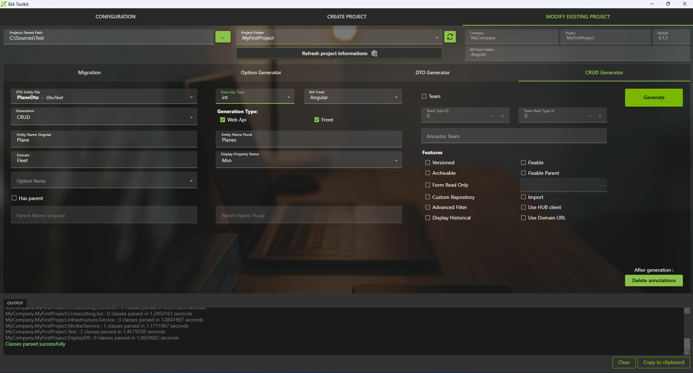

# Create your first Relation
We will create a relation between CRUD 'Plane' and option 'PlaneType' (previously created).

## Create the Plane Entity

* In **'...\MyFirstProject\DotNet\MyCompany.MyFirstProject.Domain\Fleet\Entities'**.
* Create empty class 'Plane.cs' and add:

```csharp

// <copyright file="Plane.cs" company="MyCompany">
//     Copyright (c) MyCompany. All rights reserved.
// </copyright>

namespace MyCompany.MyFirstProject.Domain.Fleet.Entities
{
    using System;
    using System.Collections.Generic;
    using System.ComponentModel.DataAnnotations.Schema;
    using BIA.Net.Core.Domain.Entity;

    /// <summary>
    /// The plane entity.
    /// </summary>
    public class Plane : BaseEntity<int>
    {
        /// <summary>
        /// Gets or sets the id.
        /// </summary>
        public int Id { get; set; }

        /// <summary>
        /// Gets or sets the Manufacturer's Serial Number.
        /// </summary>
        public string Msn { get; set; }

        /// <summary>
        /// Gets or sets a value indicating whether the plane is active.
        /// </summary>
        public bool IsActive { get; set; }

        /// <summary>
        /// Gets or sets the last flight date.
        /// </summary>
        public DateTime? LastFlightDate { get; set; }

        /// <summary>
        /// Gets or sets the delivery date.
        /// </summary>
        [Column(TypeName = "date")]
        public DateTime? DeliveryDate { get; set; }

        /// <summary>
        /// Gets or sets the daily synchronization hour.
        /// </summary>
        [Column(TypeName = "time")]
        public TimeSpan? SyncTime { get; set; }

        /// <summary>
        /// Gets or sets the capacity.
        /// </summary>
        public int Capacity { get; set; }
    }
}
```

## Create the DTO

### Using BIAToolKit
* Open the BIAToolKi
* Go to "Modify existing project" tab
* Set the projects parent path and choose your project
* Go to tab 3 "DTO Generator"
* Select your entity Plane on the list
* 

* Click on "Map to" button
* Check the required checkbox for the Id mapping property


* Then click the "Generate" button
* The DTO and the mapper will be generated
* Check in the project solution if the DTO and mapper are present


## Update Data

Open the 'PlaneModelBuilder.cs' in **'...\MyFirstProject\DotNet\MyCompany.MyFirstProject.Infrastructure.Data\ModelBuilders'** and add : 

``` csharp
        public static void CreateModel(ModelBuilder modelBuilder)
        {
        ...
            CreatePlaneModel(modelBuilder);
        }

        /// <summary>
        /// Create the model for planes.
        /// </summary>
        /// <param name="modelBuilder">The model builder.</param>
        private static void CreatePlaneModel(ModelBuilder modelBuilder)
        {
            modelBuilder.Entity<Plane>().HasKey(p => p.Id);
            modelBuilder.Entity<Plane>().Property(p => p.Msn).IsRequired().HasMaxLength(64);
            modelBuilder.Entity<Plane>().Property(p => p.IsActive).IsRequired();
            modelBuilder.Entity<Plane>().Property(p => p.LastFlightDate).IsRequired(false);
            modelBuilder.Entity<Plane>().Property(p => p.DeliveryDate).IsRequired(false);
            modelBuilder.Entity<Plane>().Property(p => p.SyncTime).IsRequired(false);
            modelBuilder.Entity<Plane>().Property(p => p.Capacity).IsRequired();
        }
```

### Update DataContext file

Open **'...\MyFirstProject\DotNet\MyCompany.MyFirstProject.Infrastructure.Data\DataContext.cs'** file and declare the DbSet associated to Plane:

``` csharp
/// <summary>
/// Gets or sets the Plane DBSet.
/// </summary>
public DbSet<Plane> Planes { get; set; }
```

### Update the DataBase

* In VSCode (folder MyFirstProject) press F1
* Click "Tasks: Run Tasks".
* Click "Database Add migration SqlServer" if you use SqlServer or "Database Add migration PostGreSql" if you use PostGerSql.
* Set the name "NewFeaturePlane" and press enter.
* Verify new file 'xxx_NewFeaturePlane.cs' is created on '...**\MyFirstProject\DotNet\MyCompany.MyFirstProject.Infrastructure.Data\Migrations'** folder, and file is not empty.


* In VSCode Run and Debug  "DotNet DeployDB"
* Verify 'Planes' table is created in the database.


## Create the CRUD

### Using the BIAToolKit 

* Start the BIAToolKit and go on "Modify existing project" tab*
* Set the projects parent path and choose your project
* Go to tab 4 "CRUD Generator"
* Choose Dto file: PlaneDto.cs
* Check "WebApi" and "Front" for Generation
* Check "CRUD" for Generation Type
* Domain name should be "Fleet"
* Set Base key type as int
* Verify "Entity name (singular)" value: Plane
* Verify "Entity name (plural)" value: Planes
* Choose "Display item": Msn
* Click on generate button



### Launch application generation

* In VSCode Stop all debug launched.
* Run and debug "Debug Full Stack"
* The swagger page will be open.
* Open a browser at address http://localhost:4200/
* Click on "APP.PLANES" in menu to display 'Planes' page.


## Add traduction

* Open **'src/assets/i18n/app/en.json'** and add:

``` json
  "app": {
    ...,
    "planes": "Planes"
  },
  "plane": {
    "add": "Add plane",
    "capacity": "Capacity",
    "deliveryDate": "Delivery Date",
    "edit": "Edit plane",
    "isActive": "Active",
    "lastFlightDate": "Last flight date",
    "listOf": "List of planes",
    "msn": "Msn",
    "syncTime": "Synchronization time"
  }
```

* Open **'src/assets/i18n/app/es.json'** and add:
``` json
  "app": {
    ...,
    "planes": "Aviones"
  },
  "plane": {
    "add": "Añadir plano",
    "capacity": "Capacidad",
    "deliveryDate": "Fecha de entrega",
    "edit": "Editar plano",
    "isActive": "Activo",
    "lastFlightDate": "Última fecha de vuelo",
    "listOf": "Lista de planos",
    "msn": "Msn",
    "syncTime": "Tiempo de sincronización"
  }
  ```

* Open **'src/assets/i18n/app/fr.json'** and add:
``` json
  "app": {
    ...,
    "planes": "Avions"
  },
  "plane": {
    "add": "Ajouter avion",
    "capacity": "Capacité",
    "deliveryDate": "Date de livraison",
    "edit": "Modifier avion",
    "isActive": "Actif",
    "lastFlightDate": "Date du dernier vol",
    "listOf": "Liste des avions",
    "msn": "Msn",
    "syncTime": "Heure de synchronisation"
  }
```

## Test

* Open web navigator on address: http://localhost:4200/ to display front page
* Verify 'Plane' page have the good name
* Open 'Plane' page and verify labels have been replaced too.
* Since you already created an administrator account in the CreateYourFirstCRUD part you should be able to create a new Plane by clicking on the "+" and filling the row.


# TODO

## Create the relation Entity
* Open with Visual Studio 2026 the solution **'...\MyFirstProject\DotNet\MyFirstProject.sln'**.
* Open the entity 'Fleet':
* In **'...\MyFirstProject\DotNet\MyCompany.MyFirstProject.Domain\Fleet\Entities'** open class 'Plane.cs' and add 'PlaneType' declaration: 
  
```csharp
/// <summary>
/// Gets or sets the  plane type.
/// </summary>
public virtual PlaneType PlaneType { get; set; }

/// <summary>
/// Gets or sets the plane type id.
/// </summary>
public int? PlaneTypeId { get; set; }
```

## Update Data
### Update the ModelBuilder
* In '...\MyFirstProject\DotNet\MyCompany.MyFirstProject.Infrastructure.Data\ModelBuilders', open class 'PlaneModelBuilder.cs' and add 'PlaneType' relationship: 
 
```csharp
/// <summary>
/// Create the model for planes.
/// </summary>
/// <param name="modelBuilder">The model builder.</param>
private static void CreatePlaneModel(ModelBuilder modelBuilder)
{
    ...
    modelBuilder.Entity<Plane>().Property(p => p.PlaneTypeId).IsRequired(false); // relationship 0..1-*
    modelBuilder.Entity<Plane>().HasOne(x => x.PlaneType).WithMany().HasForeignKey(x => x.PlaneTypeId);
}
```

### Update the DataBase
* Launch the Package Manager Console (Tools > Nuget Package Manager > Package Manager Console).
* Be sure to have the project **MyCompany.MyFirstProject.Infrastructure.Data** selected as the Default Project in the console and the project **MyCompany.MyFirstProject.Presentation.Api** as the Startup Project of your solution
* Run first command:    
```ps
Add-Migration 'update_feature_Plane' -Context DataContext 
```
* Verify new file *'xxx_update_feature_Plane.cs'* is created on '...\MyFirstProject\DotNet\MyCompany.MyFirstProject.Infrastructure.Data\Migrations' folder, and file is not empty.
* Update the database when running this command: 
```ps
Update-DataBase -Context DataContext
```
* Verify 'Planes' table is updated in the database (column *'PlaneTypeId'* was added).
  
## Create the DTO
### Using BIAToolKit
* Start the BIAToolKit and go on "Modify existing project" tab*
* Set the projects parent path and choose your project
* Open "DTO Generator" tab
* Generation:
  * Choose entity: *Plane*
  * Information message appear: "Generation was already done for this Entity"
  * Verify "Domain" value is *Plane*
  * Verify all properties are correctly selected and mapped
  * Check the property *PlaneType* and click on "Map To" button
  * New mapping PlaneType with mapping Type "Option" should be added on the list 


* ***WARNING :* Make sure to have a backup of your previous Mapper before generating**
* Click on generate button

## Generate CRUD
### Using BIAToolKit
* Start the BIAToolKit and go on "Modify existing project" tab*
* Set the projects parent path and choose your project
* Open "CRUD Generator" tab
* Generation:
  * Choose Dto file: *PlaneDto.cs*
  * Information message appear: "Generation was already done for this Dto file"
  * Verify "WebApi" and "Front" Generation are checked
  * Verify "CRUD" Generation Type is choosen
  * Verify "Entity name (singular)" value is *Plane*
  * Verify "Entity name (plural)" value is *Planes*
  * Verify "Display item"  value is *Msn*
  * On option item list, check "PlaneType" value


  * Click on "Generate" button

### Complete generated files
* Update the Mapper 'PlaneMapper':
  * Re-add custom code from your previous backup if any

## Check DotNet generation
* Return to Visual Studio 2022 on the solution '...\MyFirstProject\DotNet\MyFirstProject.sln'.
* Rebuild solution
* Project will be run, launch IISExpress to verify it. 

## Check Angular generation
* Run VS code and open the folder 'C:\Sources\Test\MyFirstProject\Angular'
* Launch command on terminal 
```ps
npm start
```

## Test
* Open 'src/app/shared/navigation.ts' file and update path value to *'/planes'* for block with "labelKey" value is *'app.planes'*   
(see 'src/app/app-routing.module.ts' file to get the corresponding path)
* Open web navigator on address: *http://localhost:4200/* to display front page
* Click on *"PLANES"* tab to display 'Planes' page.

1.    Add traduction
* Open 'src/assets/i18n/app/en.json' and add:
```json
  "plane": {
    ...
    "planeType": "Plane Type",
  },
```  
* Open 'src/assets/i18n/app/fr.json' and add:
```json
  "app": {
    ...
    "planes": "Avions",
  },
  "plane": {
    ...
    "planeType": "Type d'avions",
  },
```
* Open 'src/assets/i18n/app/es.json' and add:
```json
  "app": {
    ...
    "planes": "Planos",
  },
  "plane": {
    ...
    "planeType": "Tipos de planos",
  },
```  
* Open web navigator on address: *http://localhost:4200/* to display front page
* Open 'Plane' page and verify label has been replaced and PlaneType option is available on the list