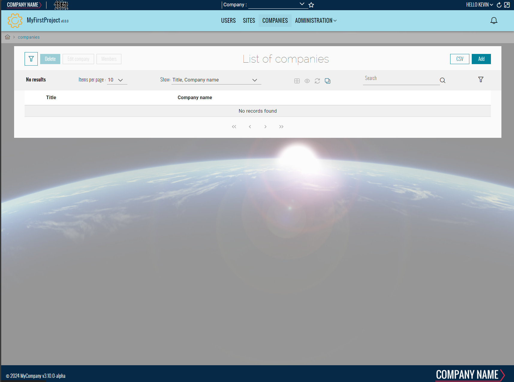

# Create your first Team
This page will explains how to create a team inside your project.

## Prerequisites
Make sure to have your project created by following the steps on [this page](./20-CreateYourFirstProject.md).

### Create the DTO
1. Open with Visual Studio 2022 the solution **'...\MyFirstProject\DotNet\MyFirstProject.sln'**.
2. In **'...\MyFirstProject\DotNet\MyCompany.MyFirstProject.Domain.Dto'** create **'Company'** folder or use parent's domain existing folder.
3. Create empty class **'CompanyDto.cs'** and add following:
```csharp title="CompanyDto.cs"
// <copyright file="CompanyDto.cs" company="MyCompany">
// Copyright (c) MyCompany. All rights reserved.
// </copyright>

namespace MyCompany.MyFirstProject.Domain.Dto.Company
{
    using BIA.Net.Core.Domain.Dto.User;

    /// <summary>
    /// The DTO used to represent a company.
    /// </summary>
    public class CompanyDto : TeamDto
    {
        /// <summary>
        /// Gets or sets the company name.
        /// </summary>
        public string CompanyName { get; set; }
    }
}
```
4. In case of children team, ensure to set the first `AncestorTeam` parent's type into `BiaDtoClass` class annotation, and set `IsParent` to true in `BiaDtoField` field annotation for parent's id property : 
```csharp title="CompanyMaintenanceDto.cs"
// <copyright file="CompanyMaintenanceDto.cs" company="MyCompany">
// Copyright (c) MyCompany. All rights reserved.
// </copyright>

namespace MyCompany.MyFirstProject.Domain.Dto.Company
{
    using BIA.Net.Core.Domain.Dto.CustomAttribute;
    using BIA.Net.Core.Domain.Dto.User;

    /// <summary>
    /// The DTO used to represent a company maintenance.
    /// </summary>
    [BiaDtoClass(AncestorTeam = "Company")]
    public class CompanyMaintenanceDto : TeamDto
    {
        /// <summary>
        /// Gets or sets the parent's company id.
        /// </summary>
        [BiaDtoField(IsParent = true, Required = true)]
        public int CompanyId { get; set; }

        /// <summary>
        /// Get or sets the company maintenance code.
        /// </summary>
        public string Code { get; set; }
    }
}
```
Make sure to inherit from `TeamDto`.
Complete with all necessary properties.
### Create the Model
1. In **'...\MyFirstProject\DotNet\MyCompany.MyFirstProject.Domain'** create **'CompanyModule'** folder, then create a folder **'Aggregate'** into it. Use the parent's domain existing module folder if exists.
2. Create empty class **'Company.cs'** and add following:
```csharp title="Company.cs"
// <copyright file="Company.cs" company="MyCompany">
// Copyright (c) MyCompany. All rights reserved.
// </copyright>

namespace MyCompany.MyFirstProject.Domain.CompanyModule.Aggregate
{
    using System.ComponentModel.DataAnnotations;
    using System.ComponentModel.DataAnnotations.Schema;
    using MyCompany.MyFirstProject.Domain.UserModule.Aggregate;

    /// <summary>
    /// The company entity.
    /// </summary>
    public class Company : Team
    {
        /// <summary>
        /// Gets or sets the company name.
        /// </summary>
        public string CompanyName { get; set; }

        /// <summary>
        /// Add row version timestamp in table Company.
        /// </summary>
        [Timestamp]
        [Column("RowVersion")]
        public byte[] RowVersionCompany { get; set; }
    }
}
```
3. In case of children team, ensure to have logical links between the parent and child entities.

Make sure to inherit from `Team` and expose a `byte[]` row version property mapped to column `RowVersion`.
Complete with all necessary properties.

### Create the Mapper
1. Stay in **'...\MyFirstProject\DotNet\MyCompany.MyFirstProject.Domain\CompanyModule\Aggregate'** folder.
2. Create empty class **'CompanyMapper.cs'** and add following:
```csharp title="CompanyMapper.cs"
// <copyright file="CompanyMapper.cs" company="MyCompany">
// Copyright (c) MyCompany. All rights reserved.
// </copyright>

namespace MyCompany.MyFirstProject.Domain.CompanyModule.Aggregate
{
    using System;
    using System.Linq;
    using System.Linq.Expressions;
    using System.Security.Principal;
    using BIA.Net.Core.Domain.Authentication;
    using MyCompany.MyFirstProject.Crosscutting.Common.Enum;
    using MyCompany.MyFirstProject.Domain.Dto.Company;
    using MyCompany.MyFirstProject.Domain.UserModule.Aggregate;

    /// <summary>
    /// The mapper used for company.
    /// </summary>
    public class CompanyMapper : TTeamMapper<CompanyDto, Company>
    {
        /// <summary>
        /// Initializes a new instance of the <see cref="CompanyMapper"/> class.
        /// </summary>
        /// <param name="principal">The principal.</param>
        public CompanyMapper(IPrincipal principal)
            : base(principal)
        {
        }

        /// <inheritdoc cref="TTeamMapper{TTeamDto, TTeam}"/>
        public override Expression<Func<Company, CompanyDto>> EntityToDto()
        {
            return base.EntityToDto().CombineMapping(entity => new CompanyDto
            {
                Id = entity.Id,
                Title = entity.Title,
                CompanyName = entity.CompanyName,

                // Should correspond to TTeam_Update permission (but without use the roles *_Member that is not determined at list display)
                CanUpdate =
                    this.UserRoleIds.Contains((int)RoleId.Admin),

                // Should correspond to TTeam_Member_List_Access (but without use the roles *_Member that is not determined at list display)
                CanMemberListAccess =
                    this.UserRoleIds.Contains((int)RoleId.Admin) ||
                    entity.Members.Any(m => m.UserId == this.UserId),
            });
        }

        /// <inheritdoc cref="TTeamMapper{TTeamDto, TTeam}"/>
        public override void DtoToEntity(CompanyDto dto, Company entity)
        {
            base.DtoToEntity(dto, entity);
            entity.CompanyName = dto.CompanyName;
        }
    }
}
```
3. In case of children team, ensure to specify logical links between the parent and child entities.

Make sure to inherit from `TTeamMapper<TTeamDto, TTeam>` and override mentionned methods. Ensure to combine the base mapping method `EntityToDto`.
Complete the mapping methods with the necessary properties according to your model.

### Complete DataContext
1. Go in **'...\MyFirstProject\DotNet\MyCompany.MyFirstProject.Infrastructure.Data\CompanyModule\Aggregate'** folder.
2. Open **DataContext.cs** and add your new `DbSet<Company>` :

```csharp title="DataContext.cs"
    public class DataContext : BiaDataContext
    {
        // Existing DbSet<T>

        /// <summary>
        /// Gets or sets the Company DBSet.
        /// </summary>
        public DbSet<Company> Companies { get; set; }
    }
```
3. In folder **ModelBuilders**, create class **CompanyModelBuilder.cs** or use parent's model builder, and add :
```csharp title="CompanyModelBuilder.cs"
namespace MyCompany.MyFirstProject.Infrastructure.Data.ModelBuilders
{
    using Microsoft.EntityFrameworkCore;
    using MyCompany.MyFirstProject.Domain.CompanyModule.Aggregate;

    /// <summary>
    /// Class used to update the model builder for Company domain.
    /// </summary>
    public static class CompanyModelBuilder
    {
        /// <summary>
        /// Create the model for projects.
        /// </summary>
        /// <param name="modelBuilder">The model builder.</param>
        public static void CreateModel(ModelBuilder modelBuilder)
        {
            CreateCompanyModel(modelBuilder);
        }

        /// <summary>
        /// Create the model for companiess.
        /// </summary>
        /// <param name="modelBuilder">The model builder.</param>
        private static void CreateCompanyModel(ModelBuilder modelBuilder)
        {
            // Use ToTable() to create the inherited relation with Team in database
            modelBuilder.Entity<Company>().ToTable("Companies");
        }
    }
}
```
4. If added to existing parent's model builder, add only the method `CreateCompanyModel` and make a call inside the `CreateModel` method. 
5. Back to **DataContext.cs**, ensure to have a call to your model builder's method `CreateModel` :
```csharp title="DataContext.cs"
    public class DataContext : BiaDataContext
    {
        /// <inheritdoc cref="DbContext.OnModelCreating"/>
        protected override void OnModelCreating(ModelBuilder modelBuilder)
        {
            // Existing model builders
            
            CompanyModelBuilder.CreateModel(modelBuilder);
            this.OnEndModelCreating(modelBuilder);
        }
    }
```
6. In case of children team, ensure to specify logical links between the parent and child entities.

## Generate Team 

### Using BIAToolKit

1. Launch the **BIAToolKit**, go to the tab **"Modify existing project"**.
2. Set your parent project path, then select your project folder.
3. Go to **"Add CRUD"** tab.
4. Fill the form as following : 

5. If your Team inherits from parent, click on the **"Has Parent"** checkbox and complete the parent's informations as following :

    <ins>Explanations</ins> :
   - **Parent name (singular or plural)** : corresponding in the back-end to the class names and in the front-end to the feature name of the parent.
   - **Parent domain** : corresponding in the back-end only to the domain name where the parent is currently created.

    Based on this informations, the BIAToolKit will detect automatically the parent's folders to generate the new team. Make sure to fill the correct informations without misspelling.
6. Then, click on **Generate** button !

### Customize generated files
After the files generation, some customization is needed.
#### Back
Open your DotNet project solution in **'...\MyFirstProject\DotNet'** and complete the following files.
##### RoleId.cs
1. Go in **'MyCompany.MyFirstProject.Crosscutting.Common\Enum'** folder and open **RoleId.cs** file.
2. Adapt the enum value of the generated value `CompanyAdmin`.
3. In case of children team, review the `TeamLeader` created value. Delete new generated value if already exists and in use by other teams.
##### TeamTypeId.cs
1. Stay in **'MyCompany.MyFirstProject.Crosscutting.Common\Enum'** folder and open **TeamTypeId.cs** file.
2. Adapt the enum value of the generated value `Company`.
##### ModelMapper.cs
1. Open your **CompanyMapper.cs** file
2. Add an override of the `TeamType` property and return the enum value of your team as int :
```csharp title="CompanyMapper.cs"
namespace MyCompany.MyFirstProject.Domain.CompanyModule.Aggregate
{
    public class CompanyMapper : TTeamMapper<CompanyDto, Company>
    {
        /// <inheritdoc cref="TTeamMapper{TTeamDto, TTeam}"/>
        public override int TeamType => (int)TeamTypeId.Company;
    }
}
```
3. Complete the overrided method `EntityToDto` to map the TeamTypeId :
```csharp title="CompanyMapper.cs"
namespace MyCompany.MyFirstProject.Domain.CompanyModule.Aggregate
{
    public class CompanyMapper : TTeamMapper<CompanyDto, Company>
    {
        public override Expression<Func<Company, CompanyDto>> EntityToDto()
        {
            return entity => new CompanyDto
            {
                Id = entity.Id,
                Title = entity.Title,
                CompanyName = entity.CompanyName,
                
                // Assign the TeamTypeId
                TeamTypeId = this.TeamType,

                // ...
            };
        }
    }
}
```

#### Front
Open your Angular project folder **'...\MyFirstProject\Angular'** and complete the following files.
##### constants.ts
1. Go in **'src\app\shared'** folder and open **constants.ts** file.
2. Go in `TeamTypeId` enum declaration.
3. Adapt the enum value of the generated value `Company`.
##### navigation.ts
1. Stay in **'src\app\shared'** folder and open **navigation.ts** file.
2. Adapt the path of the generated navigation for companies :
```typescript title="navigation.ts"
    {
        labelKey: 'app.companies',
        permissions: [Permission.Company_List_Access],
        /// TODO after creation of CRUD Team Company : adapt the path
        path: ['/companies'],
      },
```
3. In case of children team, you can move if needed the generated content into the children's array of parent `BiaNavigation` :
```typescript title="navigation.ts"
  {
    labelKey: 'app.companies',
    permissions: [Permission.Company_List_Access],
    path: ['/companies'],
    children: [
      /// BIAToolKit - Begin Partial Navigation CompanyMaintenance
      {
        labelKey: 'app.company-maintenances',
        permissions: [Permission.CompanyMaintenance_List_Access],
        /// TODO after creation of CRUD Team Company : adapt the path
        path: ['/company-maintenances'],
      },
      /// BIAToolKit - End Partial Navigation CompanyMaintenance
    ],
  },
```
##### model.ts
1. Go in **'src\app\features\companies\model'** or the children parent's path of the generated feature `companies` and open the **company.ts** file.
2. Adapt the field configuration if needed.
3. Remove all unused imports from the generated file.

### Complete traductions
1. Go in **'...\MyFirstProject\Angular\src\assets\i18n\app'**
2. Complete each available language traduction JSON file with the correct values : 
```json title="en.json"
"app": {
    //...
    "companies": "companies"
  },
  "company": {
    "add": "Add company",
    "edit": "Edit company",
    "listOf": "List of companies",
    "headerLabel": "Company",
    "admins": "Company administrators",
    "filterMember": "Member user",
    "goto": "View Company",
    "companyName": "Company name"
  },
```
### Update the database
1. Open the solution **'...\MyFirstProject\DotNet\MyFirstProject.sln'**.
2. Open a new Package Manager Console.
3. Set default project to **MyCompany.MyFirstProject.Infrastructure.Data**.
4. Run command `add-migration -context "DataContext" AddTeamCompany` (replace Company by your new team).
5. Verify the generated migration.
6. Run command `update-database -context "DataContext"`
7. Verify your database.

## Testing your Team
1. Run the DotNet solution.
2. Launch `npm start` in Angular folder.
3. Go to *http://localhost:4200/*
4. Navigate to the company team list.

