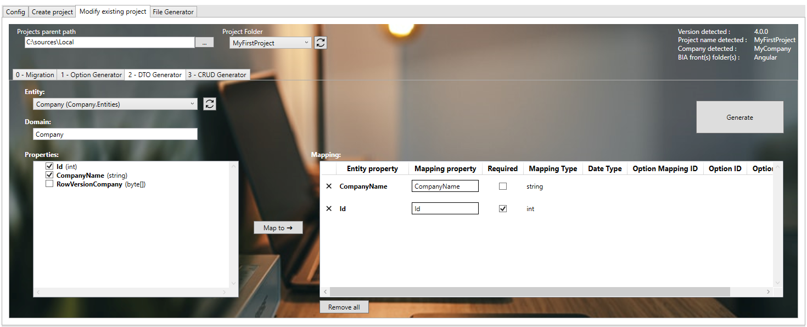
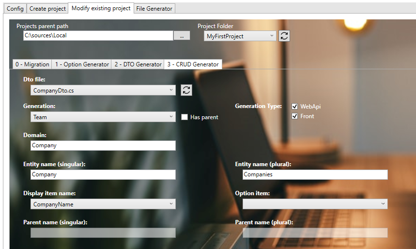

# Create your first Team
This page will explains how to create a team inside your project.

## Prerequisites
Make sure to have your project created by following the steps on [this page](./20-CreateYourFirstProject.md).

### Create the Model
1. In **'...\MyFirstProject\DotNet\MyCompany.MyFirstProject.Domain'** create **'Company'** folder, then create a folder **'Entities'** into it. Use the parent's domain existing module folder if exists.
2. Create empty class **'Company.cs'** and add following:
```csharp title="Company.cs"
// <copyright file="Company.cs" company="MyCompany">
// Copyright (c) MyCompany. All rights reserved.
// </copyright>

namespace MyCompany.MyFirstProject.Domain.Company.Entities
{
    using System.ComponentModel.DataAnnotations;
    using System.ComponentModel.DataAnnotations.Schema;
    using MyCompany.MyFirstProject.Domain.User.Entities;

    /// <summary>
    /// The company entity.
    /// </summary>
    public class Company : Team
    {
        /// <summary>
        /// Gets or sets the Id.
        /// </summary>
        public int Id { get; set; }

        /// <summary>
        /// Gets or sets the company name.
        /// </summary>
        public string CompanyName { get; set; }

        /// <summary>
        /// Add row version timestamp in table Company.
        /// </summary>
        [Timestamp]
        [Column("RowVersion")]
        public byte[] RowVersionCompany { get; set; }
    }
}
```
3. In case of children team, ensure to have logical links between the parent and child entities.

Make sure to inherit from `Team` and expose a `byte[]` row version property mapped to column `RowVersion`.  
Complete with all necessary properties.
:::tip  
You must expose the `Id` property even if it's hide the inherited property of `Team`
:::

### Complete DataContext
1. Go in **'...\MyFirstProject\DotNet\MyCompany.MyFirstProject.Infrastructure.Data'** folder.
2. Open **DataContext.cs** and add your new `DbSet<Company>` :

```csharp title="DataContext.cs"
    public class DataContext : BiaDataContext
    {
        // Existing DbSet<T>

        /// <summary>
        /// Gets or sets the Company DBSet.
        /// </summary>
        public DbSet<Company> Companies { get; set; }
    }
```
3. In folder **ModelBuilders**, create class **CompanyModelBuilder.cs** or use parent's model builder, and add :
```csharp title="CompanyModelBuilder.cs"
namespace MyCompany.MyFirstProject.Infrastructure.Data.ModelBuilders
{
    using Microsoft.EntityFrameworkCore;
    using MyCompany.MyFirstProject.Domain.Company.Entities;

    /// <summary>
    /// Class used to update the model builder for Company domain.
    /// </summary>
    public static class CompanyModelBuilder
    {
        /// <summary>
        /// Create the model for projects.
        /// </summary>
        /// <param name="modelBuilder">The model builder.</param>
        public static void CreateModel(ModelBuilder modelBuilder)
        {
            CreateCompanyModel(modelBuilder);
        }

        /// <summary>
        /// Create the model for companiess.
        /// </summary>
        /// <param name="modelBuilder">The model builder.</param>
        private static void CreateCompanyModel(ModelBuilder modelBuilder)
        {
            // Use ToTable() to create the inherited relation with Team in database
            modelBuilder.Entity<Company>().ToTable("Companies");
        }
    }
}
```
4. If added to existing parent's model builder, add only the method `CreateCompanyModel` and make a call inside the `CreateModel` method. 
5. Back to **DataContext.cs**, ensure to have a call to your model builder's method `CreateModel` :
```csharp title="DataContext.cs"
    public class DataContext : BiaDataContext
    {
        /// <inheritdoc cref="DbContext.OnModelCreating"/>
        protected override void OnModelCreating(ModelBuilder modelBuilder)
        {
            // Existing model builders
            
            CompanyModelBuilder.CreateModel(modelBuilder);
            this.OnEndModelCreating(modelBuilder);
        }
    }
```
6. In case of children team, ensure to specify logical links between the parent and child entities.

## Generate DTO
### Using BIAToolKit
1. Launch the **BIAToolKit**, go to the tab **"Modify existing project"**.
2. Set your parent project path, then select your project folder.
3. Go to **"DTO Generator"** tab.
4. Fill the form as following : 

5. Then, click on **Generate** button !

#### Children Team case
Complete the generated DTO : 
* ensure to set the first `AncestorTeam` parent's type into `BiaDtoClass` class annotation
* set `IsParent` to true in `BiaDtoField` field annotation for parent's id property
```csharp title="CompanyChildDto.cs"
/// <summary>
/// The DTO used to represent a company child.
/// </summary>
[BiaDtoClass(AncestorTeam = "Company")]
public class CompanyChildDto : TeamDto
{
    [...]

    /// <summary>
    /// Gets or sets the parent's company id.
    /// </summary>
    [BiaDtoField(IsParent = true, Required = true)]
    public int CompanyId { get; set; }
}
```

## Generate CRUD 
### Using BIAToolKit

1. Launch the **BIAToolKit**, go to the tab **"Modify existing project"**.
2. Set your parent project path, then select your project folder.
3. Go to **"CRUD Generator"** tab.
4. Fill the form as following : 

1. If your Team inherits from parent, click on the **"Has Parent"** checkbox and complete the parent's name singular and plural 
2. Then, click on **Generate** button !

### Customize generated files
After the files generation, some customization is needed.
#### Back
Open your DotNet project solution in **'...\MyFirstProject\DotNet'** and complete the following files.
##### RoleId.cs
1. Go in **'MyCompany.MyFirstProject.Crosscutting.Common\Enum'** folder and open **RoleId.cs** file.
2. Adapt the enum value of the generated value `CompanyAdmin`.
3. In case of children team, review the `TeamLeader` created value. Delete new generated value if already exists and in use by other teams.
##### TeamTypeId.cs
1. Stay in **'MyCompany.MyFirstProject.Crosscutting.Common\Enum'** folder and open **TeamTypeId.cs** file.
2. Adapt the enum value of the generated value `Company`.

#### Front
Open your Angular project folder **'...\MyFirstProject\Angular'** and complete the following files.
##### constants.ts
1. Go in **'src\app\shared'** folder and open **constants.ts** file.
2. Go in `TeamTypeId` enum declaration.
3. Adapt the enum value of the generated value `Company`.
##### navigation.ts
1. Stay in **'src\app\shared'** folder and open **navigation.ts** file.
2. Adapt the path of the generated navigation for companies :
```typescript title="navigation.ts"
    {
        labelKey: 'app.companies',
        permissions: [Permission.Company_List_Access],
        /// TODO after creation of CRUD Team Company : adapt the path
        path: ['/companies'],
      },
```
3. In case of children team, you can move if needed the generated content into the children's array of parent `BiaNavigation` :
```typescript title="navigation.ts"
  {
    labelKey: 'app.companies',
    permissions: [Permission.Company_List_Access],
    path: ['/companies'],
    children: [
      /// BIAToolKit - Begin Partial Navigation CompanyMaintenance
      {
        labelKey: 'app.company-maintenances',
        permissions: [Permission.CompanyMaintenance_List_Access],
        /// TODO after creation of CRUD Team Company : adapt the path
        path: ['/company-maintenances'],
      },
      /// BIAToolKit - End Partial Navigation CompanyMaintenance
    ],
  },
```
##### model.ts
1. Go in **'src\app\features\companies\model'** or the children parent's path of the generated feature `companies` and open the **company.ts** file.
2. Adapt the field configuration if needed.
3. Remove all unused imports from the generated file.

### Additionnal configuration
#### Automatic team selection mode
You can choose the selection mode if not default team has been set by the user : first available team (ordered by ID) or none (leave empty choice).
In back-end, open the **TeamConfig.cs** from the domain layer, and set the `TeamSelectionMode` for your team :
``` csharp title="TeamConfig.cs"
new BiaTeamConfig<Team>()
{
    // [...]
    TeamSelectionMode = BIA.Net.Core.Common.Enum.TeamSelectionMode.None,
},
```
#### Clear and choose no team in selector
You can set if the users can clear and select empty team in the team selector.
In front-end, open the **all-environments.ts** and set the `teamSelectionCanBeEmpty` for your team :
``` typescript title="all-environments.ts"
teams: [
    // [...]
    {
      // [...]
      teamSelectionCanBeEmpty: true
    },
]
```

### Complete traductions
1. Go in **'...\MyFirstProject\Angular\src\assets\i18n\app'**
2. Complete each available language traduction JSON file with the correct values : 
```json title="en.json"
"app": {
    //...
    "companies": "companies"
  },
  "company": {
    "add": "Add company",
    "edit": "Edit company",
    "listOf": "List of companies",
    "headerLabel": "Company",
    "admins": "Company administrators",
    "filterMember": "Member user",
    "goto": "View Company",
    "companyName": "Company name"
  },
```
### Update the database
1. Open the solution **'...\MyFirstProject\DotNet\MyFirstProject.sln'**.
2. Open a new Package Manager Console.
3. Set default project to **MyCompany.MyFirstProject.Infrastructure.Data**.
4. Run command `add-migration -context "DataContext" AddTeamCompany` (replace Company by your new team).
5. Verify the generated migration.
6. Run command `update-database -context "DataContext"`
7. Verify your database.

## Testing your Team 
1. Run the DotNet solution.
2. Launch `npm start` in Angular folder.
3. Go to *http://localhost:4200/*
4. Navigate to the company team list.

