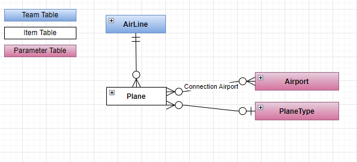
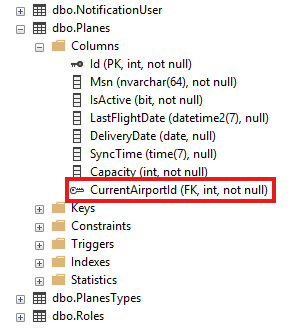
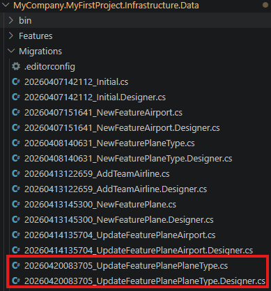
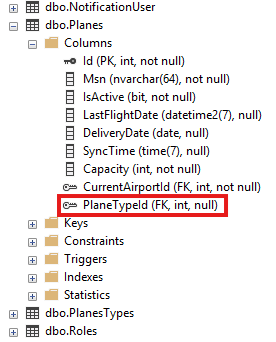
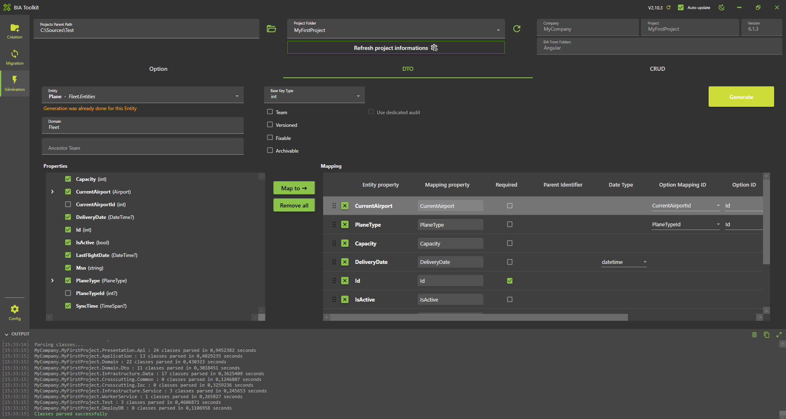
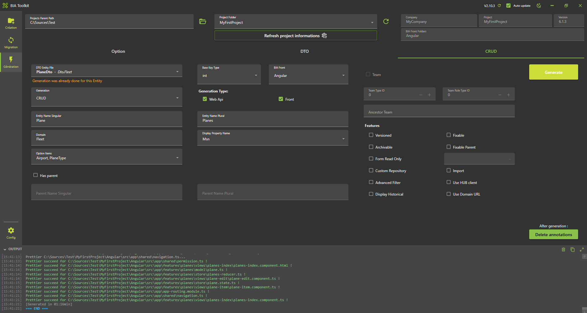
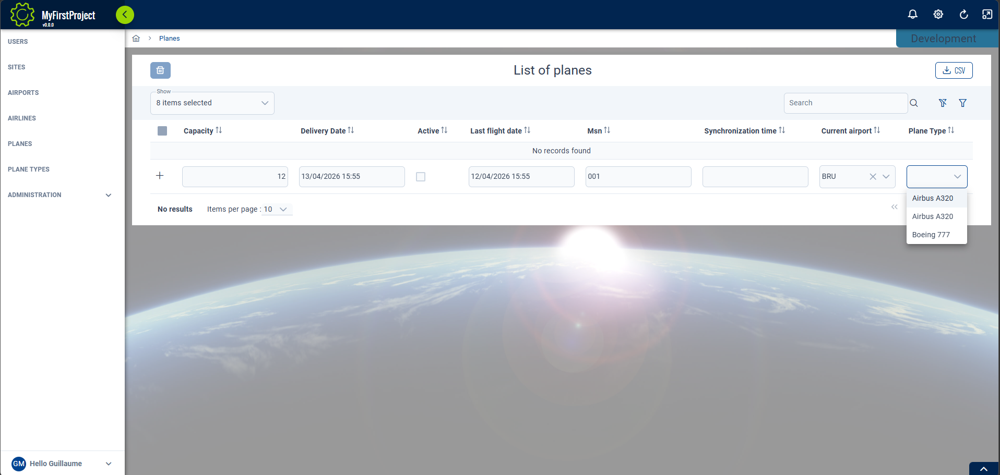

# Create your first Relation



## Create the relation Entity for Airport

* Open with Visual Studio 2022 the solution **'...\MyFirstProject\DotNet\MyFirstProject.sln'**.
* In **'...\MyFirstProject\DotNet\MyCompany.MyFirstProject.Domain\Fleet\Entities'** open class 'Plane.cs' and add 'Airport' declaration:
  
```csharp name=Plane.cs
        /// <summary>
        /// Gets or sets the current airport.
        /// </summary>
        public virtual Airport CurrentAirport { get; set; }

        /// <summary>
        /// Gets or sets the current airport id.
        /// </summary>
        public int CurrentAirportId { get; set; }
```

## Update Data

### Update the ModelBuilder

* In **'...\MyFirstProject\DotNet\MyCompany.MyFirstProject.Infrastructure.Data\ModelBuilders'**, open class 'PlaneModelBuilder.cs' and add 'Airport' relationship:

```csharp
/// <summary>
/// Create the model for planes.
/// </summary>
/// <param name="modelBuilder">The model builder.</param>
private static void CreatePlaneModel(ModelBuilder modelBuilder)
{
    ...
    modelBuilder.Entity<Plane>().HasOne(x => x.CurrentAirport).WithMany().HasForeignKey(x => x.CurrentAirportId)
}
```

### Update the DataBase

* In VSCode (folder MyFirstProject) press F1
* Click "Tasks: Run Tasks".
* Click "Database Add migration SqlServer" if you use SqlServer or "Database Add migration PostGreSql" if you use PostGerSql.
* Set the name "UpdateFeaturePlaneAirport" and press enter.
* Verify new file 'xxx_UpdateFeaturePlaneAirport.cs' is created on **'...\MyFirstProject\DotNet\MyCompany.MyFirstProject.Infrastructure.Data\Migrations'** folder, and file is not empty.


* In VSCode Run and Debug "DotNet DeployDB"
* Verify now if the table is updated (column 'CurrentAirportId' was added)




## Create the relation Entity for PlaneType

* Now let's do the same steps for PlaneType
* In **'...\MyFirstProject\DotNet\MyCompany.MyFirstProject.Domain\Fleet\Entities'** open class 'Plane.cs' and add 'PlaneType' declaration:
  
```csharp name=Plane.cs
/// <summary>
/// Gets or sets the plane type.
/// </summary>
public virtual PlaneType PlaneType { get; set; }

/// <summary>
/// Gets or sets the plane type id.
/// </summary>
public int? PlaneTypeId { get; set; }
```

## Update Data

### Update the ModelBuilder

* In **'...\MyFirstProject\DotNet\MyCompany.MyFirstProject.Infrastructure.Data\ModelBuilders'**, open class 'PlaneModelBuilder.cs' and add 'PlaneType' relationship:

```csharp
/// <summary>
/// Create the model for planes.PlaneTypeId
/// </summary>
/// <param name="modelBuilder">The model builder.</param>
private static void CreatePlaneModel(ModelBuilder modelBuilder)
{
    ...
    modelBuilder.Entity<Plane>().HasOne(x => x.PlaneType).WithMany().HasForeignKey(x => x.PlaneTypeId);

}
```

### Update the DataBase

* In VSCode (folder MyFirstProject) press F1
* Click "Tasks: Run Tasks".
* Click "Database Add migration SqlServer" if you use SqlServer or "Database Add migration PostGreSql" if you use PostGerSql.
* Set the name "UpdateFeaturePlanePlaneType" and press enter.
* Verify new file 'xxx_UpdateFeaturePlanePlaneType.cs' is created on **'...\MyFirstProject\DotNet\MyCompany.MyFirstProject.Infrastructure.Data\Migrations'** folder, and file is not empty.



* In VSCode Run and Debug "DotNet DeployDB"
* Verify now if the table is updated (column 'PlaneTypeId' was added)




## Create the DTO
### Using BIAToolKit
* Start the BIAToolKit and go on "Modify existing project" tab*
* Set the projects parent path and choose your project
* Open "DTO Generator" tab
* Choose entity: Plane
* Information message appear: "Generation was already done for this Entity"
* Verify all properties are correctly selected and mapped
* Check the property PlaneType and click on "Map To" button
* New mapping Airport and PlaneType with mapping Type "Option" should be added on the list
* **WARNING : Make sure to have a backup of your previous Mapper before generating**
* Click on generate button




## Generate CRUD
### Using BIAToolKit
* Start the BIAToolKit and go on "Modify existing project" tab*
* Set the projects parent path and choose your project
* Open "CRUD Generator" tab
* Choose Dto file: PlaneTypeDto.cs
* Information message appear: "Generation was already done for this Dto file"
* On option item list, check "Airport" and "PlaneType" value
* Verify all properties are correctly selected
* Click on generate button



### Complete generated files
Update the Mapper 'PlaneMapper':
Re-add custom code from your previous backup if any

### Check DotNet generation

* Return to Visual Studio 2022 on the solution '...\MyFirstProject\DotNet\MyFirstProject.sln'.
* Rebuild solution
* Project will be run, launch IISExpress to verify it.

### Check Angular generation
* Run VS code and open the folder 'C:\Sources\Test\MyFirstProject\Angular'
* Launch command on terminal
```
npm start
```

## Complete traduction

Open **'...\MyFirstProject\Angular\src\assets\i18n\app\en.json'** and add:
``` json
  "plane": {
    ...
    "currentAirport": "Current airport",
    "planeType" : "Plane Type"
  },
```

Open **'...\MyFirstProject\Angular\src\assets\i18n\app\es.json'** and add:
``` json
  "plane": {
    ...
    "currentAirport": "Aeropuerto actual",
    "planeType": "Tipo de avión"
  },
```

Open **'...\MyFirstProject\Angular\src\assets\i18n\app\fr.json'** and add:
``` json
  "plane": {
    ...
    "currentAirport": "Aéroport actuel",
    "planeType": "Type d'avion"
  },
```
## Test

* Open web navigator on address: http://localhost:4200/ to display front page
* Open 'Plane' page and verify label has been replaced and Airport option is available on the list

