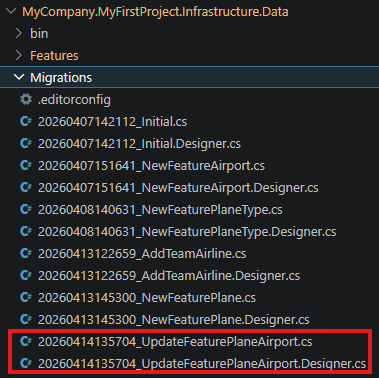
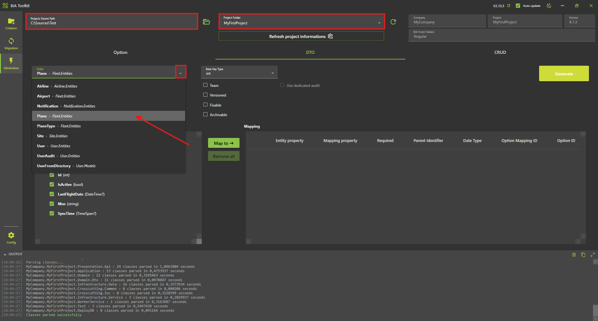
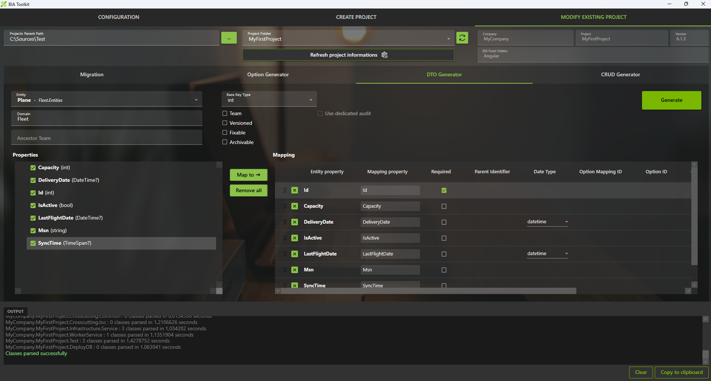
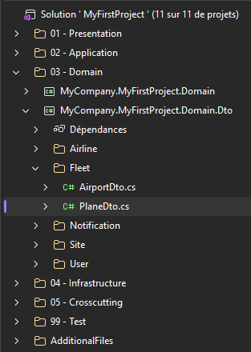
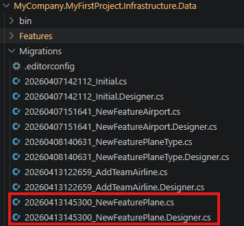
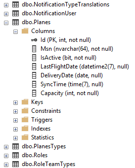
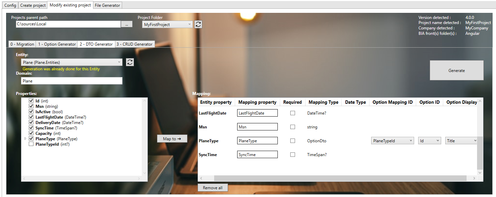
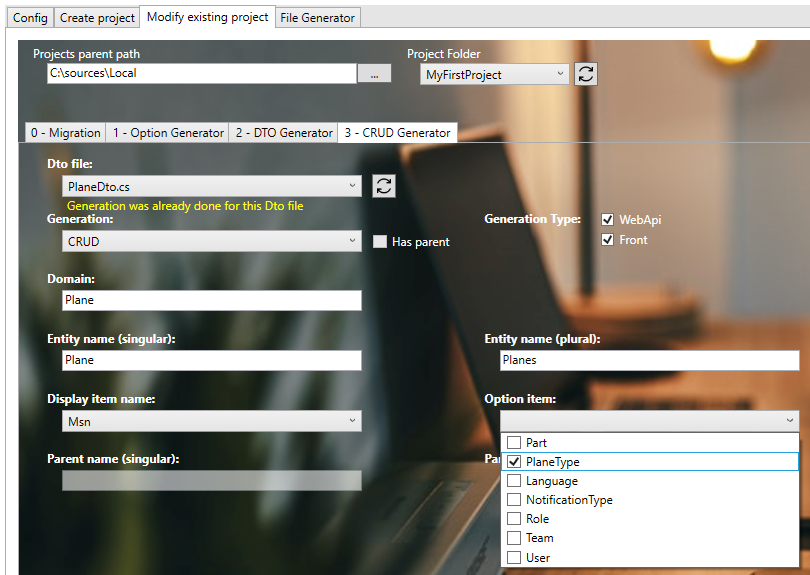

# Create your first Relation

## Create the relation Entity for Airport

* Open with Visual Studio 2022 the solution **'...\MyFirstProject\DotNet\MyFirstProject.sln'**.
* Open the entity 'Plane':
* In **'...\MyFirstProject\DotNet\MyCompany.MyFirstProject.Domain\Fleet\Entities'** open class 'Plane.cs' and add 'Airport' declaration:
  
```csharp name=Plane.cs
        /// <summary>
        /// Gets or sets the current airport.
        /// </summary>
        public virtual Airport CurrentAirport { get; set; }

        /// <summary>
        /// Gets or sets the current airport id.
        /// </summary>
        public int CurrentAirportId { get; set; }
```

## Update Data

### Update the ModelBuilder

* In **'...\MyFirstProject\DotNet\MyCompany.MyFirstProject.Infrastructure.Data\ModelBuilders'**, open class 'PlaneModelBuilder.cs' and add 'Airport' relationship:

```csharp
/// <summary>
/// Create the model for planes.
/// </summary>
/// <param name="modelBuilder">The model builder.</param>
private static void CreatePlaneModel(ModelBuilder modelBuilder)
{
    ...
    modelBuilder.Entity<Plane>().HasOne(x => x.CurrentAirport).WithMany().HasForeignKey(x => x.CurrentAirportId)
}
```

## Update the DataBase

* In VSCode (folder MyFirstProject) press F1
* Click "Tasks: Run Tasks".
* Click "Database Add migration SqlServer" if you use SqlServer or "Database Add migration PostGreSql" if you use PostGerSql.
* Set the name "UpdateFeaturePlaneAirport" and press enter.
* Verify new file 'xxx_UpdateFeaturePlaneAirport.cs' is created on **'...\MyFirstProject\DotNet\MyCompany.MyFirstProject.Infrastructure.Data\Migrations'** folder, and file is not empty.




## Create the DTO

### Using BIAToolKit
* Open the BIAToolKi
* Go to "Modify existing project" tab
* Set the projects parent path and choose your project
* Go to tab 3 "DTO Generator"
* Select your entity Plane on the list


* Click on "Map to" button
* Check the required checkbox for the Id mapping property



* Then click the "Generate" button
* The DTO and the mapper will be generated
* Check in the project solution if the DTO and mapper are present



## Update Data

Open the 'PlaneModelBuilder.cs' in **'...\MyFirstProject\DotNet\MyCompany.MyFirstProject.Infrastructure.Data\ModelBuilders'** and add : 

``` csharp
        public static void CreateModel(ModelBuilder modelBuilder)
        {
        ...
            CreatePlaneModel(modelBuilder);
        }

        /// <summary>
        /// Create the model for planes.
        /// </summary>
        /// <param name="modelBuilder">The model builder.</param>
        private static void CreatePlaneModel(ModelBuilder modelBuilder)
        {
            modelBuilder.Entity<Plane>().HasKey(p => p.Id);
            modelBuilder.Entity<Plane>().Property(p => p.Msn).IsRequired().HasMaxLength(64);
            modelBuilder.Entity<Plane>().Property(p => p.IsActive).IsRequired();
            modelBuilder.Entity<Plane>().Property(p => p.LastFlightDate).IsRequired(false);
            modelBuilder.Entity<Plane>().Property(p => p.DeliveryDate).IsRequired(false);
            modelBuilder.Entity<Plane>().Property(p => p.SyncTime).IsRequired(false);
            modelBuilder.Entity<Plane>().Property(p => p.Capacity).IsRequired();
        }
```

### Update DataContext file

Open **'...\MyFirstProject\DotNet\MyCompany.MyFirstProject.Infrastructure.Data\DataContext.cs'** file and declare the DbSet associated to Plane:

``` csharp
/// <summary>
/// Gets or sets the Plane DBSet.
/// </summary>
public DbSet<Plane> Planes { get; set; }
```

### Update the DataBase

* In VSCode (folder MyFirstProject) press F1
* Click "Tasks: Run Tasks".
* Click "Database Add migration SqlServer" if you use SqlServer or "Database Add migration PostGreSql" if you use PostGerSql.
* Set the name "NewFeaturePlane" and press enter.
* Verify new file 'xxx_NewFeaturePlane.cs' is created on '...**\MyFirstProject\DotNet\MyCompany.MyFirstProject.Infrastructure.Data\Migrations'** folder, and file is not empty.



* In VSCode Run and Debug  "DotNet DeployDB"
* Verify 'Planes' table is created in the database.



# TODO

## Create the relation Entity
* Open with Visual Studio 2026 the solution **'...\MyFirstProject\DotNet\MyFirstProject.sln'**.
* Open the entity 'Fleet':
* In **'...\MyFirstProject\DotNet\MyCompany.MyFirstProject.Domain\Fleet\Entities'** open class 'Plane.cs' and add 'PlaneType' declaration: 
  
```csharp
/// <summary>
/// Gets or sets the  plane type.
/// </summary>
public virtual PlaneType PlaneType { get; set; }

/// <summary>
/// Gets or sets the plane type id.
/// </summary>
public int? PlaneTypeId { get; set; }
```

## Update Data
### Update the ModelBuilder
* In '...\MyFirstProject\DotNet\MyCompany.MyFirstProject.Infrastructure.Data\ModelBuilders', open class 'PlaneModelBuilder.cs' and add 'PlaneType' relationship: 
 
```csharp
/// <summary>
/// Create the model for planes.
/// </summary>
/// <param name="modelBuilder">The model builder.</param>
private static void CreatePlaneModel(ModelBuilder modelBuilder)
{
    ...
    modelBuilder.Entity<Plane>().Property(p => p.PlaneTypeId).IsRequired(false); // relationship 0..1-*
    modelBuilder.Entity<Plane>().HasOne(x => x.PlaneType).WithMany().HasForeignKey(x => x.PlaneTypeId);
}
```

### Update the DataBase
* Launch the Package Manager Console (Tools > Nuget Package Manager > Package Manager Console).
* Be sure to have the project **MyCompany.MyFirstProject.Infrastructure.Data** selected as the Default Project in the console and the project **MyCompany.MyFirstProject.Presentation.Api** as the Startup Project of your solution
* Run first command:    
```ps
Add-Migration 'update_feature_Plane' -Context DataContext 
```
* Verify new file *'xxx_update_feature_Plane.cs'* is created on '...\MyFirstProject\DotNet\MyCompany.MyFirstProject.Infrastructure.Data\Migrations' folder, and file is not empty.
* Update the database when running this command: 
```ps
Update-DataBase -Context DataContext
```
* Verify 'Planes' table is updated in the database (column *'PlaneTypeId'* was added).
  
## Create the DTO
### Using BIAToolKit
* Start the BIAToolKit and go on "Modify existing project" tab*
* Set the projects parent path and choose your project
* Open "DTO Generator" tab
* Generation:
  * Choose entity: *Plane*
  * Information message appear: "Generation was already done for this Entity"
  * Verify "Domain" value is *Plane*
  * Verify all properties are correctly selected and mapped
  * Check the property *PlaneType* and click on "Map To" button
  * New mapping PlaneType with mapping Type "Option" should be added on the list 



* ***WARNING :* Make sure to have a backup of your previous Mapper before generating**
* Click on generate button

## Generate CRUD
### Using BIAToolKit
* Start the BIAToolKit and go on "Modify existing project" tab*
* Set the projects parent path and choose your project
* Open "CRUD Generator" tab
* Generation:
  * Choose Dto file: *PlaneDto.cs*
  * Information message appear: "Generation was already done for this Dto file"
  * Verify "WebApi" and "Front" Generation are checked
  * Verify "CRUD" Generation Type is choosen
  * Verify "Entity name (singular)" value is *Plane*
  * Verify "Entity name (plural)" value is *Planes*
  * Verify "Display item"  value is *Msn*
  * On option item list, check "PlaneType" value



  * Click on "Generate" button

### Complete generated files
* Update the Mapper 'PlaneMapper':
  * Re-add custom code from your previous backup if any

## Check DotNet generation
* Return to Visual Studio 2022 on the solution '...\MyFirstProject\DotNet\MyFirstProject.sln'.
* Rebuild solution
* Project will be run, launch IISExpress to verify it. 

## Check Angular generation
* Run VS code and open the folder 'C:\Sources\Test\MyFirstProject\Angular'
* Launch command on terminal 
```ps
npm start
```

## Test
* Open 'src/app/shared/navigation.ts' file and update path value to *'/planes'* for block with "labelKey" value is *'app.planes'*   
(see 'src/app/app-routing.module.ts' file to get the corresponding path)
* Open web navigator on address: *http://localhost:4200/* to display front page
* Click on *"PLANES"* tab to display 'Planes' page.

1.    Add traduction
* Open 'src/assets/i18n/app/en.json' and add:
```json
  "plane": {
    ...
    "planeType": "Plane Type",
  },
```  
* Open 'src/assets/i18n/app/fr.json' and add:
```json
  "app": {
    ...
    "planes": "Avions",
  },
  "plane": {
    ...
    "planeType": "Type d'avions",
  },
```
* Open 'src/assets/i18n/app/es.json' and add:
```json
  "app": {
    ...
    "planes": "Planos",
  },
  "plane": {
    ...
    "planeType": "Tipos de planos",
  },
```  
* Open web navigator on address: *http://localhost:4200/* to display front page
* Open 'Plane' page and verify label has been replaced and PlaneType option is available on the list