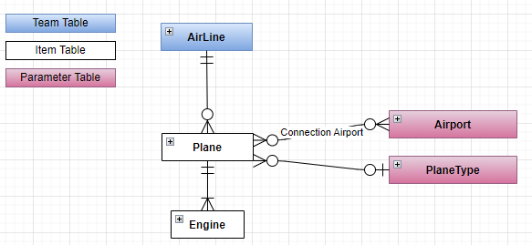
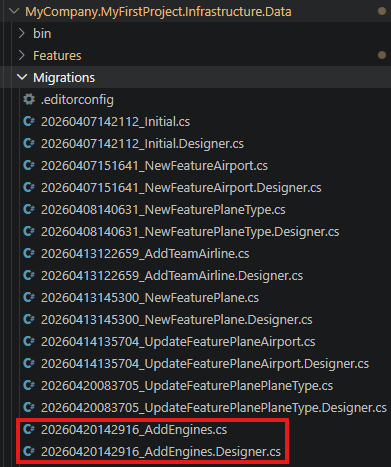
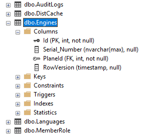
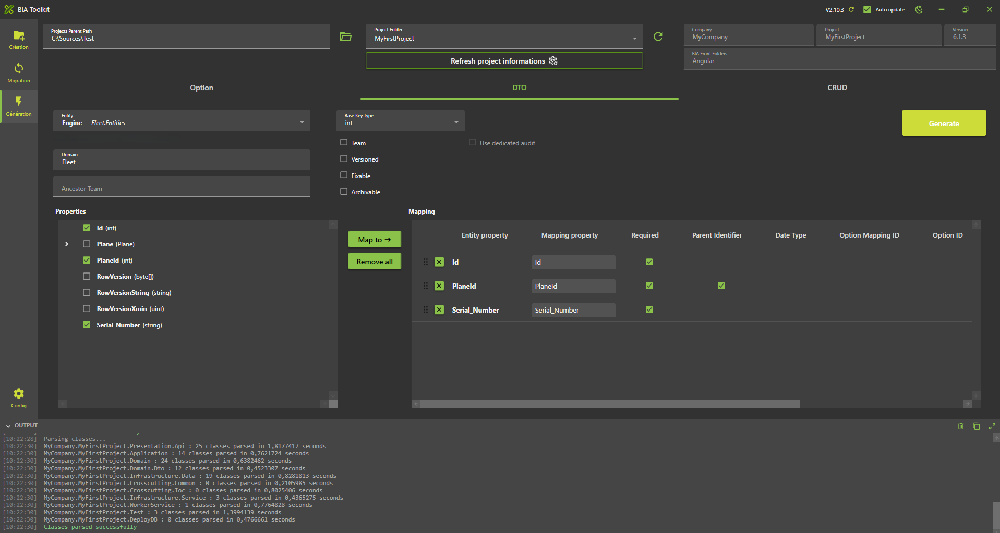
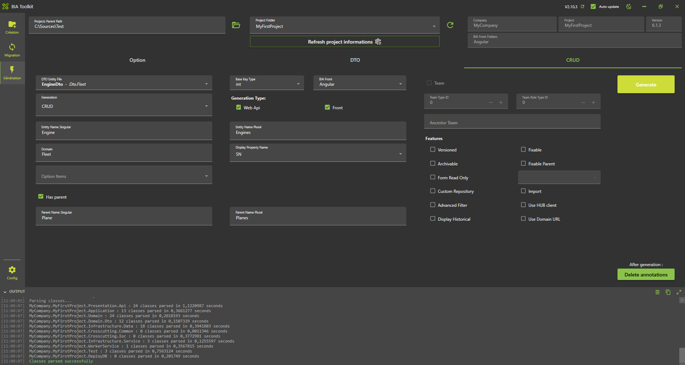
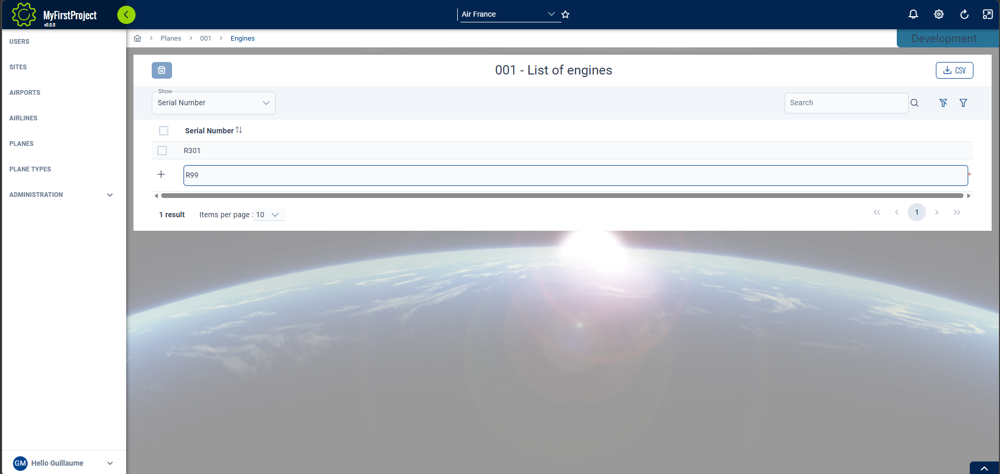

# Create Engine Child
We will create in first the child feature 'Engine'.



## Prerequisites
### CRUD Parent creation
Follow steps from the section [Create your first CRUD](./30-CreateAirportAndPlaneTypeCRUD.md) to create the parent's child.

We will assume that the parent is a Plane for this documentation.

## Create the Model
* In **'...\MyFirstProject\DotNet\MyCompany.MyFirstProject.Domain\Fleet\Entities'**
* Create empty class **'Engine.cs'** and add following:
  
```csharp title="Engine.cs"
// <copyright file="Engine.cs" company="MyCompany">
// Copyright (c) MyCompany. All rights reserved.
// </copyright>

namespace MyCompany.MyFirstProject.Domain.Fleet.Entities
{
    using BIA.Net.Core.Domain;
    using BIA.Net.Core.Domain.Entity.Interface;
    using MyCompany.MyFirstProject.Domain.Fleet.Entities;

    /// <summary>
    /// The engine entity.
    /// </summary>
    public class Engine : VersionedTable, IEntity<int>
    {
        /// <summary>
        /// Gets or sets the engine Id.
        /// </summary>
        public int Id { get; set; }

        /// <summary>
        /// Gets or sets the engine serial number.
        /// </summary>
        public string Serial_Number { get; set; }

        /// <summary>
        /// Gets or sets the plane Id.
        /// </summary>
        public int PlaneId { get; set; }

        /// <summary>
        /// Gets or sets the plane.
        /// </summary>
        public virtual Plane Plane { get; set; }
    }
}
```

* In **Plane.cs**, add Engine declaration
  
```csharp title="Plane.cs"
/// <summary>
/// Gets or sets the list of engines.
/// </summary>
        public ICollection<Engine> Engines { get; set; }
```
## Update Data
### Update DataContext
* Go in **'...\MyFirstProject\DotNet\MyCompany.MyFirstProject.Infrastructure.Data'** folder.
* Open **DataContext.cs** and add your new `DbSet<Engine>` :

```csharp title="DataContext.cs"
/// <summary>
/// Gets or sets the Engine DBSet.
/// </summary>
public DbSet<Engine> Engines { get; set; }
```

### Update the ModelBuilder
* In **'...\MyFirstProject\DotNet\MyCompany.MyFirstProject.Infrastructure.Data\ModelBuilders\PlaneModelBuilder.cs'** add :

```csharp title="PlaneModelBuilder.cs"
public static void CreateModel(ModelBuilder modelBuilder)
{
    ...
    CreateEngineModel(modelBuilder);
}

/// <summary>
/// Create the model for engines.
/// </summary>
/// <param name="modelBuilder">The model builder.</param>
private static void CreateEngineModel(ModelBuilder modelBuilder)
{
    modelBuilder.Entity<Engine>().HasOne(x => x.Plane).WithMany(x => x.Engines).HasForeignKey(x => x.PlaneId);
}
```

### Update the Database

* In VSCode (folder MyFirstProject) press F1
* Click "Tasks: Run Tasks".
* Click "Database Add migration SqlServer" if you use SqlServer or "Database Add migration PostGreSql" if you use PostGerSql.
* Set the name "AddEngines" and press enter.
* Verify new file 'xxx_AddEngines.cs' is created on **'...\MyFirstProject\DotNet\MyCompany.MyFirstProject.Infrastructure.Data\Migrations'** folder, and file is not empty.



* In VSCode Run and Debug  "DotNet DeployDB"
* Verify 'Engines' table is created in the database.




## Generate DTO
### Using BIAToolKit
* Launch the **BIAToolKit**, go to the tab **"Modify existing project"**.
* Set your parent project path, then select your project folder.
* Go to **"DTO Generator"** tab.
* Fill the form as following : 
   


* Then, click on **Generate** button !

## Generate CRUD
### Using BIAToolKit
* Launch the **BIAToolKit**, go to the tab **"Modify existing project"**.
* Set your parent project path, then select your project folder.
* Go to **"CRUD Generator"** tab.
* Fill the form as following
* Based on this informations, the BIAToolKit will detect automatically the parent's folders to generate the new CRUD child. Make sure to fill the correct informations without misspelling.
* Then click on Generate button.



## Complete traductions

* Open **'...\MyFirstProject\Angular\src\assets\i18n\app\en.json'** and add:

```json title="en.json"
"app": {
    ...
    "engines": "Engines"
  },
  "plane": {
    ...
    "engines" : "Engines"
  },
  "engine": {
    "add": "Add engine",
    "edit": "Edit engine",
    "listOf": "List of engines",
    "plane": "Plane",
    "serial_Number": "Serial Number"
  }
```

Open **'...\MyFirstProject\Angular\src\assets\i18n\app\es.json'** and add:

``` json title="es.json"
  "app": {
    ...
    "engines": "Motores"
  },  
  "plane": {
    ...
    "engines" : "Motores"
  },
  "engine": {
    "add": "Añadir motor",
    "edit": "Editar motor",
    "listOf": "Lista de motores",
    "plane": "Avión",
    "serial_Number": "Número de serie"
  }
```

Open **'...\MyFirstProject\Angular\src\assets\i18n\app\fr.json'** and add:
``` json
  "app": {
    ...
    "engines": "Moteurs"
  },
    "plane": {
    ...
    "engines" : "Moteurs"
  },
  "engine": {
    "add": "Ajouter moteur",
    "edit": "Modifier moteur",
    "listOf": "Liste des moteurs",
    "plane": "Avion",
    "serial_Number": "Numéro de série"
  }
```

## Test
* Run the DotNet solution.
* Launch `npm start` in Angular folder.
* Go to *http://localhost:4200/*
* Navigate to the plane list.
* Select one plane (create one if needed) and click on the button "Engines"
* You should access to the engines list of the plane.
