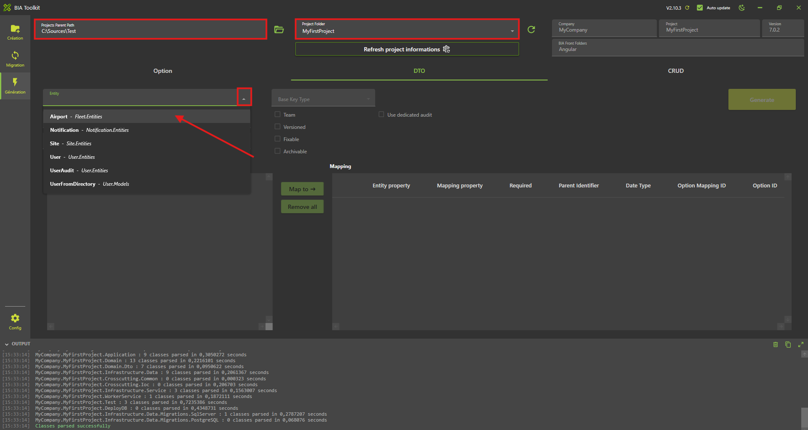
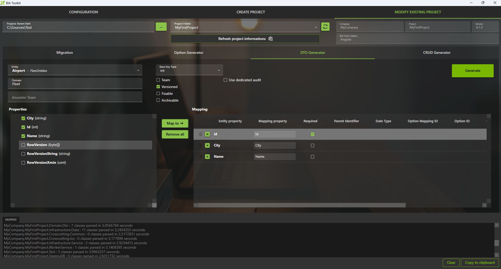
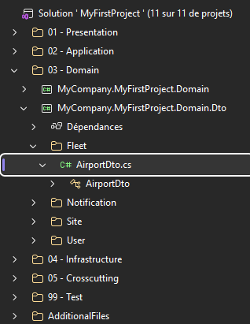

# Create your first CRUD
We will create in first the feature 'Airport'.

## Create the Entity
* Open with Visual Studio 2022 or VS Code the solution '...\MyFirstProject\DotNet\MyFirstProject.sln'.
* Create the entity 'Airport':
* In '...\MyFirstProject\DotNet\MyCompany.MyFirstProject.Domain\' create 'Fleet' folder.
* Create 'Entities' subfolder.
* Create empty class 'Airport.cs' and add: 

```csharp
// <copyright file="Airport.cs" company="TheBIADevCompany">
// Copyright (c) TheBIADevCompany. All rights reserved.
// </copyright>

namespace TheBIADevCompany.BIADemo.Domain.Fleet.Entities
{
    using Audit.EntityFramework;
    using BIA.Net.Core.Domain.Entity;

    /// <summary>
    /// The airport entity.
    /// </summary>
    [AuditInclude]
    public class Airport : BaseEntityVersioned<int>
    {
        /// <summary>
        /// Gets or sets the name of the airport.
        /// </summary>
        public string Name { get; set; }

        /// <summary>
        /// Gets or sets the City where is the airport.
        /// </summary>
        public string City { get; set; }
    }
}
```

## Create the DTO
### Using BIAToolKit
For more informations about creating a DTO, see [Create a DTO with BIAToolkit documentation](../../30-BIAToolKit/30-CreateDTO.md)

* Open the BIAToolkit
* Go to "Modify existing project" tab
* Set the projects parent path and choose your project
* Go to tab 3 "DTO Generator"
* Select your entity **Airport** on the list



 Click on "Map to" button
* All the selected properties will be added to the mapping table that represents that properties that will be generated in your corresponding DTO
* Check the required checkbox for the Id mapping property



* Then click the "Generate" button
* The DTO and the mapper will be generated
* Check in the project solution if the DTO and mapper are present

