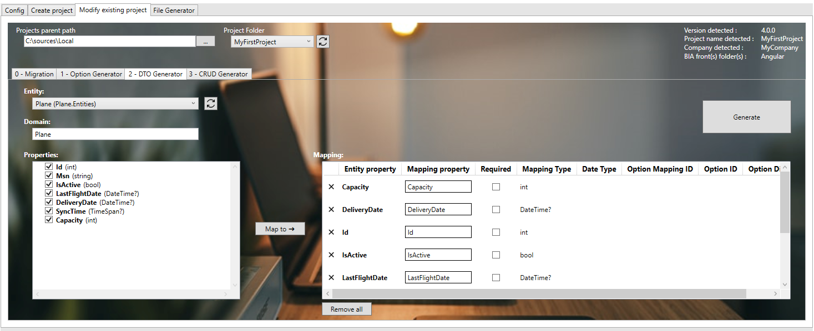
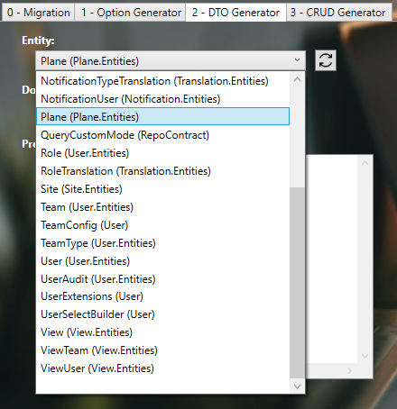
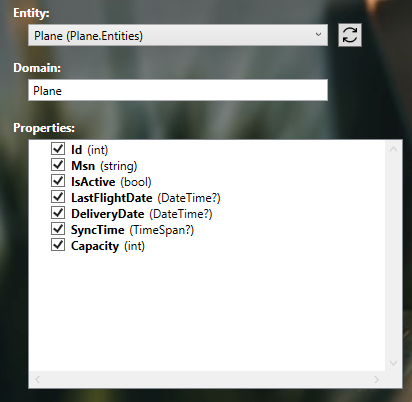
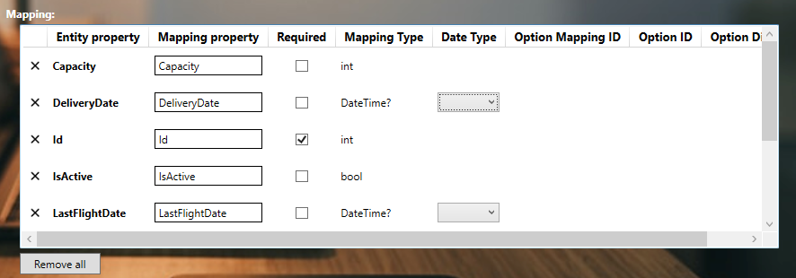
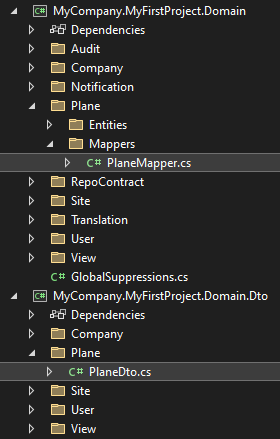
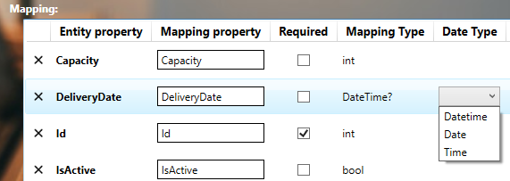
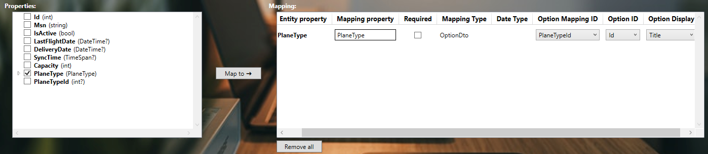
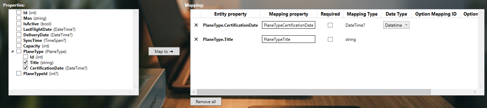
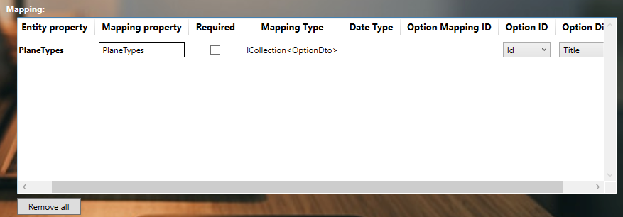

# Create DTO on existing project with the BIA tool kit
This document explains how to create a DTO with the BIAToolKit.



## Prerequisite
### Project
* You need to have an existing project. In other case, create it as [Describe here](./20-CreateProject.md).
* In first time, your project must contain: *entity* associated to the DTO you want to create.
* Project must contain **.bia** folders as 
  


### Entity
Before creating a DTO, you must create an entity in the layer domain first.  
The DTO generator will add to the entity list all availables entities with their associated domain :



## Create the DTO
The DTO generator will create both the DTO and the mapper between the entity and the generated DTO.
### Without relations in entity
1. Choose your entity
2. Set the domain of the entity if empty or incorrect
3. The properties of the entity will be added to the property list on the left  

4. Select the properties that will be mapped into the DTO
5. Click on the "Map to" button to add the properties to Mapping table

6. Custom if needed the mapping property names
7. Check required column if needed for each property
8. Click on generate button !

The DTO will be generated in the Domain.Dto layer, under your selected domain name.  
The mapper between the entity and the DTO will be generated in the Domain layer, under your selected domain name and Mappers.


#### Date Type
For the date or timespan properties, the mapped properties can be set to be displayed in CRUD component as a formatted date.  
You can select for the compatible types the **Date Type** value to your target :

   
### With relations in entity
When having an entity with relations, the BIaToolKit will analyze the relation between the entity and the differents objects in order to automatically map the linked proprties to `OptionDto` objects.

In this section we will use the relation entity to `PlaneType` as seen in the chapter [Create your first relation](../10-Introduction/30-TryIt/45-CreateYourFirstRelation.md).
#### Single relation
When your entity has a single object relation, you must have on your entity both relation object property and `int` relation identifier to the relation entity : 
```csharp title="plane.cs"
/// <summary>
/// Gets or sets the  plane type.
/// </summary>
public virtual PlaneType PlaneType { get; set; }

/// <summary>
/// Gets or sets the plane type id.
/// </summary>
public int? PlaneTypeId { get; set; }
```
1. Select your entity
2. Select only `PlaneType` property
3. Click on "Map to" button


Here you can see on the Mapping table that the mapped property has a **Mapping Type** of `OptionDto` : 
* **Option Mapping ID** corresponds to the `int` property of your *entity* that corresponds to the relation object identifier.  
* **Option ID** corresponds to the identifier property of your *relationship entity*.
* **Option Display** corresponds to the property used as display in the `OptionDto` from your *relationship entity*.

If you select both the object relation and the `int` id to object relation in your entity to map in the DTO, the BiaToolkit will automatically exclude the `int` property from the selection to avoid duplicate operations :


In other hand, you can map the inner properties of your relation object to specific properties of your DTO :


#### Many relations
Considering now the following case with multiple `PlaneType` associated to the `Plane` :
```csharp title="plane.cs"
/// <summary>
/// Gets or sets the plane types.
/// </summary>
public virtual ICollection<PlaneType> PlaneTypes { get; set; }

/// <summary>
/// Gets or sets the plane type from relation table.
/// </summary>
public virtual ICollection<PlanePlaneType> PlanePlaneTypes { get; set; }
```
You must have in your project an existing relationnal entity dedicated to link `Plane` and `PlaneType` :
```csharp title="planeplanetype.cs"
/// <summary>
/// The entity conformcertif repair site.
/// </summary>
public class PlanePlaneType : VersionedTable
{
    /// <summary>
    /// Gets or sets the Plane.
    /// </summary>
    public Plane Plane { get; set; }

    /// <summary>
    /// Gets or sets the Plane id.
    /// </summary>
    public int PlaneId { get; set; }

    /// <summary>
    /// Gets or sets the PlaneType.
    /// </summary>
    public PlaneType PlaneType { get; set; }

    /// <summary>
    /// Gets or sets the PlaneType id.
    /// </summary>
    public int PlaneTypeId { get; set; }
}
```
1. Select your entity
2. Select only `PlaneTypes` property
3. Click on "Map to" button


Here you can see on the Mapping table that the mapped property has a **Mapping Type** of `ICollection<OptionDto>` :
* **Option ID** corresponds to the identifier property of your *relationship entity*.
* **Option Display** corresponds to the property used as display in the `OptionDto` from your *relationship entity*.
