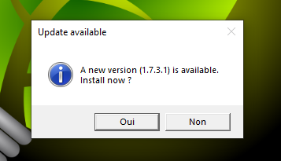
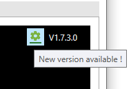
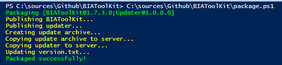

# Deploy BIAToolKit
This document explains how to deploy the BIAToolKit as portable application to a distribution server with automatic update.

## Update workflow
1. At launch, the application BIA.Toolkit will check on the distribution server if a new version has been deployed by checking the value contained in the **version.txt** file  
2. If the version is superior to the current version of running BIA.Toolkit and after update confirmation given by the user, the **BIA.Toolkit.Updater.exe** and the new version in the archived ZIP will be downloaded locally from the distribution server
3. Then, the updater will close BIA.Toolkit, unzip the archive into BIA.Toolkit installation folder, and launch BIA.Toolkit

## Deploy
### Configure package
In the solution, expand **90 - Package** folder folder and create a `package.json` file :
``` json title="package.json"
{
  "distributionServer": "\\\\share.bia.{company}\\BIAToolKit",
  "packageArchiveName": "BIAToolKit.zip",
  "packageVersionFileName": "version.txt"
}
```
Replace `distributionServer` value by the target folder that will act as distribution server.
### Set automatic update
In the **BIA.ToolKit** application, open the **App.Config** file and set the value for the automatic update :
``` xml title="App.Config"
<configuration>
	<appSettings>
		<add key="AutoUpdate" value="True"/>
	</appSettings>
</configuration>
```
If set to true, the user will be informed at launch that a new version is available :  


In any case, a notification of a new version is displayed beside the current version of the BIA.Toolkit.  
The user can click to launch the update :  


### Set BIAToolKit version 
Edit the .csproj of the **BIA.ToolKit** application to update the version number :
``` xml title="BIA.Toolkit.csproj"
<Project Sdk="Microsoft.NET.Sdk">
	<PropertyGroup>
		<Version>1.7.3.0</Version>
	</PropertyGroup>
</Project>
```
:::tip
Do the same for the **BIA.ToolKit.Updater** project if needed.
:::
### Launch package
In **90 - Package** folder, execute the `package.ps1` powershell script :  


Then, check the distribution server. You must have :
- Archive ZIP of the packaged version
- Updater at last version
- `version.txt` that contains the packaged version of BIA.Toolkit
- Backups folder with old and current versions of BIA.Toolkit and updater
