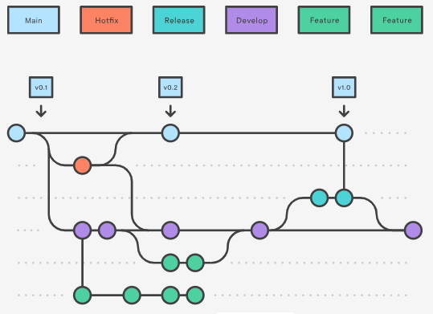
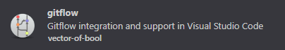
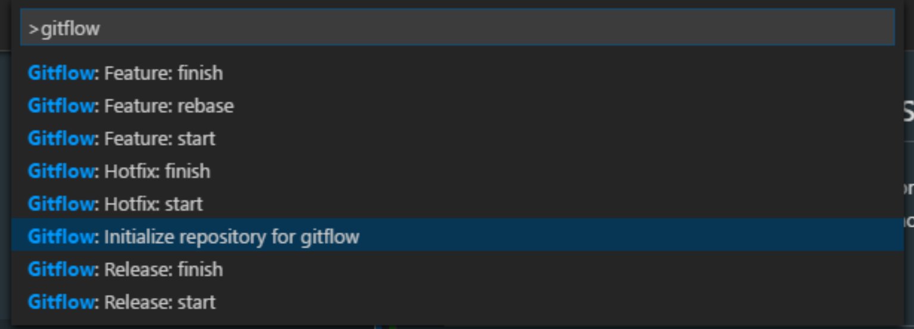

# Git Branching best practice

The goal of this page is to harmonize the git branching usage for all projects build with the BIAFramework.

The standard flow is Git flow

The strategy depend on the size of the project:

# Common strategy :
- Use a main branch and Develop branch.
- Create a release Branch for each delivery
- For hotfix create a specific branch.

## Project with 1 or 2 developers:
- Standard usage : work on Develop Branch
- For hudge feature you can create a dedicated branch.
  
## Project more the 2 developers:
- Standard usage : Develop all your Features on dedicated Branch
- For very small change you can work directly on Develop Branch

## Initialize gitflow extension
- Just install the gitflow extension for VS Code.
  
- If the initialisation have never be done press F1 (=shortcut to open VS Code Command Palette) and select 'GitFlow: Initialize repository for gitflow' (if you have an error at the first init, try a second one)
- 
- Follow the command prompts and accept the defaults...

## Use the gitflow extension
- Develop on Develop branch:
  - Pull the last version of the deveop branch and push small commits (~daily) on it.
- Develop on Feature branch:
  -  Type F1 + GitFlow: Feature: start
     -  Enter an explicit name for the feature. 
        => This action create the "feature\[Name of the feature]" branch.
  -  Push small commits (~daily) on this feature branch.
  -  2 soultion to finalize the feature:
     -  Type F1 + GitFlow: Feature: finish 
     -  Create a pull request from feature branch to develop. Warning **the feature branch should be delete** in case of squash validation.
  -  .... repeat for every feature ...
- To deliver in the both case:
  - Ensure you have change the version name in de constant.cs (DotNet) and environment.json (Angular) files :
  - Type F1 + GitFlow: Release: start
    - For the release name enter the name of the version at the format : Vx.y.z
  - You can verify that all compile.
  - Type F1 + GitFlow: Release: finish 
    - Enter the tag name (=version name) at the format Vx.y.z

- In case of hotFix
  - Type F1 + GitFlow: HotFix: start 
    - Enter for the name of the HotFix the new version at the format : Vx.y.z (you should increment the last digit)
  - Push small commits (~daily) on the created hotfix\Vx.y.z Branch.
  - Ensure you have change the version name in de constant.cs (DotNet) and environment.json (Angular) files to match with HotFix name.
  - Type F1 + GitFlow: HotFix: finish
  
## Visualize the branches:
- You can use the VS Code Git Graph extension to visualize all the branches.

## External source:
* [gitflow](https://www.atlassian.com/fr/git/tutorials/comparing-workflows/gitflow-workflow/)
* [gitflow extension](https://github.com/vector-of-bool/vscode-gitflow)
* [Git Graph extension](https://marketplace.visualstudio.com/items?itemName=mhutchie.git-graph)

