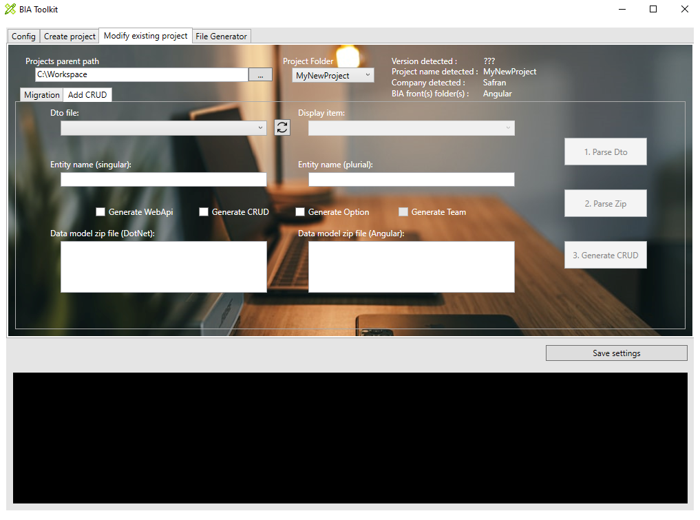
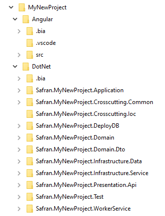
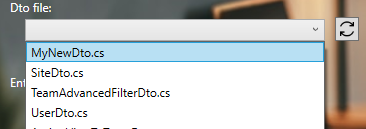
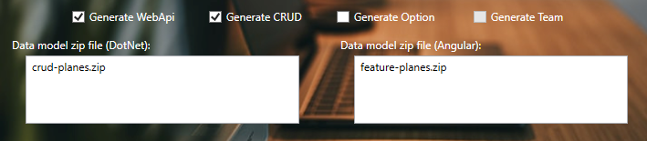
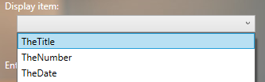
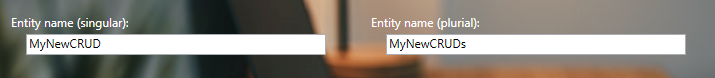

# Create CRUD on existing project with the BIA tool kit
This document explains how to create a CRUD with the BIAToolKit.

## Prerequisite
* You need to have an existing project. In other case, create it as [Describe here](./20-CreateProject.md).
* In first time, your project must contain: *entity*, *mapper* and *dto* files associated to the CRUD you want to create.
* Project must contain **.bia** folders as 
  

## 1. Choose Dto file linked to CRUD to generate
The Dto file combobox lists all Dto files on your project. 

If you have created new Dto file and you don't see it, you can refresh the list with the button on right side of combobox.

## 2. Parse Dto file
By clicking on the first button (*Parse Dto*), Dto file (previously selected) is parsed.

## 3. Select CRUD generation
Choose items you want to generate for the CRUD:
   * Back: WebAPi
   * Front: CRUD, Option (and Team in the future)
After selection, zip files usings for generation are displaying on 'Data model zip' area.

## 4. Parse Zip files
By clicking on the secund button (*Parse Zip*), choosen previous zip files are parsed.

## 5. Choose display item
On associated combobox, choose the field you want to display on front page.

## 6. Fill CRUD name
Singular entity name is fill up by default but you can change it. 

You need to complete the plurial name before CRUD generation.

## 7. Generate CRUD
By clicking on the third button (*Generate CRUD*), CRUD files are generated automatically on project.

> At first CRUD generation on the project, an historic file is made on project folder (*CrudGeneration.bia*).
> 
> After first generation, if you want change plurial CRUD name, restart step 6 + 7.
> 
> In case of regeneration, data are filled automatically from historic file.

Open DotNet and Angular projects, rebuild each one and fix issues if exists.

### Known issues
* After generation, go to navigation file (*navigation.ts*) on Angular folder, and rework **path** property (delete *examples* and change name to camel case).
* Traduction is not already implemented, so **i18n** files (fr.json/en.json/es.json) must be completed with missing labels. 