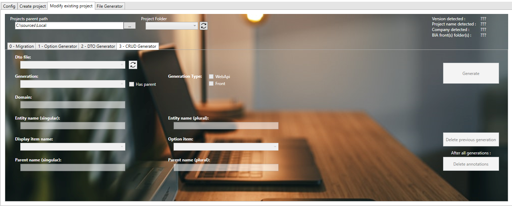
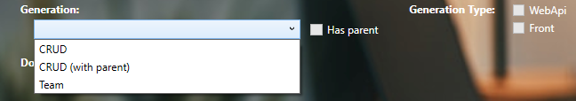
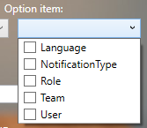

# Create CRUD on existing project with the BIA tool kit
This document explains how to create a CRUD with the BIAToolKit.

## Prerequisite
* You need to have an existing project. In other case, create it as [Describe here](./20-CreateProject.md).
* In first time, your project must contain: *entity*, *mapper* and *dto* files associated to the CRUD you want to create.
* Project must contain **.bia** folders as 
  

## 0. Choose Project Folder
Choosen the project directory to work on by choosing 'project parent path' and selecting 'project folder' ('Dto file' combobox is automatically populate).

## 1. Choose Dto file linked to CRUD to generate
The Dto file combobox lists all Dto files on your project.  
If you have created new Dto file and you don't see it, you can refresh the list with the button on right side of combobox. 
 
Entity name is deducted from dto file name. 
Option item combobox is filled after choosen dto file.

## 2. Parse Dto file
__*Step 1 is mandatory.*__ 
By clicking on the first button (*Parse Dto*), Dto file (previously selected) is parsed (and 'Dispaly item name' combobox is populated).

## 3. Select CRUD generation
Choose items you want to generate for the CRUD:
1. Generation: 
   * Back: WebAPi (selected by default)
   * Front: Front (selected by default)
2. Generation Type: (minimum a choice is mandatory)
   *  CRUD
   *  Option
   *  (and Team in the future)
After selection, zip files usings for generation are displaying on 'Data model zip' area.

## 4. Parse Zip files
__*Steps 2 and 3 are mandatory.*__ 
By clicking on the secund button (*Parse Zip*), choosen previous zip files are parsed.

## 5. Choose display item
On associated combobox, choose the field you want to display on front page. 

## 6. Fill CRUD name
Singular entity name is fill up by default but you can change it. 
You need to complete the plurial name before CRUD generation. 

## 7. Add option (not mandatory)
__*Option Generation Type must not be checked.*__ 
It is possible to generate link Option with the CRUD. 
On associated combobox, choose 1 or more option previously generated. 
 
*This field is not mandatory to generate a CRUD.*

## 8. Generate CRUD
__*Steps 4, 5 and 6 are mandatory.*__ 
By clicking on the third button (*Generate CRUD*), CRUD files are generated automatically on project.

> At first CRUD generation on the project, an historic file is made on project folder (*CrudGeneration.bia*). 
> After a first generation, if you want change:
> * display item name restart only step 5.
> * plurial CRUD name restart only step 6.
> * options link restart only step 7.  
>
> In case of regeneration, data are filled automatically from historic file.

Open DotNet and Angular projects, rebuild each one and fix issues if exists.

### <u>Known issues</u>
* After generation, on Angular folder, go to navigation file (*navigation.ts*) and rework **path** property (delete *examples*).
* On front side, when compilling angular project, if **import** are not used (mostly on model), deleted its to avoid errors.
* Traduction is not already implemented, so **i18n** files (fr.json/en.json/es.json) must be completed with missing labels. 