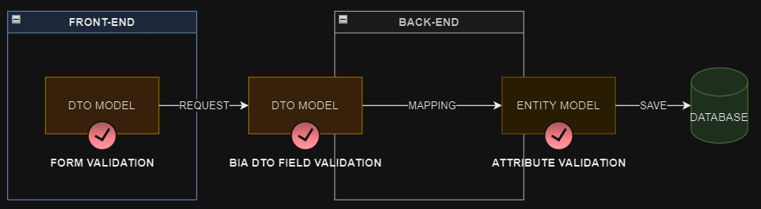

# Model State Validation
BIA Framework offers to you various way to validate your models :

## DTO model validation
### Front-end
In your DTO model class declaration, you can use `Validators` in order to constraint user to provide valid data for each fields in a form using your model. Complete the `BiaFieldsConfig` configuration used to display your model fields into BIA tables with validators :
```typescript
export class MyClass extends BaseDto {
    name: string;
    email: string;

    export const myClassFieldsConfiguration: BiaFieldsConfig = {
        Object.assign(new BiaFieldConfig('name', 'myClass.name'), {
            // Field is required and must contains 64 characters max
            validators: [Validators.Required, Validators.maxLength(64)]
        }),
        Object.assign(new BiaFieldConfig('email', 'myClass.email'), {
            // Field must be email format
            validators: [Validators.email]
        }),
    }
}
```
User will not be able to validate the form while the validors requirements are not reached.

See [official documentation](https://v17.angular.io/api/forms/Validators) for more about `Validators`.
### Back-end
In your DTO class, you can use the `BiaDtoField` attribute to apply validation constraints to each of your fields. You must set the attribute's property `EnableModelValidation` to `true` to activate the model validation at field level :
```csharp
public class MyClassDto : BaseDto<int>
{
    [BiaDtoField(EnableModelValidation = true, Required = true, MaxLength = 64)]
    public string Name { get; set; }

    [BiaDtoField(EnableModelValidation = true, Email = true)]
    public string Name { get; set; }
}
```
Enable this feature on a field will perform a model state validation when a request is received by your endpoint. It will raise into a model state validation error and return to the sender details for each field.

The available validation options into `BiaDtoField` attribute are listed below : 
```csharp
/// <summary>
/// Indicates whether the property required or not.
/// </summary>
public bool Required { get; set; }

/// <summary>
/// Set the minimum value of the number property.
/// </summary>
public double RangeMin { get; set; }

/// <summary>
/// Set the maximum value of the number property.
/// </summary>
public double RangeMax { get; set; }

/// <summary>
/// Set the minimum length of the string property.
/// </summary>
public int MinLength { get; set; }

/// <summary>
/// Set the maximum length of the string property.
/// </summary>
public int MaxLength { get; set; }

/// <summary>
/// Set the regex pattern of the string property.
/// </summary>
public string RegexPattern { get; set; }

/// <summary>
/// Indicates whether the property is email format or not.
/// </summary>
public bool Email { get; set; }

/// <summary>
/// Indicates whether the property is phone format or not.
/// </summary>
public bool Phone { get; set; }

/// <summary>
/// Indicates whether the property is url format or not.
/// </summary>
public bool Url { get; set; }

/// <summary>
/// Indicates whether the property is credit card format or not.
/// </summary>
public bool CreditCard { get; set; }
```


## Entity model validation
Additionnaly, you can set some `ValidationAttribute` ([official documentation](https://learn.microsoft.com/en-us/aspnet/core/mvc/models/validation?view=aspnetcore-8.0#built-in-attributes)) on your entitiy's fields :
```csharp
public class MyClass : IEntity<int>
{
    [Required]
    public int Id { get; set; }

    [Required]
    [MaxLength(64)]
    public string Name { get; set; }

    [Email]
    public string Email { get; set; }
}
```
By default in BIA Framework, the entity model state validation is **disabled**. 

To turn it on, you must set the corresponding application setting `EntityModelStateValidation` to `true` :
```json title=appsettings.json
{
    "EntityModelStateValidation": true
}
```
The validation will be enable for all the entities **with at least one `ValidationAttribute` on one of their fields**. The validation state model will be performed before saving changed entities into database.

**NOTE:** the entity state model validation will not check the database schema constraints configured by the entity model builder. It will only handle the validation constraints sets by the `ValidationAttribute` on each entity's fields.