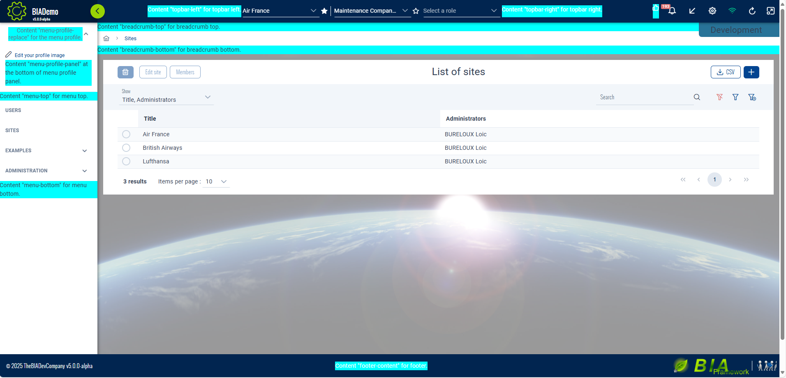

# Configure Layout of application with V4.0.0 design
Starting at V4.0.0, a new layout is available for applications. Menu is on the sidebar.
There is some configurations that could be usefull depending on your need with your application
## Change footer height
You can change the default height of the footer by changing the css variable --footer-height in your _app-custom-theme.scss and change the default 4rem by the value you need. Example for a 3 rem header :
```css
bia-ultima-layout {
  --footer-height: 3rem;
}
```

## Change sidebar width
By default the sidebar is 17rem width. 
You might need to get that sidebar larger for some reasons.
If the title of your application doesn't fit the default 17rem, we recommand using an acronym to shorten it. If you can't, you can change the width by setting the css variable --sidebar-width in your _app-custom-theme.scss. For example for a 22rem width sidebar :
```css
bia-ultima-layout {
  --sidebar-width: 22rem;
}
```

## Configure the layout
### Set default style
The layout can be configured in different ways :
You can change :
- the color scheme (light or dark)
- the sidebar / menu mode
- the footer mode
- the scale of the application
- show or hide the user avatar
- the position of the welcome menu profile (at the start of the menu or at the end)

And you can even chose to opt out of the new layout and return to pre 4.0.0 layout if needed.

To configure all that you can set the values you want in your app.component constructor with for example :
```ts
    this.layoutService.defaultConfigUpdate({
      menuMode: 'drawer',
      footerMode: 'bottom',
      showAvatar: false,
      scale: 16,
      menuProfilePosition: 'start'
    });
```
You can find all the fields in interface AppConfig.
The default values are :
```ts
const DEFAULT_LAYOUT_CONFIG: AppConfig = {
  classicStyle: false,
  colorScheme: 'light',
  menuMode: 'static',
  scale: 14,
  showAvatar: true,
  footerMode: 'overlay',
  menuProfilePosition: 'end',
}
```

### Set user configuration
The layout can be configured by the user of the application.
You can decide what the user can or cannot change :
- avatar
- language
- scale
- color theme
- sidebar / menu mode
- footer mode
- classic \<-\> ultima layout
- menu profile position

To configure all that you can set the values you want in your app.component constructor with for example :
```ts
    this.layoutService.setConfigDisplay({
      showEditAvatar: false,
      showTheme: false,
      showMenuStyle: true,
      showFooterStyle: true,
      showMenuProfilePosition: true,
    });
```
You can find all the fields in interface ConfigDisplay.
The default values are :
```ts
const DEFAULT_CONFIG_DISPLAY: ConfigDisplay = {
  showEditAvatar: true,
  showLang: true,
  showScale: true,
  showTheme: true,
  showMenuStyle: false,
  showFooterStyle: false,
  showToggleStyle: false,
  showMenuProfilePosition: false,
};
```

## Add content to default layout

You might want to add some content to the layout and it is now possible to add content in some places.
These are the places where you can add content :



To add content to these places you have to make your own CustomLayoutComponent inheriting LayoutComponent (to keep most functionalities).

```ts
@Component({
  selector: 'app-custom-layout',
  templateUrl: './custom-layout.component.html',
  imports: [NgIf, SpinnerComponent, BiaUltimaLayoutComponent],
})
export class CustomLayoutComponent extends LayoutComponent {
  constructor(
    public biaTranslationService: BiaTranslationService,
    protected navigationService: NavigationService,
    protected authService: AuthService,
    protected readonly layoutService: BiaLayoutService,
    protected readonly store: Store,
    // protected notificationSignalRService: NotificationSignalRService,
    @Inject(APP_BASE_HREF) public baseHref: string
  ) {
    super(
      biaTranslationService,
      navigationService,
      authService,
      layoutService,
      store,
      baseHref
    );
  }
}
```

The template should include the bia-ultima-layout component with all its mandatory inputs and inside it the contents you want to project to layout childrens.

All the available content projections are :
- **topbar-left** : positioned at the right of application logo and left of team selector.
- **topbar-right** : positioned at the right of team selector and left of topbar icons.
- **custom-topbar-icons** : positioned at the left of topbar icons.
- **menu-profile-replace** : completely replace the welcome menu profile by your content.
- **menu-profile-panel** : positioned at bottom of the panel showing when you click on welcome menu profile.
- **app-config-top** : positioned at the top of the config panel (accessible through the parameters wheel in the topbar icons).
- **app-config-bottom** : positioned at the bottom of the config panel (accessible through the parameters wheel in the topbar icons).
- **menu-top** : positioned at the top of the sidebar menu.
- **menu-bottom** : positioned at the bottom of the sidebar menu.
- **breadcrumb-top** : positioned above the breadcrumb.
- **breadcrumb-bottom** : positioned below the breadcrumb.
- **footer-content** : positioned in the middle of the footer.

Example for a projection of three components in three different places and also a link to documentation at the bottom of the sidebar menu. 
```html
<bia-spinner [overlay]="true" *ngIf="isLoadingUserInfo"></bia-spinner>
<bia-ultima-layout
  [menus]="menus"
  [version]="version"
  [username]="username"
  [login]="login"
  [headerLogos]="headerLogos"
  [footerLogo]="footerLogo"
  [supportedLangs]="supportedLangs"
  [appTitle]="appTitle"
  [helpUrl]="helpUrl"
  [reportUrl]="reportUrl"
  [enableNotifications]="enableNotifications"
  [companyName]="companyName"
  class="p-input-filled">
  <ng-container topbar-left
    ><app-topbar-left-component>
    </app-topbar-left-component></ng-container
  >
  <ng-container menu-profile-panel
    ><app-menu-profile-panel-component>
    </app-menu-profile-panel-component>
  </ng-container>
  <ng-container menu-bottom
    ><a href="link-to-documentation">
      Documentation for my app
    </a></ng-container
  >
  <ng-container breadcrumb-bottom
    ><app-breadcrumb-bottom-component>
    </app-breadcrumb-bottom-component></ng-container
  >
</bia-ultima-layout>
```

When your custom layout is done, use it instead of standard LayoutComponent in the app-routing.module.ts :
```ts
const routes: Routes = [
  {
    path: '',
    component: CustomLayoutComponent,
    children: [
      ...
    ]
  },
  { path: '**', redirectTo: '' },
];
```
