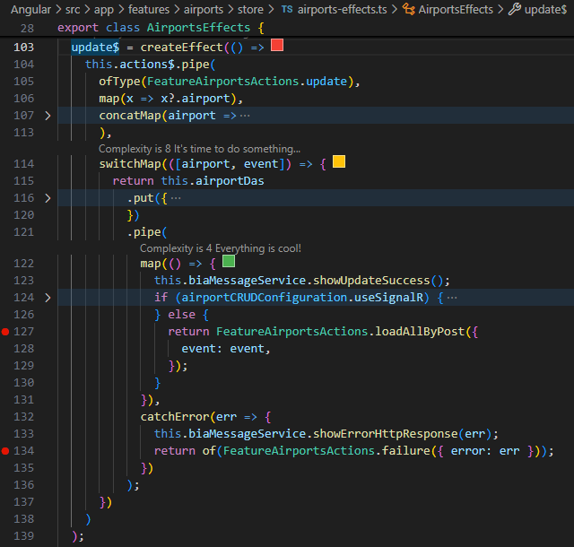
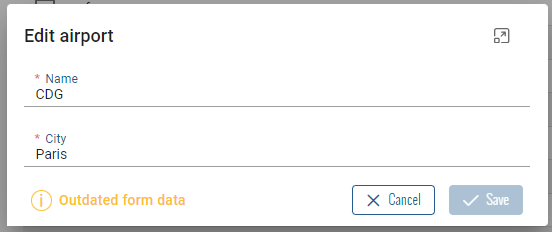
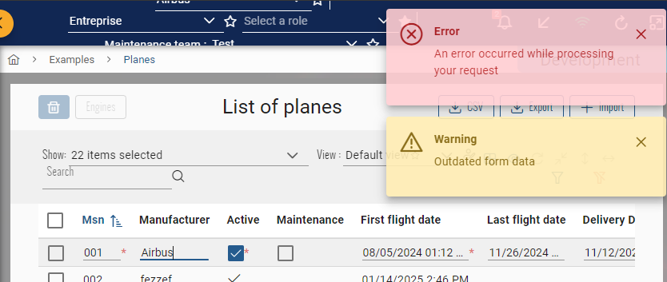

# Prevent form closing on error
When opening a form on popup or calc mode, we want sometimes prevent the closing of the form even in error case. This page explains how to handle this.  

## Block form
### Front
**NOTE :** these configuration instructions are already included into features generated from the version **4.1.0** of BIA Framework.  
1. Ensure that your feature has store action called after success or fail to create or edit an item using the matching effect into the `my-feature-effects.ts` file.  
Example with the `update$` effect, the store action on success is on **line 127** and on fail on **line 134** :  

1. Add in your feature service that inherits from `CrudItemService<>` the values for the properties `_updateSuccessActionType`, `_createSuccessActionType` and `_updateFailureActionType` matching the same store action :
``` typescript title="my-feature.service.ts"
export class MyFeatureService extends CrudItemService<MyFeature> {
    /**
     * Type of store action called after update effect is successful.
     * See update effect in store effects of CRUD item.
    */
    _updateSuccessActionType = FeatureMyFeaturesActions.loadAllByPost.type;

    /**
     * Type of store action called after create effect is successful.
     * See create effect in store effects of CRUD item.
    */
    _createSuccessActionType = FeatureMyFeaturesActions.loadAllByPost.type;

    /**
     * Type of store action called after update effect has failed.
     * See update effect in store effects of CRUD item.
    */
    _updateFailureActionType = FeatureEnginesActions.failure.type;
}
```

**Now, each time a user will have an error when validating a form inside a popup or an editable row with calc mode, the form will stay opened.**

## Inform user of conflict
Sometimes, the data opened for edit in the form can be changed by another user at the same time. You can handle these changes directly in your form to inform your user of this conflict.
### Back
**NOTE :** these configuration instructions are already included into features generated from the version **4.1.0** of BIA Framework.
1. Your entity must derived of `VersionedTable` type
2. Your mapper should include in the `EntityToDto()` method a mapping for the `RowVersion` property of the DTO based on the same property from the entity : 
``` csharp title="MyEntityMapper.cs"
public override Expression<Func<MyEntity, MyEntityDto>> EntityToDto()
{
    return entity => new MyEntityDto
    {
        // [...]

        // Add the RowVersion mapping
        RowVersion = Convert.ToBase64String(entity.RowVersion),
    }
}
```
3. Add in your `Update()` endpoint of your entity controller the catch of `OutDatedException` and the handle of `409` status code : 
``` csharp title="MyEntityController.cs"
// Add this attribute
[ProducesResponseType(StatusCodes.Status409Conflict)]
public async Task<IActionResult> Update(int id, [FromBody] MyEntityDto dto)
{
    try
    { 
        // [...]
    }
    //Add this catch block
    catch (OutDatedException)
    {
        return this.Conflict();
    }
}
```
### Front
1. Add in your feature model the assign of the `BiaFieldConfig` for the `rowVersion` :
``` typescript title="my-feature.ts"
export const myFeatureFieldsConfiguration : BiaFieldsConfig<MyFeature> = {
    columns: [
        // [...]
        Object.assign(new BiaFieldConfig('rowVersion', 'myFeature.rowVersion'), {
            isVisible: false,
            isHideByDefault: true,
        }),
    ]
}
```
2. In your feature edit component HTML template, add the binding for the `isCrudItemOutdated` property between the feature edit component and the feature form component : 
``` html title="my-feature-edit.component.html"
<app-my-feature-form
    [isCrudItemOutdated]="isCrudItemOutdated"></app-my-feature-form>
```

Warning displayed into the edit popup :  


Warning displayed as toast on calc mode :


### SignalR
You can inform your user with SignalR that the data on the opened form has been updated by another user.  
This feature works only with the **edit component** on **popup mode**.
#### Back 
1. On your feature controller, enable the `UseHubForClientInAirport` constant definition and add a sending instruction to the client with the dedicated identifier and hub :
``` csharp title="MyFeatureController"
#define UseHubForClientInAirport

namespace MyCompany.MyProject.Presentation.Api.Controllers.MyFeature
{
    // [...]
    public class MyFeatureController : BiaControllerBase
    {
        // [...]
        public async Task<IActionResult> Update(int id, [FromBody] MyEntityDto dto)
        {
            try
            { 
                // [...]
                var updatedDto = await this.airportService.UpdateAsync(dto);

                // Add the signalR notification
#if UseHubForClientInAirport
                await this.clientForHubService.SendTargetedMessage(string.Empty, "myfeatures", "update-myfeature", updatedDto);
#endif

                return this.Ok(updatedDto);
            }
            catch
            {
                // [...]
            }
        }
    }
}
```

#### Front
1. Edit your constant feature file to use signalR :
``` typescript title="my-feature.constants.ts"
export const airportCRUDConfiguration: CrudConfig<Airport> = new CrudConfig({
    // [...]
    useSignalR: true,
}); 
``` 
2. Create or complete your feature signalR service with following methods `registerUpdate()` and `unregisterUpdate()` :
``` typescript title="my-feature-signalr.service.ts"
import { Injectable } from '@angular/core';
import { BiaSignalRService } from 'src/app/core/bia-core/services/bia-signalr.service';
import { TargetedFeature } from 'src/app/shared/bia-shared/model/signalR';

@Injectable({
  providedIn: 'root',
})
export class MyFeatureSignalRService {
  private targetedFeature: TargetedFeature;

  constructor(private signalRService: BiaSignalRService) {}

  initialize() {
    this.targetedFeature = {
      parentKey: '',
      featureName: 'myFeatures',
    };
    this.signalRService.joinGroup(this.targetedFeature);
  }

  registerUpdate(callback: (args: any) => void) {
    console.log(
      '%c [MyFeatures] Register SignalR : update-myFeature',
      'color: purple; font-weight: bold'
    );
    this.signalRService.addMethod('update-myFeature', args => {
      callback(args);
    });
  }

  destroy() {
    this.unregisterUpdate();
    this.signalRService.leaveGroup(this.targetedFeature);
  }

  private unregisterUpdate() {
    console.log(
      '%c [MyFeatures] Unregister SignalR : update-myFeature',
      'color: purple; font-weight: bold'
    );
    this.signalRService.removeMethod('update-myFeature');
  }
}
```
3. Complete your feature edit component in order to react to signalR notifications : 
``` typescript title="my-feature-edit.component.ts"
import { Component, Injector, OnDestroy, OnInit } from '@angular/core';
import { firstValueFrom } from 'rxjs';
import { CrudItemEditComponent } from 'src/app/shared/bia-shared/feature-templates/crud-items/views/crud-item-edit/crud-item-edit.component';
import { myFeatureCRUDConfiguration } from '../../my-feature.constants';
import { MyFeature } from '../../model/my-feature';
import { MyFeatureSignalRService } from '../../services/my-feature-signalr.service';
import { MyFeatureService } from '../../services/my-feature.service';

@Component({
  selector: 'app-my-feature-edit',
  templateUrl: './my-feature-edit.component.html',
})
export class MyFeatureEditComponent
  extends CrudItemEditComponent<MyFeature>
  implements OnInit, OnDestroy
{
  private useSignalR = myFeatureCRUDConfiguration.useSignalR;

  constructor(
    protected injector: Injector,
    public myFeatureService: MyFeatureService,
    protected signalrService: MyFeatureSignalRService
  ) {
    super(injector, myFeatureService);
    this.crudConfiguration = myFeatureCRUDConfiguration;
  }

  ngOnInit() {
    super.ngOnInit();

    if (this.useSignalR) {
      this.signalrService.initialize();

      this.signalrService.registerUpdate(async args => {
        const updatedCrudItem = JSON.parse(args) as MyFeature;
        const currentCrudItem = await firstValueFrom(
          this.myFeatureService.crudItem$
        );

        if (
          currentCrudItem.id === updatedCrudItem.id &&
          currentCrudItem.rowVersion !== updatedCrudItem.rowVersion
        ) {
          this.isCrudItemOutdated = true;
        }
      });
    }
  }

  ngOnDestroy() {
    super.ngOnDestroy();

    if (this.useSignalR) {
      this.signalrService.destroy();
    }
  }
}
```


