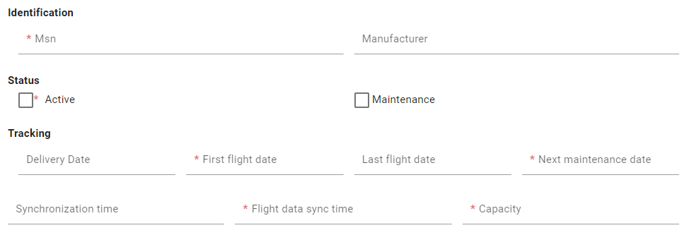

# Form Configuration
This page will explain how to configure the inputs into a form of a CRUD feature with BIA Framework.

## Form fields
### Principles
All the fields that must be displayed into your CRUD feature must be declared into a `BiaFieldsConfig<TDto>` class, where `TDto` represents your feature model. This class is used both for the form and the table display of your feature CRUD screens.  

The declaration must be set into your feature model, exported as const, and associated to the feature `CrudConfig` into your feature's constants declarations :
``` typescript title="feature.constants.ts"
export const featureCRUDConfiguration: CrudConfig<Feature> = new CrudConfig({
  featureName: 'features',
  // Here, featureFieldsConfiguration is declared as const into the feature model
  fieldsConfig: featureFieldsConfiguration
  [...]
});
```
:::info
The declaration into the model and association into the constants are already set when using CRUD generation from BIAToolkit.
:::

### Configuration
You must add all your fields to display into the `columns` property of the `BiaFieldsConfig<TDto>`.  
Each column item must be a `BiaFieldConfig<TDto>`, where you will configure for each field :
- **`field`** : feature's property name to bind with *(mandatory in constructor)*
- **`header`** : header name of your feature's property when displayed into a table *(mandatory in constructor)*
- `type` : type of the input (`Date` | `DateTime` | `Time` | `TimeOnly` | `TimeSecOnly` | `Number` | `Boolean` | `String` | `OneToMany` | `ManyToMany`)
- `filterMode` : filter mode when displayed into a table
- `isSearchable` : searchable mode (`true` | `false`)
- `isSortable` : sortable mode (`true` | `false`) 
- `icon` : icon displayed beside the header name when displayed into a table
- `isEditable` : editable mode (`true` | `false`)
- `isOnlyInitializable` : only initializable mode (`true` | `false`)
- `isOnlyUpdatable` : only updatable mode (`true` | `false`)
- `isEditableChoice` : editable choice mode (`true` | `false`)
- `isVisible` : visibility mode (`true` | `false`)
- `isHideByDefault` : hide by default mode (`true` | `false`)
- `maxlength` : maximum lenght setting when input is a string
- `isRequired` : required mode (`true` | `false`)
- `specificOutput` : specific output mode (`true` | `false`)
- `specificInput` : specific input mode (`true` | `false`)
- `validators` : set of validators to apply to the input
- `minWidth` : minimum width when displayed into a table
- `isFrozen` : frozen mode (`true` | `false`)
- `alignFrozen` : frozen alignement
- `displayFormat` : display format

Example : 
``` typescript title="feature.ts"
export const featureFieldsConfiguration: BiaFieldsConfig<Feature> = {
  columns: [
    // Field configuration for msn property
    Object.assign(new BiaFieldConfig('msn', 'feature.msn'), {
      isRequired: true,
      validators: [Validators.required, Validators.maxLength(64)],
    }),
    // Field configuration for manufacturer property
    Object.assign(new BiaFieldConfig('manufacturer', 'feature.manufacturer'), {}),
    // Field configuration for isActive property
    Object.assign(new BiaFieldConfig('isActive', 'feature.isActive'), {
      isRequired: true,
      isSearchable: true,
      isSortable: false,
      type: PropType.Boolean,
      validators: [Validators.required],
    }),
    [...]
  ]}
```

## Form layout
### Principles 
#### Hierarchy
The class `BiaFormLayoutConfig<TDto>` is the container of your form layout configuration. Each items of this class will represent a configuration to customize the disposition of your inputs into the form, where `TDto` represents your feature model.

These items can be :
- `BiaFormLayoutConfigRow<TDto>` : a row that will contains a set of `BiaFormLayoutConfigColumn<TDto>` 
- `BiaFormLayoutConfigGroup<TDto>` : a group of `BiaFormLayoutConfigRow<TDto>` under a title (title must refer to a traductible resource) 

``` typescript
// Config
new BiaFormLayoutConfig<Feature>([
  // First row
  new BiaFormLayoutConfigRow([]),
  // Second row, wich is a group
  new BiaFormLayoutConfigGroup('feature.groupTitle', [
    // First row of the group
    new BiaFormLayoutConfigRow([]),
    // Second row of the group
    new BiaFormLayoutConfigRow([]),
  ]),
])
```

A `BiaFormLayoutConfigColumn<TDto>` element can be both : 
- `BiaFormLayoutConfigField<TDto>` which represents a field of one of your feature's property
- `BiaFormLayoutConfigGroup<TDto>` so you can set in a column a new group of fields

``` typescript
// Config
new BiaFormLayoutConfig<Feature>([
  // First row
  new BiaFormLayoutConfigRow([
    // First column, which is a field
    new BiaFormLayoutConfigField('field1'),
    // Second column, which is a group
    new BiaFormLayoutConfigGroup('feature.groupTitle', [
      // First row of the group
      new BiaFormLayoutConfigRow([
        // First column, which is a field
        new BiaFormLayoutConfigField('field2')
        // Second column, which is a field
        new BiaFormLayoutConfigField('field3')
      ]),
    ]),
  ]),
])
```
:::warning
All the fields used into the `BiaFormLayoutConfig` must have been declared into the `BiaFieldsConfig` of your CRUD feature. 
:::

#### Responsive design
When declaring a `BiaFormLayoutConfigField<TDto>` or a `BiaFormLayoutConfigGroup<TDto>`, you can set the column size of these elements by :
- setting only the `lgSize` which represents the column size for large screen (>= 992px) :
  ``` typescript
  new BiaFormLayoutConfigGroup<Feature>('Group', groupRows, 2)
  new BiaFormLayoutConfigField<Feature>('field', 2)
  ```
  The `lgSize` must be set **between 1 and 12** to be valid.  
  The mobile first column size (< 576px) will be always **12**.  

  The `md` and `sm` sizes will be automatically calculate according to the following ratio table :  

  | lg (>= 992px) | md (>= 768px) | sm (>= 576px)  |
  |------------|------------------|---------------|
  | 1          | 1                | 2             |
  | 2          | 3                | 4             |
  | 3          | 4                | 6             |
  | 4          | 6                | 8             |
  | 5          | 7                | 10            |
  | 6          | 9                | 12            |
  | 7          | 10               | 12            |
  | 8          | 12               | 12            |
  | 9          | 12               | 12            |
  | 10         | 12               | 12            |
  | 11         | 12               | 12            |
  | 12         | 12               | 12            |
- setting all the size breakpoints (`lg`, `md`, `sm` and `mobileFirst`) inside a `BiaFormLayoutConfigColumnSize` class :
  ``` typescript
  new BiaFormLayoutConfigGroup<Feature>('Group', groupRows, new BiaFormLayoutConfigColumnSize(6, 6, 6, 6))
  new BiaFormLayoutConfigField<Feature>('field', new BiaFormLayoutConfigColumnSize(6, 6, 6, 6))
  ```

:::info
If you don't specify the column size, the parent `BiaFormLayoutConfigRow<TDto>` will compute the ideal column size depending both on the remaining column sizeleft by the columns with a custom size, and the total columns count into the row.
:::

### Configuration
1. In front-end, open the model of your feature
2. Complete or add the `BiaFormLayoutConfig<TDto>` definition with your form configuration
3. Add the groups, rows and columns by required order of display

Full example : 
``` typescript title="feature.ts"
export const featureFormConfiguration: BiaFormLayoutConfig<Feature> = new BiaFormLayoutConfig([
  // First row with two groups
  new BiaFormLayoutConfigRow([
    // First group with single row
    new BiaFormLayoutConfigGroup('feature.groupIdentification', [
      // Row with two fields
      new BiaFormLayoutConfigRow([
        new BiaFormLayoutConfigField('msn'),
        new BiaFormLayoutConfigField('manufacturer'),
      ]),
    ]),

    // Second group with single row
    new BiaFormLayoutConfigGroup('feature.groupStatus', [
      // Row with two fields with custom column lg size
      new BiaFormLayoutConfigRow([
        new BiaFormLayoutConfigField('isActive', 2),
        new BiaFormLayoutConfigField('isMaintenance', 2),
      ]),
    ]),
  ]),

  // Second row with single group with two rows
  new BiaFormLayoutConfigGroup('feature.groupTracking', [
    // First row with four fields
    new BiaFormLayoutConfigRow([
      new BiaFormLayoutConfigField('deliveryDate'),
      new BiaFormLayoutConfigField('firstFlightDate'),
      new BiaFormLayoutConfigField('lastFlightDate'),
      new BiaFormLayoutConfigField('nextMaintenanceDate'),
    ]),
    //Second row with single field
    new BiaFormLayoutConfigRow([
      new BiaFormLayoutConfigField('syncFlightDataTime'),
      new BiaFormLayoutConfigField('syncTime'),
    ]),
  ]),

  // Third row with single field with full custom column sizes
  new BiaFormLayoutConfigRow([
    new BiaFormLayoutConfigField(
      'motorsCount',
      new BiaFormLayoutConfigColumnSize(6, 6, 6, 6)
    ),
  ]),

  // Fourth row with two fields
  new BiaFormLayoutConfigRow([
    new BiaFormLayoutConfigField('probability'),
    new BiaFormLayoutConfigField('capacity'),
  ]),
]);
```

The framework will automatically generate the form like this :


:::info
All the remaining fields declared into the `BiaFieldsConfig` will be displayed after the fields handled into the `BiaFormLayoutConfig`.
:::

### Usage
Into your feature constants declaration, add the definition of the `formLayoutConfig` under the definition of `fieldsConfig` when declaring the `CrudConfig` :
``` typescript title="feature.constants.ts"
export const featureCRUDConfiguration: CrudConfig<Feature> = new CrudConfig({
  featureName: 'features',
  fieldsConfig: featureFieldsConfiguration
  // Add here your form layout config const reference
  formLayoutConfig: featureFormLayoutConfiguration,
  [...]
});
```

Into all the components that use a form component inherited from `CrudItemFormComponent` or `BiaFormComponent`, ensure to bind the `formConfig` property to your feature `BiaFormLayoutConfig` property : 

``` html title="feature-new.component.html"
<app-feature-form
  [...]
  [formConfig]="crudConfiguration.formConfig"
  [...]></app-feature-form>
```

:::info
All the CRUD features generated from **4.1.0** with BIAToolkit are already ready to use
:::

## Form Read Only
### Principles
You can choose if a CRUD feature form must be read only or not when displayed. 

You have two available modes : 
- **ON** : the form is read-only, all the fields are disabled
- **CLICK TO EDIT** : the form is opened as read only, the user must click on the submit button to change to edit mode

### Configuration
#### Read View
First of all, you must have a **read** view for your feature that extends the `CrudItemReadComponent` :
``` typescript title="feature-read.component.ts"
@Component({
  selector: 'app-feature-read',
  templateUrl: './feature-read.component.ts',
})
export class FeatureReadComponent extends CrudItemReadComponent<Feature> {
  constructor(
    protected injector: Injector,
    public featureService: FeatureService,
    protected authService: AuthService
  ) {
    super(injector, featureService, authService);
    this.crudConfiguration = featureCRUDConfiguration;
  }

  setPermissions(): void {
    // Set the permission to switch to edit mode
    this.canEdit = this.authService.hasPermission(Permission.Feature_Update);
  }
}
```
``` html title="feature-read.component.html"
<app-feature-form
  *ngIf="crudItemService.crudItem$ | async; let crudItem"
  [crudItem]="crudItem"
  [fields]="crudConfiguration.fieldsConfig.columns"
  [formLayoutConfig]="crudConfiguration.formLayoutConfig"
  [formReadOnlyMode]="formReadOnlyMode"
  [dictOptionDtos]="(featureService.optionsService.dictOptionDtos$ | async) ?? []"
  [showSubmitButton]="canEdit"
  (cancelled)="onCancelled()"
  (save)="onSubmitted($event)"></app-feature-form>
<bia-spinner
  *ngIf="featureService.loadingGet$ | async"
  [overlay]="true"></bia-spinner>
```

Add your read component into your feature module : 
``` typescript title="feature.module.ts"
@NgModule({
  declarations: [
    // [...]
    FeatureReadComponent,
  ],
```

#### Edit Form Read Only Mode
Into your feature's constants file, add the read only mode for your edit form into the `CrudConfig.formEditReadOnlyMode` property:
``` typescript title="feature.constants.ts"
export const featureCRUDConfiguration: CrudConfig<Feature> = new CrudConfig({
  // [...]
  formEditReadOnlyMode: FormReadOnlyMode.clickToEdit,
});
```
You can choose :
- `off` : default value. You don't have to set the value of `formEditReadOnlyMode` for this case
- `clickToEdit` : must click to edit button to enter edit mode
- `on` : strict read only

#### Read Route and Read Only Mode
Into your feature's module file :
1. before the route declaration of your **edit** component, declare the route for the **read** component
2. change the redirect path value for `read` instead of `edit`
``` typescript title="feature.module.ts"
@NgModule({
export const ROUTES: Routes = [
  {
    // [...]
    children: [
      {
        path: ':crudItemId',
        // [...]
        children: [
          // Add here your read component
          {
            path: 'read',
            data: {
              breadcrumb: 'bia.read',
              canNavigate: true,
              permission: Permission.Feature_Read,
              // Map here the formEditReadOnlyMode of the CrudConfig or set it manually
              readOnlyMode: featureCRUDConfiguration.formEditReadOnlyMode,
              title: 'feature.read',
            },
            component: FeatureReadComponent,
            canActivate: [PermissionGuard],
          },
          // Existing edit component
          {
            path: 'edit',
            // [...]
          },
          {
            path: '',
            pathMatch: 'full',
            // Change redirect to read
            redirectTo: 'read',
          },
        ],
      },
    ],
  },
];
```
- By selecting `on` or `clickToEdit` read only mode, your `FeatureIndexComponent` will automatically open the selected item details from the index table using the `read` route 
- Then, with `clickToEdit` mode enabled, by clicking to the edit mode button, the user will be redirected to `edit` route

#### Feature Form
Your feature form must inherits from `CrudItemFormComponent` : 
``` typescript title="feature-form.component.ts"
@Component({
  selector: 'app-feature-form',
  templateUrl:
    '../../../../shared/bia-shared/feature-templates/crud-items/components/crud-item-form/crud-item-form.component.html',
  styleUrls: [
    '../../../../shared/bia-shared/feature-templates/crud-items/components/crud-item-form/crud-item-form.component.scss',
  ],
})
export class FeatureFormComponent extends CrudItemFormComponent<Feature> {
  constructor(
    protected router: Router,
    protected activatedRoute: ActivatedRoute
  ) {
    super(router, activatedRoute);
  }
}
```

If your feature form use a custom HTML template, you must use `BiaFormComponent` inside your html file :
``` html title="feature-form.component.html"
<bia-form
  [element]="crudItem"
  [fields]="fields"
  [formValidators]="formValidators"
  [showSubmitButton]="showSubmitButton"
  [formReadOnlyMode]="formReadOnlyMode"
  [disableSubmitButton]="disableSubmitButton"
  (save)="onSave($event)"
  (cancelled)="onCancel()">

  <ng-template pTemplate="specificInput" let-field="field" let-form="form">
    [...]
  <ng-template>
</bia-form>
```

About the `BiaFormComponent` inputs : 
- `showSubmitButton` : show or not the submit button of the form (can be the switch to edit mode, or save button)
- `formReadOnlyMode` : the read only mode
- `disableSubmitButton` : disable or not the submit button if shown

You can handle when the read only mode is changing into the `BiaFormComponent` at init or in the life cycle by binding a method to the `readOnlyChanged` output : 
``` html title="feature-form.component.html"
<bia-form
  [...]
  (readOnlyChanged)="onReadOnlyChanged($event)">
</bia-form>
```
Then override the `onReadOnlyChanged` method into your feature form component :
``` typescript title="feature-form.component.ts"
export class FeatureFormComponent extends CrudItemFormComponent<Feature> {
  onReadOnlyChanged(readOnly: boolean): void {
    // Do something
    super.onReadOnlyChanged(readOnly);
  }
}
```
:::info
Super method handle the redirect to the `edit` route if the read only mode is set to `clickToEdit`.
:::