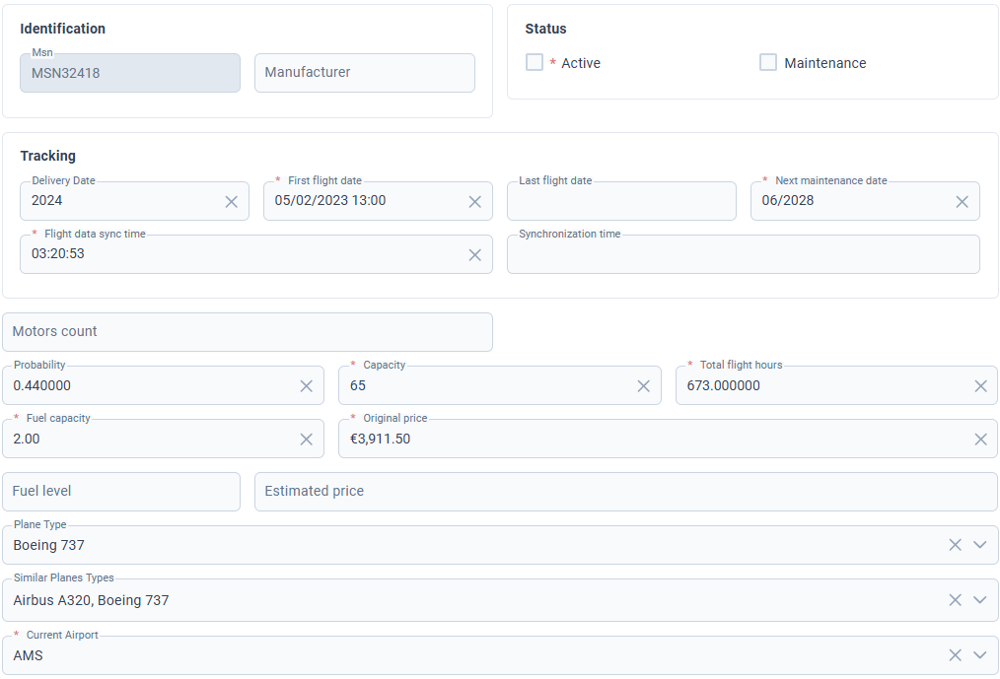
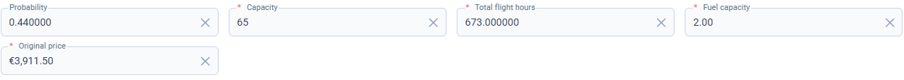
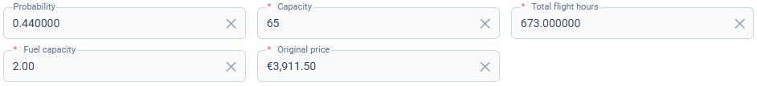
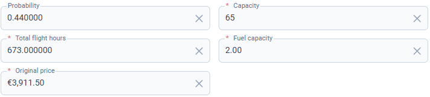
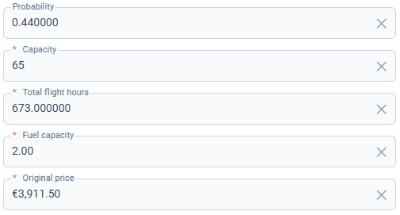

# Form Configuration
This page will explain how to configure the inputs into a form of a CRUD feature with BIA Framework.

## Form fields
### Principles
All the fields that must be displayed in your CRUD feature must be declared in a `BiaFieldsConfig<TDto>` class, where `TDto` represents your feature model. This class is used both for the form and the table display of your feature CRUD screens.  

The declaration must be set in your feature model, exported as const, and associated to the feature `CrudConfig` in your feature's constants declarations :
``` typescript title="feature.constants.ts"
export const featureCRUDConfiguration: CrudConfig<Feature> = new CrudConfig({
  featureName: 'features',
  // Here, featureFieldsConfiguration is declared as const into the feature model
  fieldsConfig: featureFieldsConfiguration
  [...]
});
```
:::info
The declaration in the model and association in the constants are already set when using CRUD generation from BIAToolkit.
:::

### Configuration
You must add all your fields to display in the `columns` property of the `BiaFieldsConfig<TDto>`.  
Each column item must be a `BiaFieldConfig<TDto>`, where you will configure for each field :
- **`field`** : feature's property name to bind with *(mandatory in constructor)*
- **`header`** : header name of your feature's property when displayed into a table *(mandatory in constructor)*
- `type` : type of the input (`Date` | `DateTime` | `Time` | `TimeOnly` | `TimeSecOnly` | `Number` | `Boolean` | `String` | `OneToMany` | `ManyToMany`)
- `filterMode` : filter mode when displayed into a table
- `isSearchable` : searchable mode (`true` | `false`)
- `isSortable` : sortable mode (`true` | `false`) 
- `icon` : icon displayed beside the header name when displayed into a table
- `isEditable` : editable mode (`true` | `false`)
- `isOnlyInitializable` : only initializable mode (`true` | `false`)
- `isOnlyUpdatable` : only updatable mode (`true` | `false`)
- `isEditableChoice` : editable choice mode (`true` | `false`)
- `isVisible` : visibility mode into **form** (`true` | `false`)
- `isVisibleInTable` : visibility mode into **table** (`true` | `false`)
- `isHideByDefault` : hide by default mode into the "columns visible by default" dropdown of the table (`true` | `false`)
- `maxlength` : maximum length setting when input is a string
- `isRequired` : required mode (`true` | `false`)
- `validators` : set of validators to apply to the input
- `minWidth` : minimum width when displayed into a table
- `isFrozen` : frozen mode into the table (`true` | `false`)
- `alignFrozen` : frozen alignement in the table (`right` | `left`)
- `displayFormat` : display format for **numbers** or **date** by providing the required `BiaFieldNumberFormat` or `BiaFieldDateFormat`
- `specificOutput` : specific output mode (`true` | `false`) (see [next chapter](#specific-inputoutput))
- `specificInput` : specific input mode (`true` | `false`) (see [next chapter](#specific-inputoutput))

Example : 
``` typescript title="feature.ts"
export const featureFieldsConfiguration: BiaFieldsConfig<Feature> = {
  columns: [
    // Field configuration for msn property
    Object.assign(new BiaFieldConfig('msn', 'feature.msn'), {
      isRequired: true,
      validators: [Validators.maxLength(64)],
    }),
    // Field configuration for manufacturer property
    Object.assign(new BiaFieldConfig('manufacturer', 'feature.manufacturer'), {}),
    // Field configuration for isActive property
    Object.assign(new BiaFieldConfig('isActive', 'feature.isActive'), {
      isRequired: true,
      isSearchable: true,
      isSortable: false,
      type: PropType.Boolean,
    }),
    // Field configuration for estimatedPrice property
    Object.assign(new BiaFieldConfig('estimatedPrice', 'plane.estimatedPrice'), {
      type: PropType.Number,
      filterMode: PrimeNGFiltering.Equals,
      displayFormat: Object.assign(new BiaFieldNumberFormat(), {
        mode: NumberMode.Currency,
        minFractionDigits: 2,
        maxFractionDigits: 2,
        currency: 'EUR',
      }),
      validators: [Validators.min(0)],
    }),
    [...]
  ]}
```
:::tip
No need to set a required `Validator` if you have set the property `isRequired` to `true`
:::

### Specific input/output
You can set your field as specific input and/or output into your form or your table to customize the display and setting of your field's value :
* set `specificInput` to `true` into your **BIA forms** and **BIA table using calc mode**
* set `specificOutput` to `true` into your **BIA tables** 

To use them, you must define a template for your `specificInput` or `specificOutput` into the form or the table :
``` html title="feature-table.component.html"
<bia-calc-table>
  <ng-template pTemplate="specificInput" let-field="field" let-form="form">
    <span [formGroup]="form">
      <ng-container [ngSwitch]="field.field">
        <ng-container *ngSwitchCase="'myField'">
          <!-- Apply here your template for your field  -->
          <p-checkbox binary="true" [formControlName]="field.field"></p-checkbox>
        </ng-container>
      </ng-container>
    </span>
  </ng-template>

  <ng-template pTemplate="specificOutput" let-field="field" let-data="data">
    <ng-container [ngSwitch]="field.field">
      <ng-container *ngSwitchCase="'myField'">
        <!-- Apply here your template for your field  -->
        <i class="pi pi-circle-fill" [ngClass]="{ 'red-circle': !data, 'green-circle': !!data }"></i>
      </ng-container>
    </ng-container>
  </ng-template>
</bia-calc-table>
```

## Form layout
### Principles 
#### Hierarchy
The class `BiaFormLayoutConfig<TDto>` is the container of your form layout configuration. Each items of this class (`BiaFormLayoutConfigItem`) will represent a configuration to customize the disposition of your inputs into the form, where `TDto` represents your feature model.

These `BiaFormLayoutConfigItem` can be :
- `BiaFormLayoutConfigRow<TDto>` : a row that will contain a set of `BiaFormLayoutConfigColumn<TDto>` 
- `BiaFormLayoutConfigGroup<TDto>` : a group of `BiaFormLayoutConfigRow<TDto>` under a title (title must refer to a translatable resource) 
- `BiaFormLayoutConfigTabGroup<TDto>` : a set of `BiaFormLayoutConfigTab<TDto>` that each contains other `BiaFormLayoutConfigItem`

``` typescript
// Config
new BiaFormLayoutConfig<Feature>([
  // First row
  new BiaFormLayoutConfigRow([]),
  // Second row, wich is a group
  new BiaFormLayoutConfigGroup('feature.groupTitle', [
    // First row of the group
    new BiaFormLayoutConfigRow([]),
    // Second row of the group
    new BiaFormLayoutConfigRow([]),
  ]),
  // Third row, which is a tab
  new BiaFormLayoutConfigTabGroup([
    // First tab
    new BiaFormLayoutConfigTab([
      new BiaFormLayoutConfigRow([]),
    ]),
    // Second tab
    new BiaFormLayoutConfigTab([
      new BiaFormLayoutConfigRow([]),
    ]),
  ])
])
```

A `BiaFormLayoutConfigColumn<TDto>` element can be : 
- `BiaFormLayoutConfigField<TDto>` which represents a field of one of your feature's property
- `BiaFormLayoutConfigGroup<TDto>` so you can set in a column a new group of fields
- `BiaFormLayoutConfigTabGroup<TDto>` to set a new tab group into your column

``` typescript
// Config
new BiaFormLayoutConfig<Feature>([
  // First row
  new BiaFormLayoutConfigRow([
    // First column, which is a field
    new BiaFormLayoutConfigField('field1'),
    // Second column, which is a group
    new BiaFormLayoutConfigGroup('feature.groupTitle', [
      // First row of the group
      new BiaFormLayoutConfigRow([
        // First column, which is a field
        new BiaFormLayoutConfigField('field2')
        // Second column, which is a field
        new BiaFormLayoutConfigField('field3')
      ]),
    ]),
    // Third column, which is a tab
    new BiaFormLayoutConfigTabGroup([
      // First tab
      new BiaFormLayoutConfigTab([
        new BiaFormLayoutConfigRow([
          // First column of the tab, which is a field
          new BiaFormLayoutConfigField('field4')
          // Second column of the tab, which is a field
          new BiaFormLayoutConfigField('field5')
        ]),
      ]),
      // Second tab
      new BiaFormLayoutConfigTab([
        new BiaFormLayoutConfigRow([
          // First column of the tab, which is a field
          new BiaFormLayoutConfigField('field6')
          // Second column of the tab, which is a field
          new BiaFormLayoutConfigField('field7')
        ]),
      ]),
    ])
  ]),
])
```
:::warning
All the fields used in the `BiaFormLayoutConfig` must have been declared in the `BiaFieldsConfig` of your CRUD feature. 
:::

#### Responsive design
When declaring a `BiaFormLayoutConfigColumn<TDto>` element, you can set the column size by :
- setting only the `lgSize` which represents the column size for large screen (>= 992px) :
  ``` typescript
  new BiaFormLayoutConfigGroup<Feature>('Group', groupRows, 2)
  new BiaFormLayoutConfigField<Feature>('field', 2)
  ```
  The `lgSize` must be set **between 1 and 12** to be valid.  
  The mobile first column size (< 576px) will be always **12**.  

  The `lg`, `md` and `sm` sizes will be automatically calculated according to the following rules:
  - `sm` (>= 576px) is always **12**
  - `lg` (>= 992px) is computed as `floor(remainingSize / autoSizedColumns)`, where `remainingSize = 12 - sum of explicit lgSizes` and `autoSizedColumns` is the number of columns without an explicit size
  - `md` (>= 768px) is computed as `snapToGrid(ceil(12 / colsInRow))`, where `colsInRow` is the total number of columns in the row and `snapToGrid` rounds up to the nearest value in `[1, 2, 3, 4, 6, 12]`

  For a row with a single column (`colsInRow = 1`), both `md` and `sm` will always be **12**.

  For rows with multiple columns, the `md` size is snapped to the grid based on the number of columns. Examples:

  | colsInRow | lg (>= 992px) | md (>= 768px) | sm (>= 576px) |
  |-----------|---------------|---------------|---------------|
  | 1         | 12            | 12            | 12            |
  | 2         | 6             | 6             | 12            |
  | 3         | 4             | 4             | 12            |
  | 4         | 3             | 3             | 12            |
  | 5         | 2             | 3             | 12            |
  | 6         | 2             | 2             | 12            |
  | 12        | 1             | 1             | 12            |
- setting all the size breakpoints (`lg`, `md`, `sm` and `mobileFirst`) inside a `BiaFormLayoutConfigColumnSize` class :
  ``` typescript
  new BiaFormLayoutConfigGroup<Feature>('Group', groupRows, new BiaFormLayoutConfigColumnSize(6, 6, 6, 6))
  new BiaFormLayoutConfigField<Feature>('field', new BiaFormLayoutConfigColumnSize(6, 6, 6, 6))
  ```

:::info
If you don't specify the column size, the parent `BiaFormLayoutConfigRow<TDto>` will compute the ideal column size depending both on the remaining column size left by the columns with a custom size, and the total column count in the row.
:::

### Configuration
1. In front-end, open the model of your feature
2. Complete or add the `BiaFormLayoutConfig<TDto>` definition with your form configuration
3. Add the groups, rows and columns by required order of display

### Size Configuration Examples

Below is a real-world example using a `Plane` feature, covering the main use cases for column size configuration.

``` typescript title="plane.constants.ts"
export const planeFormLayoutConfiguration: BiaFormLayoutConfig<Plane> =
  new BiaFormLayoutConfig([
    // Row with two groups side by side (auto-sized columns)
    new BiaFormLayoutConfigRow([
      new BiaFormLayoutConfigGroup('plane.groupIdentification', [
        // 2 auto-sized fields → lg:6, md:6, sm:12 each
        new BiaFormLayoutConfigRow([
          new BiaFormLayoutConfigField('msn'),
          new BiaFormLayoutConfigField('manufacturer'),
        ]),
      ]),
      new BiaFormLayoutConfigGroup('plane.groupStatus', [
        // 2 auto-sized fields → lg:6, md:6, sm:12 each
        new BiaFormLayoutConfigRow([
          new BiaFormLayoutConfigField('isActive'),
          new BiaFormLayoutConfigField('isMaintenance'),
        ]),
      ]),
    ]),

    // Group with two rows
    new BiaFormLayoutConfigGroup('plane.groupTracking', [
      // 4 auto-sized fields → lg:3, md:3, sm:12 each
      new BiaFormLayoutConfigRow([
        new BiaFormLayoutConfigField('deliveryDate'),
        new BiaFormLayoutConfigField('firstFlightDate'),
        new BiaFormLayoutConfigField('lastFlightDate'),
        new BiaFormLayoutConfigField('nextMaintenanceDate'),
      ]),
      // 2 auto-sized fields → lg:6, md:6, sm:12 each
      new BiaFormLayoutConfigRow([
        new BiaFormLayoutConfigField('syncFlightDataTime'),
        new BiaFormLayoutConfigField('syncTime'),
      ]),
    ]),

    // Single field with explicit size: half-width on lg/md, full-width on sm/mobile
    new BiaFormLayoutConfigRow([
      new BiaFormLayoutConfigField('motorsCount',
        new BiaFormLayoutConfigColumnSize(6, 6, 12, 12)),
    ]),

    // 3 auto-sized fields → lg:4, md:4, sm:12 each
    new BiaFormLayoutConfigRow([
      new BiaFormLayoutConfigField('probability'),
      new BiaFormLayoutConfigField('capacity'),
      new BiaFormLayoutConfigField('totalFlightHours'),
    ]),

    // Mixed explicit sizes in the same row:
    // fuelCapacity takes 4/12 on lg, originalPrice takes 8/12 on lg
    new BiaFormLayoutConfigRow([
      new BiaFormLayoutConfigField('fuelCapacity',
        new BiaFormLayoutConfigColumnSize(4, 6, 12, 12)),
      new BiaFormLayoutConfigField('originalPrice',
        new BiaFormLayoutConfigColumnSize(8, 12, 12, 12)),
    ]),

    // Fine-grained control: non-standard breakpoints for all sizes
    // fuelLevel is narrow (3/12) on lg/md/sm, half on mobile
    // estimatedPrice fills the rest (9/12) on lg/md/sm, full on mobile
    new BiaFormLayoutConfigRow([
      new BiaFormLayoutConfigField('fuelLevel',
        new BiaFormLayoutConfigColumnSize(3, 3, 3, 6)),
      new BiaFormLayoutConfigField('estimatedPrice',
        new BiaFormLayoutConfigColumnSize(9, 9, 9, 12)),
    ]),
  ]);
```

The framework will automatically generate the form like this :


:::info
All the remaining fields declared in the `BiaFieldsConfig` will be displayed after the fields handled in the `BiaFormLayoutConfig`.
:::

#### Use cases explained

**Auto-sized columns** — omit the size argument and let the row distribute the space evenly:
```typescript
// 2 fields in a row → each gets lg:6, md:6, sm:12
new BiaFormLayoutConfigRow([
  new BiaFormLayoutConfigField('msn'),
  new BiaFormLayoutConfigField('manufacturer'),
])
```

**Single explicit `lgSize`** — pass a number to control the large-screen width; `md` and `sm` are derived automatically:
```typescript
// lg:2 → md: snapToGrid(ceil(12/1)) = 12, sm:12
new BiaFormLayoutConfigField('msn', 2)
```

**Full explicit size with `BiaFormLayoutConfigColumnSize(lg, md, sm, mobileFirst)`** — use when you need precise control at every breakpoint:
```typescript
// Half-width on lg and md, full-width on sm and mobile
new BiaFormLayoutConfigField('motorsCount',
  new BiaFormLayoutConfigColumnSize(6, 6, 12, 12))
```

**Mixed explicit sizes in a row** — fields share the 12-column grid; sizes must add up to 12 for a clean layout:
```typescript
// fuelCapacity: 4/12 on lg | originalPrice: 8/12 on lg
new BiaFormLayoutConfigRow([
  new BiaFormLayoutConfigField('fuelCapacity',
    new BiaFormLayoutConfigColumnSize(4, 6, 12, 12)),
  new BiaFormLayoutConfigField('originalPrice',
    new BiaFormLayoutConfigColumnSize(8, 12, 12, 12)),
])
```

**Non-standard breakpoints** — useful when the default snapping doesn't match your design:
```typescript
// Narrow label (3/12) next to a wide value (9/12) at all breakpoints
new BiaFormLayoutConfigRow([
  new BiaFormLayoutConfigField('fuelLevel',
    new BiaFormLayoutConfigColumnSize(3, 3, 3, 6)),
  new BiaFormLayoutConfigField('estimatedPrice',
    new BiaFormLayoutConfigColumnSize(9, 9, 9, 12)),
])
```

**Intentional overflow to control wrapping across breakpoints** — when you have more fields than fit in one row at smaller screen sizes, you can use explicit sizes to control how many fields appear per row at each breakpoint. Fields that exceed 12 columns wrap to the next line automatically:
```typescript
// 5 fields × col-3 = 15 on lg → wraps: 4 fields on first line, 1 on second
// 5 fields × col-4 = 20 on md → wraps: 3 fields per line
// 5 fields × col-6 = 30 on sm → wraps: 2 fields per line
// 5 fields × col-12 = 60 on mobile → 1 field per line
new BiaFormLayoutConfigRow([
  new BiaFormLayoutConfigField('probability',
    new BiaFormLayoutConfigColumnSize(3, 4, 6, 12)),
  new BiaFormLayoutConfigField('capacity',
    new BiaFormLayoutConfigColumnSize(3, 4, 6, 12)),
  new BiaFormLayoutConfigField('totalFlightHours',
    new BiaFormLayoutConfigColumnSize(3, 4, 6, 12)),
  new BiaFormLayoutConfigField('fuelCapacity',
    new BiaFormLayoutConfigColumnSize(3, 4, 6, 12)),
  new BiaFormLayoutConfigField('originalPrice',
    new BiaFormLayoutConfigColumnSize(3, 4, 6, 12)),
])
```

Large size screen result:



Medium size screen result:



Small size screen result:



Mobile size screen result:



### Usage
Into your feature constants declaration, add the definition of the `formLayoutConfig` under the definition of `fieldsConfig` when declaring the `CrudConfig` :
``` typescript title="feature.constants.ts"
export const featureCRUDConfiguration: CrudConfig<Feature> = new CrudConfig({
  featureName: 'features',
  fieldsConfig: featureFieldsConfiguration
  // Add here your form layout config const reference
  formLayoutConfig: featureFormLayoutConfiguration,
  [...]
});
```

Into all the components that use a form component inherited from `CrudItemFormComponent` or `BiaFormComponent`, ensure to bind the `formConfig` property to your feature `BiaFormLayoutConfig` property :

``` html title="feature-new.component.html"
<app-feature-form
  [...]
  [formConfig]="crudConfiguration.formConfig"
  [...]></app-feature-form>
```

:::info
All the CRUD features generated from **4.1.0** with BIAToolkit are already ready to use
:::

## Form Read Only
### Principles
You can choose if a CRUD feature form must be read only or not when displayed. 

You have two available modes : 
- **ON** : the form is read-only, all the fields are disabled
- **CLICK TO EDIT** : the form is opened as read only, the user must click on the submit button to change to edit mode

### Configuration
#### Read View
First of all, you must have a **read** view for your feature that extends the `CrudItemReadComponent` :
``` typescript title="feature-read.component.ts"
@Component({
  selector: 'app-feature-read',
  templateUrl: './feature-read.component.ts',
})
export class FeatureReadComponent extends CrudItemReadComponent<Feature> {
  constructor(
    protected injector: Injector,
    public featureService: FeatureService,
    protected authService: AuthService
  ) {
    super(injector, featureService, authService);
    this.crudConfiguration = featureCRUDConfiguration;
  }

  setPermissions(): void {
    // Set the permission to switch to edit mode
    this.canEdit = this.authService.hasPermission(Permission.Feature_Update);
  }
}
```
``` html title="feature-read.component.html"
<app-feature-form
  *ngIf="crudItemService.crudItem$ | async; let crudItem"
  [crudItem]="crudItem"
  [fields]="crudConfiguration.fieldsConfig.columns"
  [formLayoutConfig]="crudConfiguration.formLayoutConfig"
  [formReadOnlyMode]="formReadOnlyMode"
  [dictOptionDtos]="(featureService.optionsService.dictOptionDtos$ | async) ?? []"
  [showSubmitButton]="canEdit"
  (cancelled)="onCancelled()"
  (save)="onSubmitted($event)"></app-feature-form>
<bia-spinner
  *ngIf="featureService.loadingGet$ | async"
  [overlay]="true"></bia-spinner>
```

Add your read component into your feature module : 
``` typescript title="feature.module.ts"
@NgModule({
  declarations: [
    // [...]
    FeatureReadComponent,
  ],
```

#### Edit Form Read Only Mode
Into your feature's constants file, add the read only mode for your edit form into the `CrudConfig.formEditReadOnlyMode` property:
``` typescript title="feature.constants.ts"
export const featureCRUDConfiguration: CrudConfig<Feature> = new CrudConfig({
  // [...]
  formEditReadOnlyMode: FormReadOnlyMode.clickToEdit,
});
```
You can choose :
- `off` : default value. You don't have to set the value of `formEditReadOnlyMode` for this case
- `clickToEdit` : must click to edit button to enter edit mode
- `on` : strict read only

#### Read Route and Read Only Mode
Into your feature's module file :
1. before the route declaration of your **edit** component, declare the route for the **read** component
2. change the redirect path value for `read` instead of `edit`
``` typescript title="feature.module.ts"
@NgModule({
export const ROUTES: Routes = [
  {
    // [...]
    children: [
      {
        path: ':crudItemId',
        // [...]
        children: [
          // Add here your read component
          {
            path: 'read',
            data: {
              breadcrumb: 'bia.read',
              canNavigate: true,
              permission: Permission.Feature_Read,
              // Map here the formEditReadOnlyMode of the CrudConfig or set it manually
              readOnlyMode: featureCRUDConfiguration.formEditReadOnlyMode,
              title: 'feature.read',
            },
            component: FeatureReadComponent,
            canActivate: [PermissionGuard],
          },
          // Existing edit component
          {
            path: 'edit',
            // [...]
          },
          {
            path: '',
            pathMatch: 'full',
            // Change redirect to read
            redirectTo: 'read',
          },
        ],
      },
    ],
  },
];
```
- By selecting `on` or `clickToEdit` read only mode, your `FeatureIndexComponent` will automatically open the selected item details from the index table using the `read` route 
- Then, with `clickToEdit` mode enabled, by clicking to the edit mode button, the user will be redirected to `edit` route

#### Feature Form
Your feature form must inherit from `CrudItemFormComponent` : 
``` typescript title="feature-form.component.ts"
@Component({
  selector: 'app-feature-form',
  templateUrl:
    '../../../../shared/bia-shared/feature-templates/crud-items/components/crud-item-form/crud-item-form.component.html',
  styleUrls: [
    '../../../../shared/bia-shared/feature-templates/crud-items/components/crud-item-form/crud-item-form.component.scss',
  ],
})
export class FeatureFormComponent extends CrudItemFormComponent<Feature> {
  constructor(
    protected router: Router,
    protected activatedRoute: ActivatedRoute
  ) {
    super(router, activatedRoute);
  }
}
```

If your feature form uses a custom HTML template, you must use `BiaFormComponent` inside your html file :
``` html title="feature-form.component.html"
<bia-form
  [element]="crudItem"
  [fields]="fields"
  [formValidators]="formValidators"
  [showSubmitButton]="showSubmitButton"
  [formReadOnlyMode]="formReadOnlyMode"
  [disableSubmitButton]="disableSubmitButton"
  (save)="onSave($event)"
  (cancelled)="onCancel()">

  <ng-template pTemplate="specificInput" let-field="field" let-form="form">
    [...]
  <ng-template>
</bia-form>
```

About the `BiaFormComponent` inputs : 
- `showSubmitButton` : show or not the submit button of the form (can be the switch to edit mode, or save button)
- `formReadOnlyMode` : the read only mode
- `disableSubmitButton` : disable or not the submit button if shown

You can handle when the read only mode is changing into the `BiaFormComponent` at init or in the life cycle by binding a method to the `readOnlyChanged` output : 
``` html title="feature-form.component.html"
<bia-form
  [...]
  (readOnlyChanged)="onReadOnlyChanged($event)">
</bia-form>
```
Then override the `onReadOnlyChanged` method into your feature form component :
``` typescript title="feature-form.component.ts"
export class FeatureFormComponent extends CrudItemFormComponent<Feature> {
  onReadOnlyChanged(readOnly: boolean): void {
    // Do something
    super.onReadOnlyChanged(readOnly);
  }
}
```
:::info
Super method handles the redirect to the `edit` route if the read only mode is set to `clickToEdit`.
:::


