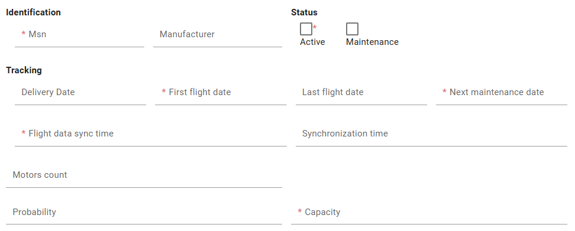

# Form Configuration
This page will explain how to configure the inputs into a form of a CRUD feature with BIA Framework.

## Form fields
### Principles
All the fields that must be displayed into your CRUD feature must be declared into a `BiaFieldsConfig<TDto>` class, where `TDto` represents your feature model. This class is used both for the form and the table display of your feature CRUD screens.  

The declaration must be set into your feature model, exported as const, and associated to the feature `CrudConfig` into your feature's constants declarations :
``` typescript title="feature.constants.ts"
export const featureCRUDConfiguration: CrudConfig<Feature> = new CrudConfig({
  featureName: 'features',
  // Here, featureFieldsConfiguration is declared as const into the feature model
  fieldsConfig: featureFieldsConfiguration
  [...]
});
```

**NOTE :** the declaration into the model and association into the constants are already set when using CRUD generation from BIAToolkit.

### Configuration
You must add all your fields to display into the `columns` property of the `BiaFieldsConfig<TDto>`.  
Each column item must be a `BiaFieldConfig<TDto>`, where you will configure for each field :
- **`field`** : feature's property name to bind with *(mandatory in constructor)*
- **`header`** : header name of your feature's property when displayed into a table *(mandatory in constructor)*
- `type` : type of the input (`Date` | `DateTime` | `Time` | `TimeOnly` | `TimeSecOnly` | `Number` | `Boolean` | `String` | `OneToMany` | `ManyToMany`)
- `filterMode` : filter mode when displayed into a table
- `isSearchable` : searchable mode (`true` | `false`)
- `isSortable` : sortable mode (`true` | `false`) 
- `icon` : icon displayed beside the header name when displayed into a table
- `isEditable` : editable mode (`true` | `false`)
- `isOnlyInitializable` : only initializable mode (`true` | `false`)
- `isOnlyUpdatable` : only updatable mode (`true` | `false`)
- `isEditableChoice` : editable choice mode (`true` | `false`)
- `isVisible` : visibility mode (`true` | `false`)
- `isHideByDefault` : hide by default mode (`true` | `false`)
- `maxlength` : maximum lenght setting when input is a string
- `isRequired` : required mode (`true` | `false`)
- `specificOutput` : specific output mode (`true` | `false`)
- `specificInput` : specific input mode (`true` | `false`)
- `validators` : set of validators to apply to the input
- `minWidth` : minimum width when displayed into a table
- `isFrozen` : frozen mode (`true` | `false`)
- `alignFrozen` : frozen alignement
- `displayFormat` : display format

Example : 
``` typescript title="feature.ts"
export const featureFieldsConfiguration: BiaFieldsConfig<Feature> = {
  columns: [
    // Field configuration for msn property
    Object.assign(new BiaFieldConfig('msn', 'feature.msn'), {
      isRequired: true,
      validators: [Validators.required, Validators.maxLength(64)],
    }),
    // Field configuration for manufacturer property
    Object.assign(new BiaFieldConfig('manufacturer', 'feature.manufacturer'), {}),
    // Field configuration for isActive property
    Object.assign(new BiaFieldConfig('isActive', 'feature.isActive'), {
      isRequired: true,
      isSearchable: true,
      isSortable: false,
      type: PropType.Boolean,
      validators: [Validators.required],
    }),
    [...]
  ]}
```

## Form layout
### Principles 
The class `BiaFormLayoutConfig<TDto>` is the container of your form layout configuration. Each items of this class will represent a configuration to customize the disposition of your inputs into the form. 

These items can be :
1. `BiaFormLayoutConfigRow<TDto>` : a row that will contains a set of `BiaFormLayoutConfigColumns<TDto>` which represents each a field of one of your feature's property
2. `BiaFormLayoutConfigGroup<TDto>` : a group of `BiaFormLayoutConfigRow<TDto>` under a title  

When declaring a `BiaFormLayoutConfigColumns<TDto>`, you can set a column size according to the principle of columns contained into a grid. This column size must be set **between 1 and 12 to be valid**.  
The column without specified column size are managed by the `BiaFormLayoutConfigRow<TDto>` that calculate the ideal column size depending both on the remaining column size and the columns count into the row.

**NOTE :** all the fields used into the `BiaFormLayoutConfig` must have been declared into the `BiaFieldsConfig` of your CRUD feature. 

### Configuration
1. In front-end, open the model of your feature
2. Complete or add the `BiaFormLayoutConfig<TDto>` definition with your form configuration
3. Add the groups, rows and columns by required order of display

Example : 
``` typescript title="feature.ts"
export const featureFormConfiguration: BiaFormLayoutConfig<Feature> = new BiaFormLayoutConfig([
  // Define a group
  new BiaFormLayoutConfigGroup('Identification', [
    // Define a row inside the group
    new BiaFormLayoutConfigRow([
      // Define the columns of the row
      new BiaFormLayoutConfigColumn('msn'),
      new BiaFormLayoutConfigColumn('manufacturer'),
    ]),
  ]),
  new BiaFormLayoutConfigGroup('Status', [
    new BiaFormLayoutConfigRow([
      new BiaFormLayoutConfigColumn('isActive'),
      new BiaFormLayoutConfigColumn('isMaintenance'),
    ]),
  ]),
  new BiaFormLayoutConfigGroup('Tracking', [
    new BiaFormLayoutConfigRow([
      new BiaFormLayoutConfigColumn('deliveryDate'),
      new BiaFormLayoutConfigColumn('firstFlightDate'),
      new BiaFormLayoutConfigColumn('lastFlightDate'),
      new BiaFormLayoutConfigColumn('nextMaintenanceDate'),
    ]),
  ]),
  // Define a row
  new BiaFormLayoutConfigRow([
    // Define the columns of the row
    new BiaFormLayoutConfigColumn('syncTime'),
    // Define a column with a sepcific size
    new BiaFormLayoutConfigColumn('syncFlightDataTime', 6),
    new BiaFormLayoutConfigColumn('capacity'),
  ]),
  // Define a row with a single column with a specific size
  new BiaFormLayoutConfigRow([new BiaFormLayoutConfigColumn('syncTime', 3)]),
]);
```

The framework will automatically generate the form according to the `BiaFormLayoutConfig` :


**NOTE :** all the remaining fields declared into the `BiaFieldsConfig` will be displayed after the fields handled into the `BiaFormLayoutConfig`.

### Usage
Into your feature constants declaration, add the definition of the `formLayoutConfig` under the definition of `fieldsConfig` when declaring the `CrudConfig` :
``` typescript title="feature.constants.ts"
export const featureCRUDConfiguration: CrudConfig<Feature> = new CrudConfig({
  featureName: 'features',
  fieldsConfig: featureFieldsConfiguration
  formLayoutConfig: featureFormLayoutConfiguration,
  [...]
});
```

Into all the components that use a form component inherited from `CrudItemFormComponent` or `BiaFormComponent`, ensure to bind the `formConfig` property to your feature `BiaFormLayoutConfig` property : 

``` html title="feature-new.component.html"
<app-feature-form
  [...]
  [formConfig]="crudConfiguration.formConfig"
  [...]></app-feature-form>
```

**NOTE :** all the CRUD features generated from **4.1.0** with BIAToolkit are already ready to use