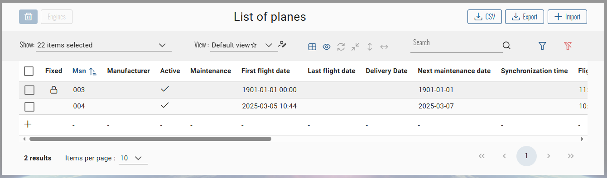
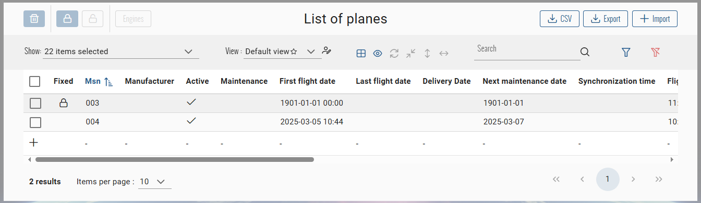
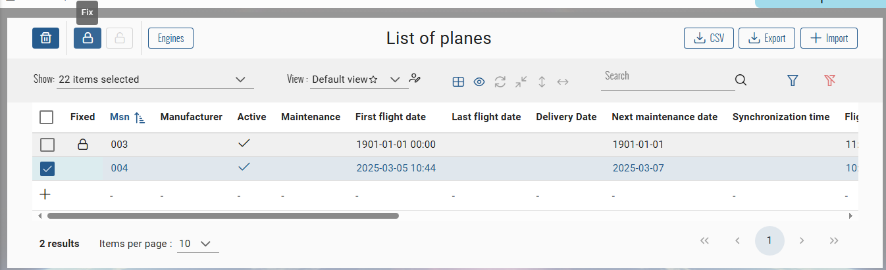
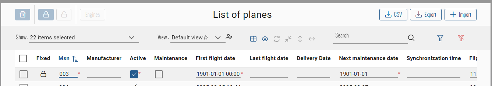
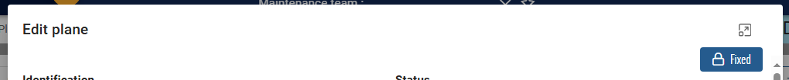
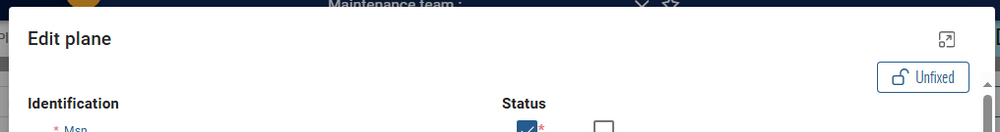

# Fixable CRUD
This page will explain how to configure a CRUD that can be fixed.

## Principles
A fixable CRUD represents an entity with a fixed state.  
This state indicates weither the entity is fixed or not and should not be edited anymore if true.  

When an entity is fixed, only users with a permission to edit fixable entities can change the fixable status or edit the entity.  
For the others, the entities will be only available as read only.

When an entity is fixed, his fixed date is automatically updated by the current date time.  
If the entity is updated event already fixed, the fixed date is automatically updated too.

## UI/UX
:::tip
UI/UX implementation is optionnal, just skip all the instructions on this page relative to front end
:::
### Users views
#### Index page
The user will see on the table a new **Fixed** column with the fixed status of the item.  
A lock icon will be displayed if the item is fixed :  

:::info
- User can not edit a fixed item in calc mode
- The **delete** button will be enable only if at least one of selected items is not fixed  
Even when multiple items with fixed status are selected, only the not fixed will be deleted
:::

#### Edit page
If the opened item is fixed, the form will be displayed as read-only with a fixed state button on the top right corner :  

### Users with rights views
#### Index page
The user will have access to the fixable buttons on the top left corner of the table header :  


User must select only one item to use these button :  

:::info
Fix button will be available if selected item is not fixed, and invert for unfix button
:::

User can edit in calc mode a fixed item :  


#### Edit page
The fixable button of the page will be enable on top right corner :  


Clicking on it will invert the value :  



## Configuration
### Define the fixable entity
#### Entity Model
Implements the interface `IEntityFixable<TKey>` in your feature's entity :
``` csharp title="Feature.cs"
public class Feature : IEntityFixable<int>
{
  /// <summary>
  /// Gets or sets the is fixed.
  /// </summary>
  public bool IsFixed { get; set; }

  /// <summary>
  /// Gets or sets the fixed date.
  /// </summary>
  public DateTime? FixedDate { get; set; }
}
```
:::info
`IEntityFixable<TKey>` inherits from `IEntity<TKey>`.
:::

#### DTO Model
Inherits from the class `FixableDto<TKey>` your feature's DTO :
``` csharp title="FeatureDto.cs"
public class FeatureDto : FixableDto<int>
```
:::info
`FixableDto<TKey>` inherits from `BaseDto<TKey>`.
:::

#### Mapper
Add the required mapping of the fixable properties into your feature's mapper : 
``` csharp title="FeatureMapper.cs"
public class FeatureMapper : BaseMapper<FeatureDto, Feature, int>
{
  public override void DtoToEntity(FeatureDto dto, Feature entity)
  {
    // [...]
    entity.IsFixed = dto.IsFixed;
    entity.FixedDate = dto.FixedDate;
  }

  public override Expression<Func<Feature, FeatureDto>> EntityToDto()
  {
    return entity => new FeatureDto
    {
      // [...]
      IsFixed = entity.IsFixed,
    }
  }
}
```
:::tip
Add the mapping of the `FixedDate` when mapping to DTO only if needed in your application.
:::

#### Front CRUD Configuration
Into your feature's constants file, set the property `isFixable` of the `CrudConfig` to `true` :
``` typescript title="feature.constants.ts"
export const featureCRUDConfiguration: CrudConfig<Feature> = new CrudConfig({
  // [...]
  isFixable: true,
});
```

### Define the permissions
#### Back
Into `bianetconfig.json`, add the fix permission and associate roles :
``` json title="bianetconfig.json"
{
  "BiaNet": {
    "Permissions": [
      {
        "Names": [ "Feature_Fix" ],
        "Roles": [ "Role" ] 
      }
    ]
  }
}
```

Into `Rights.cs`, add the fix right :
``` csharp title="Rights.cs"
public static class Rights
{
  public static class Features 
  {
    /// <summary>
    /// The right to fixe features.
    /// </summary>
    public const string Fix = "Feature_Fix";
  }
}
```

Into your feature application service, add to `FiltersContext` the filter specification to apply to users with no fix permissions :
``` csharp title="FeatureAppService.cs"
public class FeatureAppService : CrudAppServiceBase<FeatureDto, Feature, int, PagingFilterFormatDto, FeatureMapper>, IFeatureAppService
{
  public FeatureAppService(ITGenericRepository<Feature, int> repository, IPrincipal principal)
      : base(repository)
  {
      // [...]

      if (!(principal as BiaClaimsPrincipal).IsInRole(Rights.Features.Fix))
      {
          // Specification to filter on only not fixed items
          var specification = new DirectSpecification<Feature>(p => !p.IsFixed);
          // Apply specification when updating or deleting to block user actions on fixed items if not authorized
          this.FiltersContext.Add(AccessMode.Update, specification);
          this.FiltersContext.Add(AccessMode.Delete, specification);
      }
  }
}
```

#### Front
Into `permission.ts` add the fix permission :
``` typescript title="permission.ts"
export enum Permission {
  Feature_Fix = 'Feature_Fix',
}
```

### Configure index component
Into your feature index component, add the definition of `canFix` property into the `setPermissions()` method :
``` typescript title="feature-index.component.ts"
export class FeaturesIndexComponent extends CrudItemsIndexComponent<Feature> {
  protected setPermissions(): void {
    // [...]
    this.canFix = this.authService.hasPermission(Permission.Feature_Fix);
  }
}
```

Add into the HTML template these properties bindings for handling fixable state into `bia-table-header`, `bia-table`, `bia-calc-table` inherited or used components : 
``` html title="feature-index.component.html"
<div>
  <div>
    <!-- BiaTableHeaderComponent --->
    <bia-table-header
      [canFix]="canFix"
      [showFixedButtons]="crudConfiguration.isFixable"
      (crudItemFixedChanged)="crudItemService.updateFixedStatus($event.crudItemId, $event.fixed)">
    </bia-table-header>

    <!-- BiaTableComponent --->
    <bia-table
      [canFix]="canFix"
      [showFixableState]="crudConfiguration.isFixable">
    </bia-table>

    <!-- BiaCalcTableComponent --->
    <bia-calc-table
      [canFix]="canFix"
      [showFixableState]="crudConfiguration.isFixable">
    </bia-calc-table>
  </div>
</div>
```

### Configure edit component
Into your feature edit component, set the permissions into the `setPermissions()` method like following :
``` typescript title="feature-edit.component.ts"
export class FeaturesEditComponent extends CrudItemsEditComponent<Feature> {
  protected setPermissions(): void {
    // Define if user can fix
    this.canFix = this.authService.hasPermission(Permission.Feature_Fix);
    // Define the read only mode
    this.sub.add(
      this.crudItemService.crudItem$
        .pipe(filter(feature => !!feature && Object.keys(feature).length > 0))
        .subscribe(feature => {
          if (
            this.crudConfiguration.isFixable === true &&
            this.canFix !== true &&
            feature.isFixed === true
          ) {
            // Read only enable if current CRUD is fixable, item is fixed and user can't fix
            this.formReadOnlyMode = FormReadOnlyMode.on;
          }
        })
    );
  }
}
```

Add into the HTML template these properties bindings for handling fixable state into `bia-form`, `crud-item-form` inherited or used components : 
``` html title="feature-edit.component.html"
<app-feature-form
  [canFix]="canFix"
  (fixedChanged)="onFixedChanged($event)">
</app-feature-form>
```
### Configure read component
:::info
Only applicable if you have set read only strategy on your CRUD.  
See **[Form Read Only](./70-FormConfiguration.md#form-read-only)** page.
:::

Into your feature read component, set the permissions into the `setPermissions()` method like following :
``` typescript title="feature-read.component.ts"
export class FeaturesReadComponent extends CrudItemsReadComponent<Feature> {
  protected setPermissions(): void {
    // Define if user can fix
    this.canFix = this.authService.hasPermission(Permission.Feature_Fix);
    // Define if user can swith to edit mode and read only mode
    this.sub.add(
      this.crudItemService.crudItem$
        .pipe(filter(feature => !!feature && Object.keys(feature).length > 0))
        .subscribe(feature => {
          // Define if user can edit
          this.canEdit =
            this.crudConfiguration.isFixable === true && feature.isFixed === true
              ? this.canFix
              : this.authService.hasPermission(Permission.Feature_Update);

          // Define the read only mode
          this.formReadOnlyMode =
            this.crudConfiguration.isFixable === true && feature.isFixed === true
              ? this.canEdit
                ? this.formReadOnlyMode
                : FormReadOnlyMode.on
              : this.formReadOnlyMode;
        })
    );
  }
}
```

Add into the HTML template these properties bindings for handling fixable state into `bia-form`, `crud-item-form` inherited or used components : 
``` html title="feature-read.component.html"
<app-feature-form
  [canFix]="canFix"
  (fixedChanged)="onFixedChanged($event)">
</app-feature-form>
```