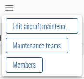
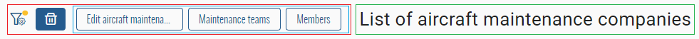
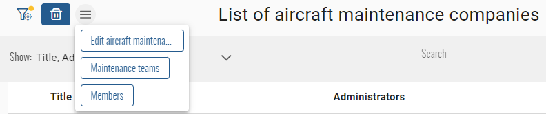

# Button Group
This page will explain how to group some buttons inside a burger menu.  


## Configuration
### Buttons definition
The set of buttons to group must be of type `BiaButtonGroupItem`. This class implements the interface `MenuItem` of primeng ([documentation API](https://v17.primeng.org/menubar#api.menubar.interfaces.MenuItem)) but exposes only usefull properties for the BIAFramework :
``` typescript
export class BiaButtonGroupItem implements MenuItem {
  label?: string | undefined;
  tooltipPosition?: string | undefined;
  tooltip?: string | undefined;
  visible?: boolean | undefined;
  disabled?: boolean | undefined;
  command(event: MenuItemCommandEvent): void {}

  constructor(
    label: string,
    command: (event: MenuItemCommandEvent) => void,
    visible?: boolean | undefined,
    disabled?: boolean | undefined,
    tooltip?: string | undefined,
    tooltipPosition?: string | undefined
  ) {
  }
}
```

Declare your array of `BiaButtonGroupItem` inside your component that will group the buttons : 
``` typescript
this.buttonGroup = [
  new BiaButtonGroupItem(
    "FirstButton",
    () => this.onFirstButtonClick(),
    true,
    true,
    "This is my first button",
    "top"
  ),
  new BiaButtonGroupItem(
    "SecondButton",
    () => this.onSecondButtonClick(),
  )
];
```

**NOTE :** optionnal parameter `visible` will have default value of `true` while the default value of `disabled` will be `false` 
### Button group component
Inside your HTML component, use the `BiaButtonGroupComponent` :
``` html
<bia-button-group
  [buttons]="buttonGroup"
  [compact]="true"
  [autoCompact]="false"></bia-button-group>
``` 
- `buttons` : array of `BiaButtonGroupItem`
- `compact` : force the group to be displayed under a burger button. Default value is `false`
- `autoCompact` : display by default all the buttons on the same line, will automatically group the buttons under a burger button depending of the available space between the group container and the next or previous sibling element. Default value is `true`

**NOTE :** 
- when `compact` is `true`, `autoCompact` will be always `false`
- event with `autoCompact` at `false`, the buttons will be grouped under the burger button if the screen size is smaller enought to trigger the passage to mobile mode

**Example** :  

-  : the button group component
-  : container that contains the button group component
-  : next sibling container of the button group container

If the  crops on the , or the screen width triggers the mobile mode, the `BiaButtonGroupComponent` will automatically group the button under the burger button :  


The buttons will return to their intial display format on the same line if mobile mode is not triggered and the space between the  and , including the total width of the buttons, is enough.


## Builtin with CRUD index component
When using a component that inherits from `CrudItemsIndexComponent`, you can use three predefined array of `BiaButtonGroupItem` :
- `selectedButtonGroup` : the buttons that must be displayed at the left of the list header
- `listButtonGroup` : the buttons that must be displayed at the right of the list header
- `customButtonGroup` : the buttons that must be displayed at the right of the list header title

The definition can be made by overriding the dedicated method of each array :
- `initSelectedButtonGroup()`
- `initListButtonGroup()`
- `initCustomButtonGroup()`

``` typescript title="feature-index.component.ts"
protected initSelectedButtonGroup() {
  this.selectedButtonGroup = [
    [...] // Define the BiaButtonGroupItems
  ];
}
``` 

**NOTE :** the `CrudItemsIndexComponent` will automatically init the button groups at init of the component, after permissions set and when the list element selection changes. It allows you to bind the `BiaButtonGroupItem` properties to local properties that can change. If you want to refresh all the buttons groups by yourself, you can call the protected method `initButtonGroups()` inside your own index component.

You can now use theses arrays with the `BiaButtonGroupComponent` into your index component for each corresponding `pTemplate` when using the `BiaTableHeaderComponent` :
``` html title="feature-index.component.html"
<bia-table-header>
  <ng-template pTemplate="actionOnSelected">
    <bia-button-group [buttons]="selectedButtonGroup"></bia-button-group>
  </ng-template>
  <ng-template pTemplate="actionOnList">
    <bia-button-group [buttons]="listButtonGroup"></bia-button-group>
  </ng-template>
  <ng-template pTemplate="customControl">
    <bia-button-group [buttons]="customButtonGroup"></bia-button-group>
  </ng-template>
</bia-table-header>
```
