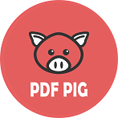
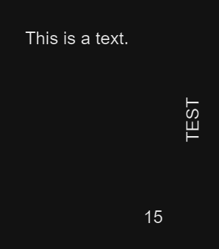

# Extract PDF words

## UglyToad.PdfPig


[GitHub](https://github.com/UglyToad/PdfPig) - [Wiki](https://github.com/UglyToad/PdfPig/wiki)

Install nuget package on your project :
```cmd
Install-Package PdfPig
```

## Extract words
### What is a word ?
A word is a group of letters with the same orientation where the proximity between them before and after spaces can compose a single word.

Basically, PdfPig will parse all the available letters, getting for each their positions and orientations. Next, the library will be able to group these letters into words by using various parameters, such as maximum distance between them.
### Basic usage
Following code example showing a simple usage of PdfPig to get all the words on a PDF document :
```csharp
List<string> ExtractPdfWords(string pdfPath)
{
    var pdfWords = new List<string>();

    //Open the PDF document using PdfPig
    using var document = PdfDocument.Open(pdfPath);
    //Iterate trought document's pages
    foreach (var page in document.GetPages())
    {
        //Getting words of current page from left to right and top to bottom horizontally
        var words = page.GetWords()
            //Optional: Exclude empty words
            .Where(w => !string.IsNullOrWhiteSpace(w.Text));

        //Keeping words values only
        pdfWords.AddRange(words.Select(w => w.Text));
    }

    return pdfWords;
}
```
Here, PdfPig will return all words of the document from left to right and top to bottom, **horizontally only**. It means that any letters of rotated words will be kept as single word. 

For example, if your PDF document has this content :



The method will return following words : 
```cmd
This
is
a
text.
T
S
E
T
15
```

### Custom usage
Next code example will show you how to get words from any orientation :
```csharp
List<string> ExtractPdfWords(string pdfPath)
{
    var pdfWords = new List<string>();

    //Open the PDF document using PdfPig
    using var document = PdfDocument.Open(pdfPath);
    //Iterate trought document's pages
    foreach(var page in document.GetPages())
    {
        //Getting all letters of current page
        var letters = page.Letters
            //Optional: Keep only vertical letters rotated at 90°
            .Where(l => l.TextOrientation == UglyToad.PdfPig.Content.TextOrientation.Rotate90)
            .ToList();

        //Assign word extractor using current instance of NearestNeighbourWordExtractor.
        //Note: A custom word extractor can be created using a new instance of NearestNeighbourWordExtractor
        //      giving a new NearestNeighbourWordExtractor.NearestNeighbourWordExtractorOptions() with custom configuration
        var wordExtractor = NearestNeighbourWordExtractor.Instance;

        //Getting words using word extractor on keeped page's letters
        var words = wordExtractor.GetWords(letters)
            //Optional: Exclude empty words
            .Where(w => !string.IsNullOrWhiteSpace(w.Text));

        //Keeping words values only
        pdfWords.AddRange(words.Select(w => w.Text));
    }

    return pdfWords;
}
```
With the same PDF content example used in previous chapter, the extracted result will only contains the word **TEST**.

If we remove the optional instruction `.Where(l => l.TextOrientation == UglyToad.PdfPig.Content.TextOrientation.Rotate90)` to kept all the letters that PdfPig will detect in the document, the extracted words will be grouped according to them orientation (horizontal, then rotate 270°, then rotate 180°, then rotate 90°, then other rotations) :
```cmd
This
is
a
text.
15
TEST
```

### Grouping per line
Additionaly, you can regroup the words per line by implementing custom method to group the words according to their orientation :
```csharp
List<string> ExtractPdfWords(string pdfPath)
{
    var pdfWords = new List<string>();

    using var document = PdfDocument.Open(pdfPath);
    foreach(var page in document.GetPages())
    {
        var letters = page.Letters.ToList();
        var wordExtractor = NearestNeighbourWordExtractor.Instance;
        var words = wordExtractor.GetWords(letters);

        var wordsPerLine = GetWordsPerLine(words);
        pdfWords.AddRange(wordsPerLine);
    }

    return pdfWords;
}

List<string> GetWordsPerLine(IEnumerable<Word> words)
{
    var result = new List<string>();

    //Group words by text orientation
    var wordsGroupedByOrientation = words.GroupBy(w => w.TextOrientation).ToList();

    foreach(var group in wordsGroupedByOrientation)
    {
        //Horizontal words
        if (group.Key == UglyToad.PdfPig.Content.TextOrientation.Horizontal)
        {
            //Represents the tolerance between two word bottom position to group them into the same line
            var lineTolerance = 5;

            var wordsPerLine = group
                //Group by bottom position with tolerance ratio
                .GroupBy(w => Math.Round(w.BoundingBox.Bottom / lineTolerance) * lineTolerance)
                //Order by bottom position descending to have words per line from top to bottom
                .OrderByDescending(g => g.Key)
                //Join the words of the same line, ordered by left position ascending
                .Select(g => string.Join(string.Empty, g.OrderBy(w => w.BoundingBox.Left).Select(w => w.Text)));

            result.AddRange(wordsPerLine);
        }

        //Implements the grouping methods for all the other text orientations
        //...
    }

    return result;
}
```


