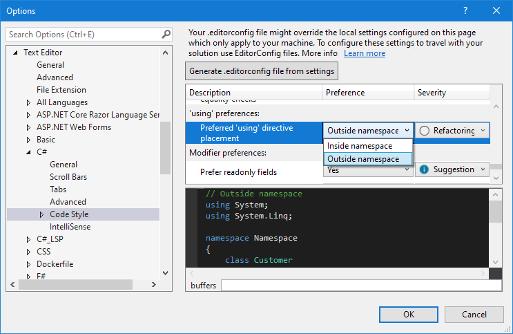
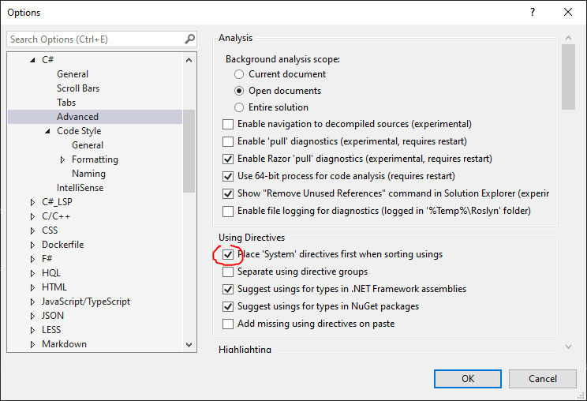

# Configure your dotnet development environment:

## Minimum requirements

### Visual Studio 2019 & components
**Installation :**

Install [Visual Studio 2019 16.8 or later](https://visualstudio.microsoft.com/fr/vs/) and be sure to add the latest SDK of .NET Core from the components list.

Add those components during installation :
- [Development Time IIS Support](https://devblogs.microsoft.com/aspnet/development-time-iis-support-for-asp-net-core-applications/)
  When installing IIS, make sur that "WWW Services -> Security -> Windows Authentication" and "Basic Authentication" are ckecked and restart IIS
  

If Visual Studio 2019 is already installed, you can add those components by launching the VS Installer.

**Configuration :**

Set your "using placement" code style setting to **inside namespace**
Code style settings are available from Tools > Options > Text Editor > C# > Code Style.

**Enable** your "Place 'System' directives first when sorting usings"
This setting is available from Tools > Options > Text Editor > C# > Advanced 

### Variable Environment
create the following system environment variable:  
Name: ASPNETCORE_ENVIRONMENT  
Value: Development  
The IIS server must be restarted in order that this variable is taken into account

