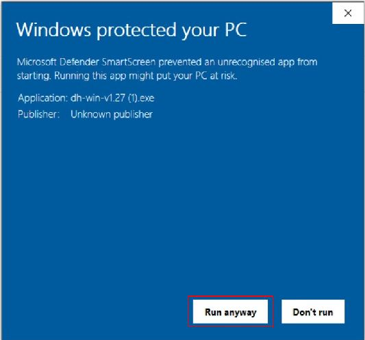

# Configure the BIA tool kit
This document explains how to configure the BIA tool kit, to be ready to apply the other operation (creation, migration...)

## Get the BIAToolKit
Take the last version of the "BIAToolKit.zip" from [last release](https://github.com/BIATeam/BIAToolKit/releases).
Unzip it and launch the BIA.ToolKit.exe

If you have the Windows defender smart screen warning click on "More Info" then click "Run anyway"":

## Configure your BIA Template repository
In the first tab, in the upper left corner, chose if you want to use a local folder to synchronize it.
* It is not required so if you don't have clone the BIATemplate locally select the first radio button "Use the BIAtemplate GitHub repository" the local folder will be : C:\Users\YourLogin\AppData\Local\BIA.ToolKit\BIA.ToolKit\1.0.0\BIATemplate\Repo
* If you work regularly on BIATemplate or if you synchronize regularly you select the second option "use a local cloned folder" and enter the local pat of this folder.

Click on the "synchronize" button to do a git sync between the GitHub repo and the local folder.

## Use company files 
The Company files are use to replace some files like logos, configuration files at the creation of the project or during migration.
The company files can be a shared folder or a git repository.

It is not necessary but it is recommended to have those files if you implement severals projects with the framework. It avoid you to manually make the replacement on each project.

If you do not have company files check the check box in the right part.
Select if you want to use a git repo or a local folder.
The synchronize work only if you have configure the repo url.

## Save the settings
Click on the save settings button to save the settings. The configuration is save for the next start of the BIAToolKit