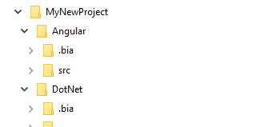
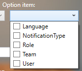

# Create CRUD on existing project with the BIA tool kit
This document explains how to create a CRUD with the BIAToolKit.

## Prerequisite
* You need to have an existing project. In other case, create it as [Describe here](./20-CreateProject.md).
* In first time, your project must contain: *entity*, *mapper* and *dto* files associated to the CRUD you want to create.
* Project must contain **.bia** folders as 
  

## 0. Project Folder
Choose the project directory to work on by choosing 'project parent path' and selecting 'project folder' ('Dto file' combobox is automatically populate). Zips contains on '.bia' folders are automatically parsed.

## 1. Dto file linked to CRUD to generate
The 'Dto file' combobox lists all Dto files on your project (based on file name).

Dto file selected is automatically parsed. The 'Entity name (singular)' is filled and the 'Display item name' combobox is populated.

If you have created new Dto file and you don't see it, you can refresh the list with the button on right side of combobox.

## 2. Items generation
Choose items you want to generate for the CRUD:
* Generation: 
   * Back: WebAPi (selected by default)
   * Front: Front (selected by default)
* Generation Type: (minimum a choice is mandatory)
   *  CRUD
   *  CRUD (with parent)
   *  Team

## 3. Parent (not mandatory)
By selecting CRUD (with parent) the checkbox "Has Parent" will be automatically checked. 
When selecting Team generation type, you can choose to activate or not the Has Parent checkbox.

This checkbox enable mechanisms that will automatically link your CRUD to generate to the parent. 
You will need to fill the fields Parent Name singular and plural at the bottom of the form.

## 4. Domain
The domain associated to your CRUD.

When Has Parent is checked, the domain should be the parent domain.

## 5. CRUD name
Singular entity name is fill up by default but you can change it.
You need to complete the plural name before generation.

## 6. Display item
On associated combobox, choose the field you want to display on front page.

## 7. Option (not mandatory)
__*Option Generation Type must not be checked.*__

It is possible to generate link Option with the CRUD. On associated combobox, choose 1 or more option previously generated.

*This field is not mandatory to generate a CRUD.*

##

## 8. Generation
By clicking on the button 'Generate', CRUD files are generated automatically on project.

> At first CRUD generation on the project, an historic file is made on project folder (*CrudGeneration.bia*).
> In case of regeneration, data are automatically filled from historic file, and warning message is displayed to inform you.

Open DotNet and Angular projects, rebuild each one and fix issues if exists.

### Known issues
* After generation, on Angular folder, go to navigation file (*navigation.ts*) and rework **path** property (delete *examples*).
* On front side, when compiling angular project, if **import** are not used (mostly on model), deleted its to avoid errors.
* Traduction is not already implemented, so **i18n** files (fr.json/en.json/es.json) must be completed with missing labels. 

## Delete previous CRUD generation
In case of you want previous generation:
* in first, select the Dto file
* then, click on 'Delete previous generation' button

## Delete annotations
After generations, if you want to clean code, you can choose to delete annotations.
Be careful, because in this case, ***you can't regenerate or delete previous features generated***, but you can ***continue to generate new features***.
