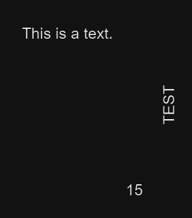

# Extract PDF words
This documentation will show you how to extract words from a PDF.

## UglyToad.PdfPig


[GitHub](https://github.com/UglyToad/PdfPig) - [Wiki](https://github.com/UglyToad/PdfPig/wiki)

Current documentation will use the NuGet Package **PdfPig**.

## What is a word ?
A word is a group of letters with the same orientation where the proximity between them can compose a single word.

Basically, PdfPig will parse all the available letters, getting for each their positions and orientations. Next, the library will be able to group these letters into words by using various parameters, such as maximum distance between them.
## BIADemo example
The project **BIADemo** implements an example solution in order to use **PdfPig** to analyze PDF document. The implementation schema respects the layer's segregation and abstraction to show you how to properly use the package throught a dedicated repository, giving you the opportunity to implements other document analyzers for different types (Word, Excel, raw...).

Architecture scheme is following : 
```cmd
      [PRESENTATION LAYER]
   DocumentAnalysisController
              🠃
      [APPLICATION LAYER]
    IDocumentAnalysisService
              🠃
     [INFRASTRUCTURE LAYER]
IDocumentAnalysisRepositoryFactory
              🠃
   IDocumentAnalysisRepository
```

```csharp title="DocumentAnalysisController"
/// <summary>
/// Controller for document analysis.
/// </summary>
public class DocumentAnalysisController : BiaControllerBase
{
    private readonly IDocumentAnalysisService documentAnalysisService;

    /// <summary>
    /// Initializes a new instance of the <see cref="DocumentAnalysisController"/> class.
    /// </summary>
    /// <param name="documentAnalysisService">Document analysis service.</param>
    public DocumentAnalysisController(IDocumentAnalysisService documentAnalysisService)
    {
        this.documentAnalysisService = documentAnalysisService;
    }

    /// <summary>
    /// Retrieve the content of a document.
    /// </summary>
    /// <param name="file"><see cref="IFormFile"/> of the document.</param>
    /// <returns>Document content.</returns>
    [HttpPost("[action]")]
    [AllowAnonymous]
    [ProducesResponseType(typeof(DocumentContent), StatusCodes.Status200OK)]
    [ProducesResponseType(typeof(string), StatusCodes.Status400BadRequest)]
    public IActionResult GetContent(IFormFile file)
    {
        if (file == null || file.Length == 0)
        {
            return this.BadRequest("File cannot be empty.");
        }

        try
        {
            using var fileStream = file.OpenReadStream();
            var documentContent = this.documentAnalysisService.GetContent(file.FileName, file.ContentType, fileStream);
            return this.Ok(documentContent);
        }
        catch (Exception ex)
        {
            return this.BadRequest(ex.Message);
        }
    }
}
```

```csharp title="DocumentAnalysisService"
/// <summary>
/// Service for document analysis.
/// </summary>
public class DocumentAnalysisService : IDocumentAnalysisService
{
    private readonly IDocumentAnalysisRepositoryFactory documentAnalysisRepositoryFactory;

    /// <summary>
    /// Initializes a new instance of the <see cref="DocumentAnalysisService"/> class.
    /// </summary>
    /// <param name="documentAnalysisRepositoryFactory">The document analysys repositories factory <see cref="IDocumentAnalysisRepositoryFactory"/>.</param>
    public DocumentAnalysisService(IDocumentAnalysisRepositoryFactory documentAnalysisRepositoryFactory)
    {
        this.documentAnalysisRepositoryFactory = documentAnalysisRepositoryFactory;
    }

    /// <summary>
    /// Analyse and retrieve document content.
    /// </summary>
    /// <param name="fileName">The document name.</param>
    /// <param name="fileContentType">The document content type.</param>
    /// <param name="fileStream">The document conntat as <see cref="Stream"/>.</param>
    /// <returns>The document content as <see cref="DocumentContent"/>.</returns>
    public DocumentContent GetContent(string fileName, string fileContentType, Stream fileStream)
    {
        // Retrieve the document type from his content type
        var documentType = GetDocumentType(fileContentType);

        // Get the corresponding implementation of IDocumentAnalysisRepository for the document type
        var documentAnalysisRepository = this.documentAnalysisRepositoryFactory.GetDocumentAnalysisRepository(documentType);

        // Get document pages from repository
        var documentPages = documentAnalysisRepository.GetPagesContent(fileStream);

        return new DocumentContent
        {
            Name = fileName,
            Type = documentType,
            Pages = documentPages,
        };
    }

    private static DocumentType GetDocumentType(string fileContentType)
    {
        return fileContentType switch
        {
            "application/pdf" => DocumentType.Pdf,
            _ => throw new NotImplementedException($"Document analysis for content type {fileContentType} is not implemented yet.")
        };
    }
}
```

The PDF implementation for the interface `IDocumentAnalysisRepository` using **PdfPig** is following :
```csharp title="PdfAnalysisRepository"
/// <summary>
/// Document analysis repository for PDF files.
/// </summary>
public class PdfAnalysisRepository : IDocumentAnalysisRepository
{
    /// <summary>
    /// Document type handled by the repository.
    /// </summary>
    public DocumentType DocumentType => DocumentType.Pdf;

    /// <summary>
    /// Analyze the document's pages content.
    /// </summary>
    /// <param name="stream">Document content.</param>
    /// <returns>Collection of <see cref="DocumentPage"/>.</returns>
    public List<DocumentPage> GetPagesContent(Stream stream)
    {
        var documentPages = new List<DocumentPage>();

        // Open the PDF document using PdfPig
        using var document = PdfDocument.Open(stream);

        // Iterate trought document's pages
        foreach (var page in document.GetPages())
        {
            // Getting all letters of current page
            // Optional: letters can be filtered by some criterias
            var letters = page.Letters;

            // Set word extractor based on current instance of PdfPig NearestNeighbourWordExtractor class
            // Optional: custom word extractor can be set
            var wordExtractor = NearestNeighbourWordExtractor.Instance;

            // Getting words using word extractor page's letters and map them into DocumentWord
            var documentWords = wordExtractor.GetWords(letters)
                .Select(word => new DocumentWord
                {
                    Text = word.Text,
                    PositionX = word.BoundingBox.BottomLeft.X,
                    PositionY = word.BoundingBox.BottomLeft.Y,
                    Rotation = word.BoundingBox.Rotation,
                    Height = word.BoundingBox.Height,
                    Orientation = GetTextOrientation(word.TextOrientation),
                });

            documentPages.Add(new DocumentPage(page.Number, documentWords));
        }

        return documentPages;
    }

    private static TextOrientation GetTextOrientation(UglyToad.PdfPig.Content.TextOrientation orientation)
    {
        return orientation switch
        {
            UglyToad.PdfPig.Content.TextOrientation.Horizontal => TextOrientation.Horizontal,
            UglyToad.PdfPig.Content.TextOrientation.Rotate180 => TextOrientation.Rotated180,
            UglyToad.PdfPig.Content.TextOrientation.Rotate90 => TextOrientation.Rotated90,
            UglyToad.PdfPig.Content.TextOrientation.Rotate270 => TextOrientation.Rotated270,
            _ => TextOrientation.Other
        };
    }
}
```

For example, if your PDF document has this content :



The endpoint will return this kind of response : 
```json
{
  "name":"Example.pdf",
  "type":0,
  "pagesCount":1,
  "pages":[
    {
      "number":1,
      "linesCount":5,
      "wordsCount":70,
      "lines":[
        {
          "content":"This is a text.",
          "orientation":0,
          "words":[
            {
              "text":"This",
              "positionX":207.9,
              "positionY":800.6003,
              "rotation":0,
              "height":7.4361621093750045,
              "orientation":0
            },
            {
              "text":" ",
              "positionX":251.89233932812496,
              "positionY":800.6003,
              "rotation":0,
              "height":0,
              "orientation":0
            },
            {
              "text":"is",
              "positionX":254.62745732812496,
              "positionY":800.6003,
              "rotation":0,
              "height":7.269960937499945,
              "orientation":0
            },
            {
              "text":" ",
              "positionX":268.08748762499994,
              "positionY":800.6003,
              "rotation":0,
              "height":0,
              "orientation":0
            },
            {
              "text":"a",
              "positionX":270.82260562499994,
              "positionY":800.6003,
              "rotation":0,
              "height":7.623808593750027,
              "orientation":0
            },
            {
              "text":" ",
              "positionX":273.86331932812493,
              "positionY":800.6003,
              "rotation":0,
              "height":0,
              "orientation":0
            },
            {
              "text":"text.",
              "positionX":276.59843732812493,
              "positionY":800.6003,
              "rotation":0,
              "height":7.4361621093750045,
              "orientation":0
            }
          ]
        },
        {
          "content":"15",
          "orientation":0,
          "words":[
            {
              "text":"15",
              "positionX":31.14,
              "positionY":36.5603,
              "rotation":0,
              "height":7.420078125000003,
              "orientation":0
            }
          ]
        },
        {
          "content":"TEST",
          "orientation":3,
          "words":[
            {
              "text":"TEST",
              "positionX":545.4,
              "positionY":155.0603,
              "rotation":90,
              "height":4.44140625,
              "orientation":3
            }
          ]
        }
      ],
      "words":[
        {
          "text":"This",
          "positionX":207.9,
          "positionY":800.6003,
          "rotation":0,
          "height":7.4361621093750045,
          "orientation":0
        },
        {
          "text":" ",
          "positionX":251.89233932812496,
          "positionY":800.6003,
          "rotation":0,
          "height":0,
          "orientation":0
        },
        {
          "text":"is",
          "positionX":254.62745732812496,
          "positionY":800.6003,
          "rotation":0,
          "height":7.269960937499945,
          "orientation":0
        },
        {
          "text":" ",
          "positionX":268.08748762499994,
          "positionY":800.6003,
          "rotation":0,
          "height":0,
          "orientation":0
        },
        {
          "text":"a",
          "positionX":270.82260562499994,
          "positionY":800.6003,
          "rotation":0,
          "height":7.623808593750027,
          "orientation":0
        },
        {
          "text":" ",
          "positionX":273.86331932812493,
          "positionY":800.6003,
          "rotation":0,
          "height":0,
          "orientation":0
        },
        {
          "text":"text.",
          "positionX":276.59843732812493,
          "positionY":800.6003,
          "rotation":0,
          "height":7.4361621093750045,
          "orientation":0
        },
        {
          "text":"15",
          "positionX":31.14,
          "positionY":36.5603,
          "rotation":0,
          "height":7.420078125000003,
          "orientation":0
        },
        {
          "text":"TEST",
          "positionX":545.4,
          "positionY":155.0603,
          "rotation":90,
          "height":4.44140625,
          "orientation":3
        }
      ]
    }
  ]
}
```

## Going further
### Group words per line
In the class `DocumentPage`, some public static methods are available and used to retrieve collection of `DocumentLine` from a bunch of `DocumentWord`. These methods can only handle the horizontal and vertical text orientation to recompose the document lines :
```csharp title="DocumentPage"
public class DocumentPage
{
    /// <summary>
    /// Extract lines from words.
    /// </summary>
    /// <param name="words">Collection of <see cref="DocumentWord"/>.</param>
    /// <returns>Collection of <see cref="DocumentLine"/>.</returns>
    public static List<DocumentLine> ExtractLines(IEnumerable<DocumentWord> words)
    {
        var lines = new List<DocumentLine>();

        lines.AddRange(ExtractHorizontalLines(words));
        lines.AddRange(ExtractRotated90Lines(words));
        lines.AddRange(ExtractRotated180Lines(words));
        lines.AddRange(ExtractRotated270Lines(words));

        return lines;
    }

    /// <summary>
    /// Extract lines from horizontal words.
    /// </summary>
    /// <param name="words">Collection of <see cref="DocumentWord"/>.</param>
    /// <returns>Collection of <see cref="DocumentLine"/>.</returns>
    public static IEnumerable<DocumentLine> ExtractHorizontalLines(IEnumerable<DocumentWord> words)
    {
        return words
            .Where(w => w.Orientation == TextOrientation.Horizontal)
            .GroupBy(w => GroupByPosition(w.PositionY, words.Max(x => x.Height) + 1))
            .OrderByDescending(g => g.Key)
            .Select(g => g.OrderBy(w => w.PositionX))
            .Select(g => new DocumentLine(TextOrientation.Horizontal, g));
    }

    /// <summary>
    /// Extract lines from horizontal upside down words.
    /// </summary>
    /// <param name="words">Collection of <see cref="DocumentWord"/>.</param>
    /// <returns>Collection of <see cref="DocumentLine"/>.</returns>
    public static IEnumerable<DocumentLine> ExtractRotated180Lines(IEnumerable<DocumentWord> words)
    {
        return words
            .Where(w => w.Orientation == TextOrientation.Rotated180)
            .GroupBy(w => GroupByPosition(w.PositionY, words.Max(x => x.Height) + 1))
            .OrderByDescending(g => g.Key)
            .Select(g => g.OrderByDescending(w => w.PositionX))
            .Select(g => new DocumentLine(TextOrientation.Rotated180, g));
    }

    /// <summary>
    /// Extract lines from vertical going down words.
    /// </summary>
    /// <param name="words">Collection of <see cref="DocumentWord"/>.</param>
    /// <returns>Collection of <see cref="DocumentLine"/>.</returns>
    public static IEnumerable<DocumentLine> ExtractRotated90Lines(IEnumerable<DocumentWord> words)
    {
        return words
            .Where(w => w.Orientation == TextOrientation.Rotated90)
            .GroupBy(w => GroupByPosition(w.PositionX, words.Max(x => x.Height) + 1))
            .OrderBy(g => g.Key)
            .Select(g => g.OrderByDescending(w => w.PositionY))
            .Select(g => new DocumentLine(TextOrientation.Rotated90, g));
    }

    /// <summary>
    /// Extract lines from vertical going up words.
    /// </summary>
    /// <param name="words">Collection of <see cref="DocumentWord"/>.</param>
    /// <returns>Collection of <see cref="DocumentLine"/>.</returns>
    public static IEnumerable<DocumentLine> ExtractRotated270Lines(IEnumerable<DocumentWord> words)
    {
        return words
            .Where(w => w.Orientation == TextOrientation.Rotated270)
            .GroupBy(w => GroupByPosition(w.PositionX, words.Max(x => x.Height) + 1))
            .OrderBy(g => g.Key)
            .Select(g => g.OrderBy(w => w.PositionY))
            .Select(g => new DocumentLine(TextOrientation.Rotated270, g));
    }

    private static double GroupByPosition(double position, double tolerance)
    {
        return Math.Round(position / tolerance) * tolerance;
    }
}
```

### Getting words from pages and area
Sometime you may have needs to extract words from a range of pages and/or specific location in the document.

Following code example show you how to keep words from specific pages and area using the words positions : 
```csharp
public List<DocumentWord> GetWords(
    Stream stream,
    int fromPage,
    int toPage,
    Point topLeftPosition,
    Point topRightPosition,
    Point bottomRightPosition,
    Point bottomLeftPosition)
{
    var documentWords = new List<DocumentWord>();

    using var document = PdfDocument.Open(stream);
    foreach (var page in document.GetPages())
    {
        if (page.Number < fromPage || page.Number > toPage)
        {
            continue;
        }

        var words = NearestNeighbourWordExtractor.Instance.GetWords(page.Letters).Where(w =>
            w.BoundingBox.TopLeft.X >= topLeftPosition.X && w.BoundingBox.TopLeft.Y <= topLeftPosition.Y
            && w.BoundingBox.TopRight.X <= topRightPosition.X && w.BoundingBox.TopRight.Y <= topRightPosition.Y
            && w.BoundingBox.BottomRight.X <= bottomRightPosition.X && w.BoundingBox.BottomRight.Y >= bottomRightPosition.Y
            && w.BoundingBox.BottomLeft.X >= bottomLeftPosition.X && w.BoundingBox.BottomLeft.Y >= bottomLeftPosition.Y);

        documentWords.AddRange(words.Select(word => new DocumentWord
        {
            Text = word.Text,
            PositionX = word.BoundingBox.BottomLeft.X,
            PositionY = word.BoundingBox.BottomLeft.Y,
            Rotation = word.BoundingBox.Rotation,
            Height = word.BoundingBox.Height,
            Orientation = GetTextOrientation(word.TextOrientation),
        }));
    }

    return documentWords;
}
```


