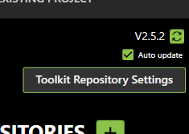
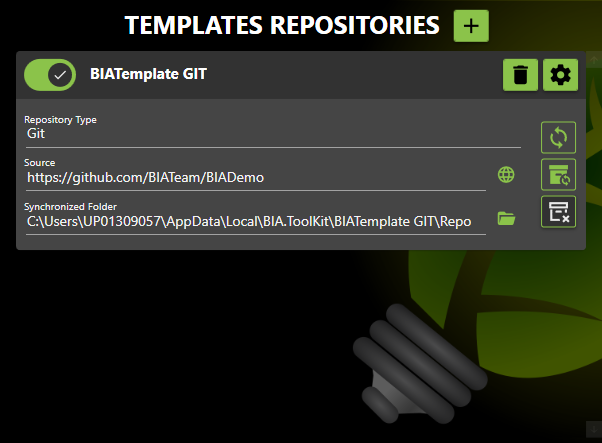
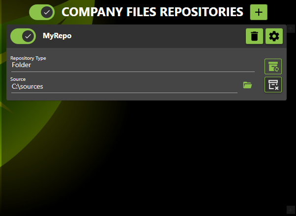
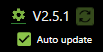
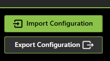

# Configure the BIA tool kit
This document explains how to configure the BIA tool kit, to be ready to apply the other operation (creation, migration...)

## Get the BIAToolKit
Take the last version of the "BIAToolKit.zip" from [last release](https://github.com/BIATeam/BIAToolKit/releases).  
Unzip it and launch the BIA.ToolKit.exe  

If you have the Windows defender smart screen warning click on "More Info" then click "Run anyway"":

Here is the BiaToolKit !  

## Repositories Configuration
The repository is the source of the releases used for the BIAToolKit himself for auto-upgrade, the templates of BIA Framework, or the Company Files.  

1. **Use or not the repository** : will use the releases data of this repository into BIAToolKit
2. **Delete the repository from the list** : only for Template and Company Files repositories
3. **Edit repository settings** : only for Template and Company Files repositories
4. **Synchronise repository** (only repository GIT) : if no use of local cloned folder, clone (delete + clone) the GIT repository localy into `AppData\Local\BIA.ToolKit\RepositoryName\Repo`. Either, synchroinze the source into the local cloned folder.
5. **Get releases data of the repository** : list all the releases available for the repository to use in the BIAToolKit
6. **Clean releases** : remove all releases downloaded into `AppData\Local\BIA.ToolKit\RepositoryName`
7. **Open repository source** : browse to URL (repository GIT) or open folder location (repository Folder)
8. **Open synchronized folder** (only for repository GIT) : open folder location where the repository has been synchronized (from AppData or local cloned folder)
   
### Repository GIT
A GIT repository is a repository of source code with a dedicated URL :
- you can clone localy the GIT repository by synchronizing it (will remove old cloned folder then clone again)
- you can use an existing local cloned folder (will not remove the folder, just sync the sources)

This repository can have multiple release type :
#### Release GIT
:::warning
Only available for **GitHub** repositories
:::

The GIT releases are provided from the GIT repository.  
The releases are available throught an URL or an API consumed by a web client into the BiaToolKit. 

:::info
In case of specific GIT Repository URL release, the name of each release will used the tag name associated to the release and added to the specific release URL provided : `{UrlRelease}/{Tag}.zip`
:::
#### Release Tag
The Tag releases are produced from the direct sources of the repository at a target tag.  
The repository will be cloned and checkout at this tag. The content of the release is the repository source.
 

#### Release Folder
The Folder releases are produced from the folders into the direct sources of the repository.  
The folders will be copied from the sources into the repository releases location.  

A regex pattern can be set to filter the releases from the GIT repository sources.  
 

### Repository Folder
A repository folder is a local or shared folder that will contains the releases into dedicated folders.  
A regex pattern can be set to filter the releases from the folder sources.  

## Configure BIAToolKit release repository
On the top right corner, click the "**Toolkit Repository Settings**" button to open repository details and configure the repository to get the releases of BIAToolkit for updating.  

## Configure Templates release repositories
Manage the template repositories onto the dedicated list : 

:::warning
You must have at least one template repository to use the BiaToolkit
:::
## Configure Company Files release repositories
Company Files are custom files with sensitive data (Database connection string, credentials...) to add to your BIA Framework projects.  
You can use or not the company files by using the toggle next the title "**Company Files Repositories**".

Manage the company files repositories onto the dedicated list : 

:::warning
You must have at least one company file repository to use the BiaToolkit when using the company files
:::
## Configure update settings
On the top right corner, you will have some buttons to manage the update settings :  

- Enable or not the **auto update** with dedicated checkbox : it will verify at launch if a new version is available or not
- **Cog button** at left of BIAToolKit version indicates that a new version is available. Click on it to launch update process
- **Refresh button** at right of BIAToolKit version is used to check if a new version is available manually

## Import/Export configuration
You can import or export BIAToolKit configuration by using these buttons :  

:::info
Config files must be `.btksettings` type
:::
