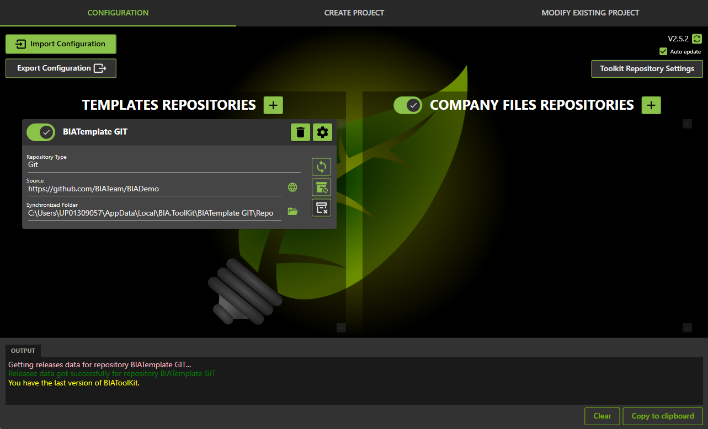

# Configure the BIA tool kit
This document explains how to configure the BIA tool kit, to be ready to apply the other operation (creation, migration...)

## Get the BIAToolKit
Take the last version of the "BIAToolKit.zip" from [last release](https://github.com/BIATeam/BIAToolKit/releases).  
Unzip it and launch the BIA.ToolKit.exe  

If you have the Windows defender smart screen warning click on "More Info" then click "Run anyway"":

Here is the BiaToolKit !  

## Repositories Configuration
The repository is the source of the releases used for the BIAToolKit himself for auto-upgrade, the templates of BIA Framework, or the Company Files.  

1. **Use or not the repository** : will use the releases data of this repository into BIAToolKit
2. **Delete the repository from the list** : only for Template and Company Files repositories
3. **Edit repository settings** : only for Template and Company Files repositories
4. **Synchronise repository** (only repository GIT) : if no use of local cloned folder, clone (delete + clone) the GIT repository localy into `AppData\Local\BIA.ToolKit\RepositoryName\Repo`. Either, synchroinze the source into the local cloned folder.
5. **Get releases data of the repository** : list all the releases available for the repository to use in the BIAToolKit
6. **Clean releases** : remove all releases downloaded into `AppData\Local\BIA.ToolKit\RepositoryName`
7. **Open repository source** : browse to URL (repository GIT) or open folder location (repository Folder)
8. **Open synchronized folder** (only for repository GIT) : open folder location where the repository has been synchronized (from AppData or local cloned folder)
   
### Repository GIT
A GIT repository is a repository of source code with a dedicated URL :
- you can clone localy the GIT repository by synchronizing it (will remove old cloned folder then clone again)
- you can use an existing local cloned folder (will not remove the folder, just sync the sources)

This repository can have multiple release type :
#### Release GIT
:::warning
Only available for **GitHub** repositories
:::

The GIT releases are provided from the GIT repository.  
The releases are available throught an URL or an API consumed by a web client into the BiaToolKit. 

#### Release Tag
The Tag releases are produced from the direct sources of the repository at a target tag.  
The repository will be cloned and checkout at this tag. The content of the release is the repository source.
 

#### Release Folder
The Folder releases are produced from the folders into the direct sources of the repository.  
The folders will be copied from the sources into the repository releases location.  

A regex pattern can be set to filter the releases from the GIT repository sources.  
 

### Repository Folder
A repository folder is a local or shared folder that will contains the releases into dedicated folders.  
A regex pattern can be set to filter the releases from the folder sources.  

## Configure BIAToolKit release repository
## Configure Templates release repositories
## Configure Company Files release repositories

## Configure your BIA Template repository
In the first tab, in the upper left corner, chose if you want to use a local folder to synchronize it.
* It is not required so if you don't have clone the BIATemplate locally select the first radio button "Use the BIAtemplate GitHub repository" the local folder will be : C:\Users\YourLogin\AppData\Local\BIA.ToolKit\BIA.ToolKit\1.0.0\BIATemplate\Repo
* If you work regularly on BIATemplate or if you synchronize regularly you select the second option "use a local cloned folder" and enter the local pat of this folder.

Click on the "synchronize" button to do a git sync between the GitHub repo and the local folder.

## Use company files 
The Company files are use to replace some files like logos, configuration files at the creation of the project or during migration.
The company files can be a shared folder or a git repository.

It is not necessary but it is recommended to have those files if you implement severals projects with the framework. It avoid you to manually make the replacement on each project.

If you do not have company files check the check box in the right part.
Select if you want to use a git repo or a local folder.
The synchronize work only if you have configure the repo url.

## Save the settings
Click on the save settings button to save the settings. The configuration is save for the next start of the BIAToolKit