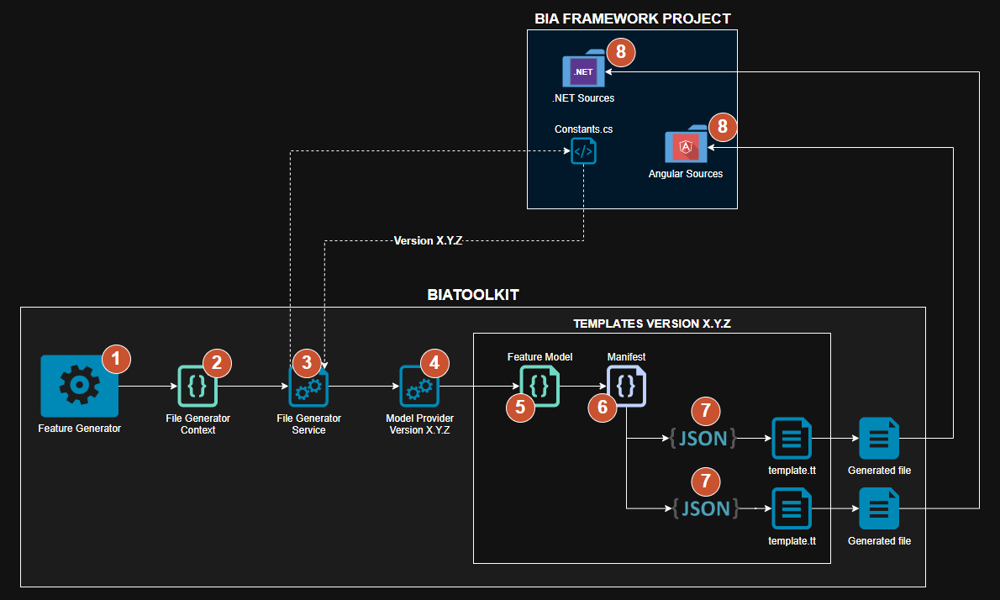

# Templates
:::warning
**Only for BIAToolKit maintainers**
:::

This document explains how the BIAToolkit use templates to generate Option, DTO and CRUD features, and how to maintain them.

## Diagram


1. Developper wants to generate a feature (Option, DTO, CRUD) for his BIA Framework project using the BIAToolKit
2. A file generator context is created based on the selected feature to generate
3. The file generator service gets the current project BIA Framework Version (X.Y.Z) from the `Constants.cs` file of the .NET sources
4. The file generator asks for the corresponding model provider according to the current project version (X.Y.Z)
5. A feature model corresponding to the target framework version and feature to generate is created
6. The model provider read the template's manifest of the correspondings feature kind and project version
7. Each entry of the manifest use the template file based on the feature model data to generate the file
8.  The generatd file is created and copied or included into his target directory or file where the path is provided by the manifest

## Version Templates
The templates for a dedicated version (or a range) corresponding to a bunch of various elements :
- The **templates** `.tt` used to generate the files
- The **models** used to inject data into the templates
- The **mocks** of the models used to simulate data when creating the templates
- The **manifest** used to list the templates data (`.tt` file and target file into the project) that must be used for each feature kind

Each bunch corresponds to a breaking changes version of the BIA Framework. It means that if you have a minor version that provides any changes of one of the files that must be generated using the templates, you will have a dedicated bunch of templates for this version.  

Commonly, there is a new bunch created for each major version.  
Unless a new major version, the bunch must covered all versions until the new one.

:::info
The bunch are located into the `BIA.ToolKit.Applications.Templates`  

<u>**Example**</u> :  
The templates for the version **5.0.0** will be located into the namespace `BIA.ToolKit.Applications.Templates._5_0_0`.  
They will be used for all the versions **5.*** unless a new breaking minor version is released : here, the **5.1.0**.  
In that case, the new templates will be located into the namespace `BIA.ToolKit.Applications.Templates._5_1_0`.
:::
:::tip
The new bunch must be copied from the previous one and adapted for each concerned elements : 
1. Copy the previous folder and rename it with your new version identifier **_X_Y_Z**
2. Rename in this folder old **_X_Y_Z** references to new **_X_Y_Z**
3. Do the same for **X.Y.Z** references between old and new
:::

### Models
Templates models corresponds to the model of data that will be used into the templates files `.tt` to generate the files for a dedicated feature.  

It must exists a model for each kind of feature to generate, and a dedicated interface for them.

:::info 
- The templates models are located into the namespace `BIA.ToolKit.Applications.Templates._X_Y_Z.Models`  
- The templates models common elements are located into the namespace `BIA.ToolKit.Applications.Templates._X_Y_Z.Common`  
- The templates models interfaces are located into the namespace `BIA.ToolKit.Applications.Templates._X_Y_Z.Common.Interfaces`  

:::
### Mocks
Mocks are simply templates models implementation used into the templates files `.tt` to simulate data when editing the template file.

:::info 
The templates mocks are located into the namespace `BIA.ToolKit.Applications.Templates._X_Y_Z.Mocks`
:::
### Templates files
The templates are T4 Text Template (.tt) powered by the tools of Microsoft Visual Studio ([Official Documentation](https://learn.microsoft.com/en-us/visualstudio/modeling/code-generation-and-t4-text-templates?view=vs-2022)).  
:::tip
Install and use the extension [T4 Editor](https://marketplace.visualstudio.com/items?itemName=TimMaes.t4editor) into Visual Studio
:::

Into the dedicated namespace `BIA.ToolKit.Applications.Templates._X_Y_Z.Templates` you will find :
- the templates for the .NET and Angular files. The structures of these folders are the same as the BIA Framework version used for
- T4 includes, the Text Templates files that can be used as include for all the other templates. There is one common template include, and one for each kind of feature to generate

#### Includes
Add into your include all the assembly, namespaces references, model parameters or variable declaration that sould be used for your other templates :
``` csharp title="Includes\Template.include"
<#@ assembly name="$(TargetPath)" #>
<#@ assembly name="System.Core" #>
<#@ import namespace="System.Linq" #>
<#@ import namespace="System.Text" #>
<#@ import namespace="System.Collections.Generic" #>
<#@ import namespace="BIA.ToolKit.Application.Templates" #>
<#@ import namespace="BIA.ToolKit.Application.Templates.Common.Models" #>
<#@ import namespace="BIA.ToolKit.Application.Templates.Common.Interfaces" #>
<#@ import namespace="BIA.ToolKit.Application.Templates._X_Y_Z.Models" #>
<#@ import namespace="BIA.ToolKit.Application.Templates._X_Y_Z.Mocks" #>
```
``` csharp title="Includes\TemplateCrud.include"
<#@ include file="Template.ttinclude" #>
<#@ parameter type="BIA.ToolKit.Application.Templates._X_Y_Z.Models.EntityCrudModel<BIA.ToolKit.Application.Templates._X_Y_Z.Models.PropertyCrudModel>" name="Model" #>
<# var ModelInstance = Model ?? new EntityCrudMock(); #>
```
:::tip
- **include** the target file with the relative or complete path
- **parameter** refers to the class that will be used into the template as the **Model** variable
- **ModelInstance** is a variable mapped to the **Model** variable if exists, otherwise a new instance of a mock of the same class model. The last case is commonly used when generating the file while editing the template into Visual Studio
:::

Then, add the reference to the T4 include file into your T4 template :
``` chsapr title="DotNet\MyTemplate.tt"
<#@ include file="$(T4Includes_X_Y_Z)\TemplateCrud.ttinclude" #>
```
:::warning
You must have into the `BIA.ToolKit.Application.Templates.csproj` a property `T4Includes_X_Y_Z` corresponding to the path of your includes for the version X.Y.Z :
``` csharp title="BIA.ToolKit.Application.Template.csproj"
<Project>
  <PropertyGroup>
    <T4Includes_X_Y_Z>$(MSBuildProjectDirectory)\_X_Y_Z\Templates\Includes</T4Includes_X_Y_Z>
  </PropertyGroup>
</Project>
```
:::

#### Templates
- each Text Template file must be created into a folder that match the same structure as the target file to generate into the BIA Framework project
- the name fo the Text Template file should match as possible the same target file name to generate and ends with `Template` before the extension : 
  - `DotNet\Application\EntityAppServiceTemplate.tt` used to generate the `DotNet\Company.Project.Application\Domain\EntityAppService.cs`
- the Text Templates used for partial content should indicates into their name the partial state, the markup name and optionally the feature kind : 
  - `DotNet\CrosscuttinCommon\Enum\PartialCrudRoleIdTemplate.tt` used to generate partial content for markup `RoleId` into the file `DotNet\Company.Project.Crosscutting.Common\Enum\RoleId.cs` when generating a CRUD feature

:::warning
Each template must at least implements these lines :
``` csharp title="MyTemplate.tt"
<#@ template debug="true" hostspecific="true" language="C#" #>
<#@ include file="$(T4Includes_X_Y_Z)\TemplateCrud.ttinclude" #>
<#@ output extension=".cs" #>
```
- **template** declaration is used for Visual Studio to generate the file
- **include** the target include file 
- declare the **output** extension of your file
:::

When saving a template, Visual Studio will automatically generate the file into the same folder and under your text template item into your solution explorer.  
If an error occurs when generating the template, the error will be displayed into the **Error List** of your Visual Studio instance.

### Manifest
The manifest contains all the files to generate for each feature kind of a version read by the file generator service :
``` json title="BIA.ToolKit.Application.Templates\\_X.Y.Z\manifest.json"
{
  "version": "X.Y.Z",
  "features": [
    {
      "type": "Option",
      "angularTemplates": [
        {
          "inputPath": "src\\app\\domains\\services\\EntityOptionDasServiceTemplate.tt",
          "outputPath": "src\\app\\domains\\{Entity}-option\\services\\{Entity}-option-das.service.ts"
        }
      ],
      "dotNetTemplates": [
        {
          "inputPath": "Domain\\Mappers\\EntityOptionMapperTemplate.tt",
          "outputPath": "{Project}.Domain\\{Domain}\\Mappers\\{Entity}OptionMapper.cs"
        },
        {
          "inputPath": "CrosscuttingCommon\\PartialOptionRightsTemplate.tt",
          "outputPath": "{Project}.Crosscutting.Common\\Rights.cs",
          "isPartial": true,
          "partialInsertionMarkup": "RightsForOption"
        }
      ]
    }
  ]
}
```
:::info
- complete the manifest for all `type` of `features` (`Dto`, `Option`, `Crud`...)
- each template item should have an `inputPath` and an `outputPath`
  - `inputPath` is the path to the template file into the `BIA.ToolKit.Application.Templates\_X_Y_Z\Templates` folder
  - `outputPath` is the path to the target file into the target BIA Framework project
  - these path are both relatives to their source kind (`DotNet` or `Angular`)
- you can mark a template as partial with `isPartial` property
  - you must then provide the `partialInsertionMarkup` value that corresponds to the area into the target file where the generated content will be added
- you can use templates property between `{}` into path properties that will be replaced by the file generator service :
  - `{Project}` : the target project name
  - `{Domain}` : the target entity's domain name 
  - `{Entity}` : the target entity's name (Pascal case)
  - `{EntityPlural}` : the target entity's name plural (Pascal case)
  - `{Parent}` : the target entity's parent name (Pascal case)
  - `{ParentRelativePath}` : the target entity's parent feature relative path into **Angular project**
  - `{ParentChildrenRelativePath}` : the target entity's parent feature of children relative path into **Angular project**
:::

## File Generator Service
This service is used by the BiaToolKit to generate the files using the templates configured previously.  

It must be initialized by calling the method `Init()` when a BIA Framework project is choosen.

Then, after calling the target feature method to generate from the service :
1. The service will get from the model provider factory the corresponding model provider according to the target project version
2. The service will use the model provider method to get the corresponding model template to use for the feature from the file generator context
3. The service will generate all the files listed into the manifest of the correspoding version by using T4 tools and template model
4. The service will clean the generated files by ordering using and apply a prettier specifically to the angular files
   
### Context
This context is used to map the UI properties from the BiaToolKit to the generation context that will be used to generate the files.  

For each kind of feature, you must implement the corresponding context by inheritance of `FileGeneratorContext` abstract class :
``` csharp title="FileGeneratorDtoContext"
public sealed class FileGeneratorDtoContext : FileGeneratorContext
{
    public List<MappingEntityProperty> Properties { get; set; } = [];
    public bool IsArchivable { get; set; }
    public bool IsFixable { get; set; }
    public bool IsVersioned { get; set; }
}
```
### Model Provider
The model provider is the provider of the [template's models](#models) for each version X.Y.Z available into the templates from the `FileGeneratorContext` provided.

They all must implements the interface `IFileGeneratorModelProvider` :
``` csharp title="IFileGeneratorModelProvider"
internal interface IFileGeneratorModelProvider
{
    List<BiaFrameworkVersion> CompatibleBiaFrameworkVersions { get; }
    object GetDtoTemplateModel(FileGeneratorDtoContext dtoContext);
    object GetOptionTemplateModel(FileGeneratorOptionContext optionContext);
    object GetCrudTemplateModel(FileGeneratorCrudContext crudContext);
}
```
:::info
- `CompatibleBiaFrameworkVersions` is the list of `BiaFrameworkVersion` compatible with the version X.Y.Z of the templates
  - You can add each precise version compatbiles (4.0.0, 4.1.0, 4.2.0, 4.2.1...)
  - Or you can set a specific range (4.*, 4.1.\*...)
- Each `Get{Feature}TemplateModel` for each feature kind are used to map the provided feature file generator context to the corresponding feature model template
:::

Each model provider can inherit from the `FileGeneratorModelProviderBase` by providing each template model of the corresponding version :
``` csharp title="FileGeneratorModelProviderBase"
internal abstract class FileGeneratorModelProviderBase<TEntityDtoModel, TEntityCrudModel, TEntityOptionModel, TPropertyDtoModel, TPropertyCrudModel>(IConsoleWriter consoleWriter) : IFileGeneratorModelProvider
    where TPropertyDtoModel : class, IPropertyDtoModel, new()
    where TEntityDtoModel : class, IEntityDtoModel<TPropertyDtoModel>, new()
    where TPropertyCrudModel : class, IPropertyCrudModel, new()
    where TEntityCrudModel : class, IEntityCrudModel<TPropertyCrudModel>, new()
    where TEntityOptionModel : class, IEntityOptionModel, new()
```
``` csharp title="FileGeneratorModelProvider_X_Y_Z"
namespace BIA.ToolKit.Application.Services.FileGenerator.ModelProviders
{
    using System.Collections.Generic;
    using BIA.ToolKit.Application.Helper;
    using BIA.ToolKit.Application.Templates._X_Y_Z.Models;
    using BIA.ToolKit.Common;

    internal class FileGeneratorModelProvider_X_Y_Z(IConsoleWriter consoleWriter) : 
        FileGeneratorModelProviderBase<EntityDtoModel<PropertyDtoModel>,
        EntityCrudModel<PropertyCrudModel>,
        EntityOptionModel,
        PropertyDtoModel,
        PropertyCrudModel>(consoleWriter)
    {
        public override List<BiaFrameworkVersion> CompatibleBiaFrameworkVersions =>
        [
            new("X.Y.Z"),
        ];
    }
}
```

:::warning
- Create the implementation with the following naming convention : `FileGeneratorModelProvider_X_Y_Z.cs`
- Add a new instance of your model provider into the `FileGeneratorModelProviderFactory`
:::

## Unit Tests