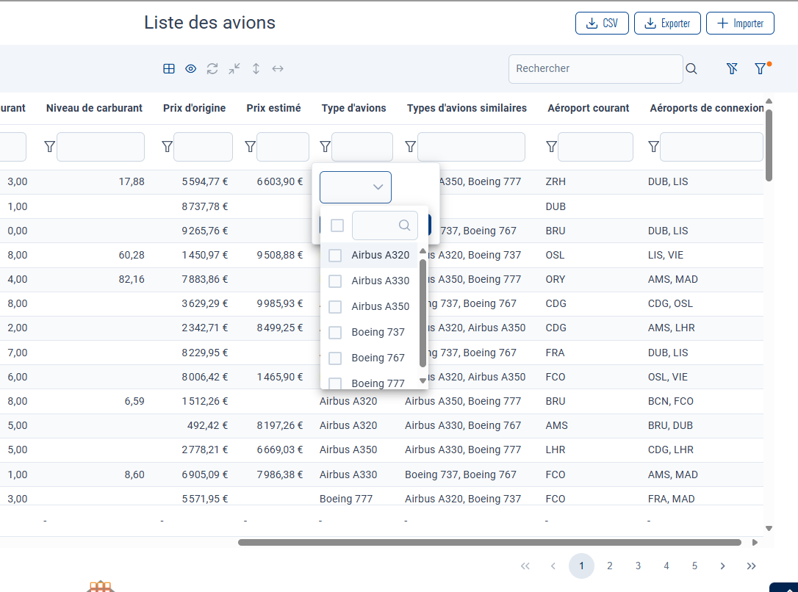
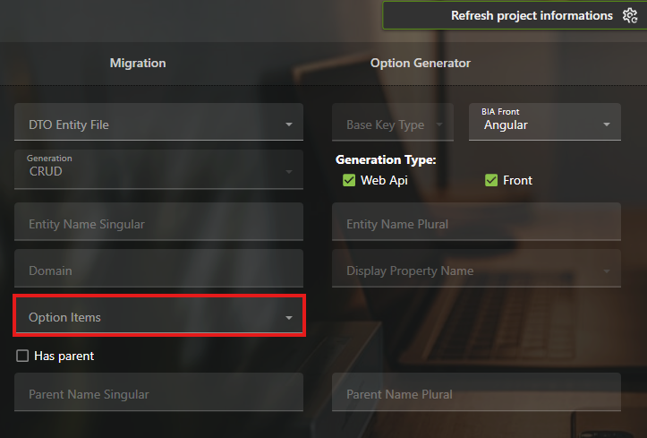

# Use "in" filter in table

One to Many and Many to Many field can use a new type of column filter : in filtering.

It allows the user to select values to find in a list of values:


## How to use it

### Using BiaToolkit
Creating a CRUD with the BIA Toolkit will automatically activate this filter if the list of options is correctly selected in the interface:


### Manually
#### Front
In the angular part, you will need to have the options available in the options service of your CRUD feature.
If the options are available, you then need to give the dictOptionsDtos through the input of the table, calc-table or custom-table:
```html
      [dictOptionDtos]="
        (crudItemService.optionsService.dictOptionDtos$ | async) ?? []
      "
```

It should immediately change the filter to an "in" filter.

### Back
The mapper need a way to understand how to manage an "in" filter.
An ExpressionCollectionFilterIn is available in the BaseMapper that can be overidden in your CRUD mapper.

Here is an example of how it is done in BiaDemo for four columns that are in ManyToMany (SimilarTypes and ConnextingAirports) and OneToManyu (PlaneType, CurrentAirport):

```csharp
        /// <inheritdoc />
        public override ExpressionCollection<Plane> ExpressionCollectionFilterIn
        {
            get
            {
                return new ExpressionCollection<Plane>(
                    base.ExpressionCollectionFilterIn,
                    new ExpressionCollection<Plane>()
                    {
                        { HeaderName.PlaneType, plane => plane.PlaneType.Id },
                        { HeaderName.SimilarTypes, plane => plane.SimilarTypes.Select(x => x.Id) },
                        { HeaderName.CurrentAirport, plane => plane.CurrentAirport.Id },
                        { HeaderName.ConnectingAirports, plane => plane.ConnectingAirports.Select(x => x.Id) },
                    });
            }
        }
```

This should completely enable the "in" filter in your CRUD.

## Activate the "in" on label instead of Id
By default, the in filter filter items on their id for better performances. If you want to have the filtering on the option label instead, you can modify the code to enable it.

### Front
First, you need to configure the front to send the display label instead of the id in the filters.
The option to do so is filterWithDisplay in the BiaFieldConfig of the column.

### Back
In the back end, configure the ExpressionCollectionFilterIn of the CRUD mapper to look the display instead of the id.

In this example, PlaneType and SimilarTypes are filtered by string in the in filter:
```csharp
        /// <inheritdoc />
        public override ExpressionCollection<Plane> ExpressionCollectionFilterIn
        {
            get
            {
                return new ExpressionCollection<Plane>(
                    base.ExpressionCollectionFilterIn,
                    new ExpressionCollection<Plane>()
                    {
                        { HeaderName.PlaneType, plane => plane.PlaneType.Display },
                        { HeaderName.SimilarTypes, plane => plane.SimilarTypes.Select(x => x.Display) },
                        { HeaderName.CurrentAirport, plane => plane.CurrentAirport.Id },
                        { HeaderName.ConnectingAirports, plane => plane.ConnectingAirports.Select(x => x.Id) },
                    });
            }
        }
```