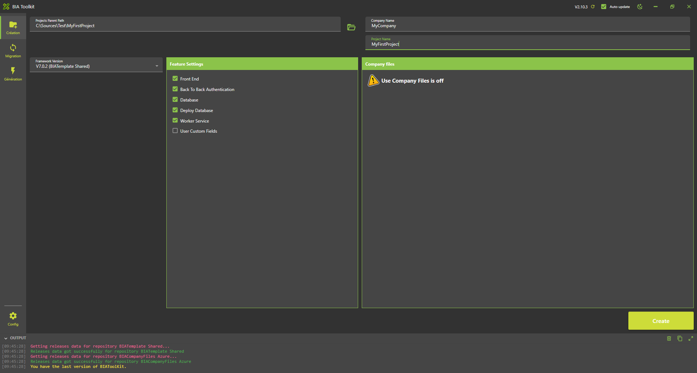
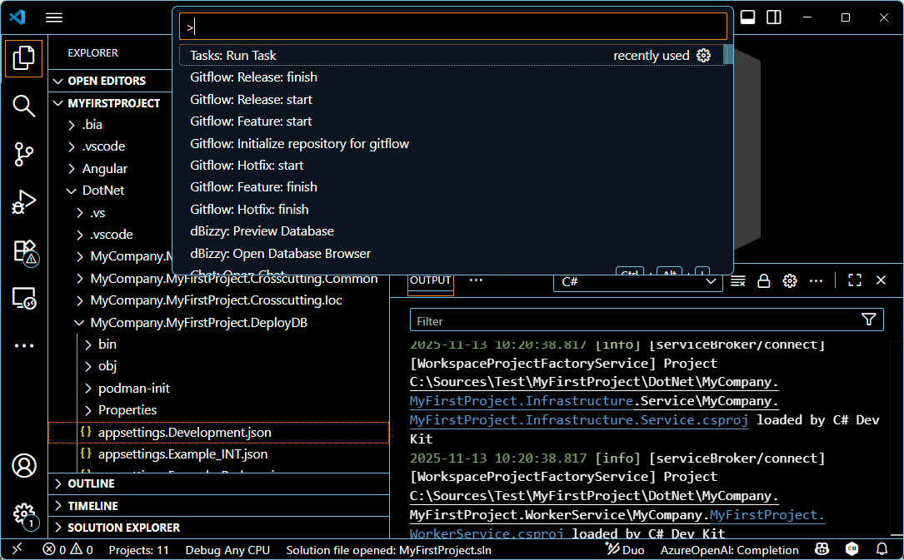
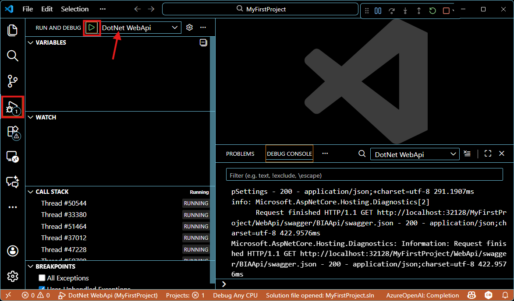
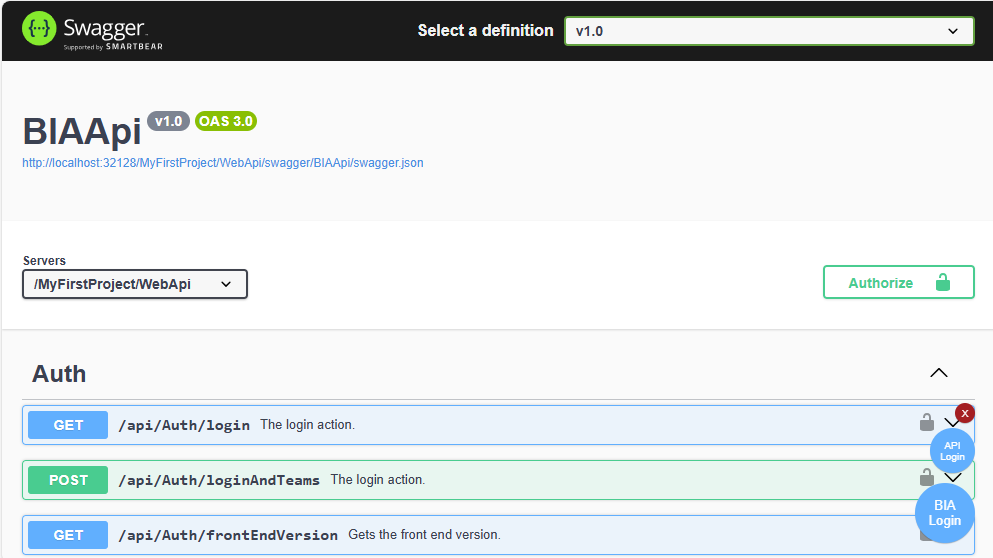
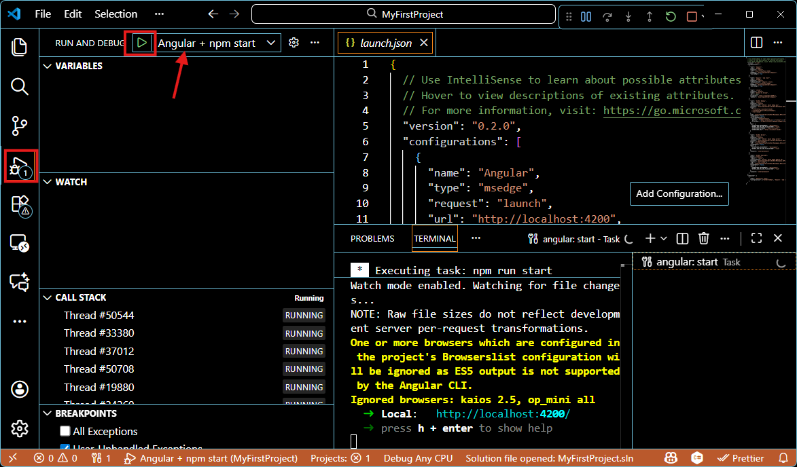

# Build your first project

1. Create a project "MyFirstProject" with company name "MyCompany" using the BIAToolKit in folder "C:\Sources\Test". [Step describe here](../../30-BIAToolKit/20-CreateProject.md). If you have company files used them to have correct settings.
  

2. Open the folder "C:\Sources\Test\MyFirstProject"   
   

3. Create the database:
  a. If you use SqlServer:
      Open Sql Server Management Studio and create a database named "MyFirstProject"   
   

    b. If you use PostGreSQL
    Use pgAdmin 4 to create your database. 

4. Open with Visual Studio code (VSCode) the folder "C:\Sources\Test\MyFirstProject"
   
5. ONLY If you have not company files containing configuration files
   1.  In project DotNet\MyCompany.MyFirstProject.DeployDB rename files 
       1. appsettings.Example_Development.json => appsettings.Development.json
       2. bianetconfig.Example_Development.json => bianetconfig.Development.json

   2. In project DotNet\MyCompany.MyFirstProject.Presentation.Api rename files 
      1. appsettings.Example_Development.json => appsettings.Development.json
      2. bianetconfig.Example_Development.json => bianetconfig.Development.json

   3. In project DotNet\MyCompany.MyFirstProject.WorkerService rename files 
      1. appsettings.Example_Development.json => appsettings.Development.json
      2. bianetconfig.Example_Development.json => bianetconfig.Development.json

6. Create the first database migration: 
    1. In VSCode (folder MyFirstProject) press F1
    2. Click "Tasks: Run Tasks".
      
    3. Click "Database Add migration SqlServer" if you use SqlServer or "Database Add migration PostGreSql" if you use PostGerSql.
    4. Let the name "Initial" for this first migration and press enter.
    5. Console must display no error message and verify new file *'...Initial.cs'* is created:    
        

7.  Deploy the base:
    1.  In VS Code Run and debug the "DotNet DeployDB"
      
    2.  Verify tables are created in the database:   
      

8.  Run the WebApi:
    1.  In VSCode Run and debug "DotNet WebApi" 
      
    2.  The swagger page will be open.  
      Click on "BIA login" at bottom right.  
      The button will be green.  
      
    
    3. If the button is red it is probably an error in bianetconfig.Development.json.

9.  Run the Front
    1.  Do not stop the Run of the "DotNet WebApi" launched in previous step
    2.  Install npm:
        1. In VSCode (folder MyFirstProject) press F1
        2. Click "Tasks: Run Tasks".
        3. Click "Angular: install".
    3.  In VSCode Run and debug "Angular + npm start" 
    
    4.  Open a browser at address http://localhost:4200/  
    