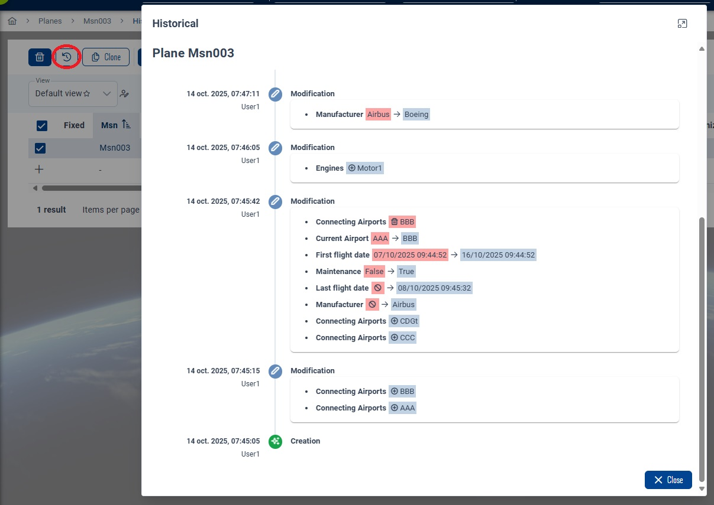

# Historical
This page will explain how to display the modification historical of a CRUD.

## Overview
You can access to the historical of an entity by using the dedicated button when using calc mode :


Or by opening the details of your entity (popup, split, fullpage) into the **Historical** tab :


## Configuration
:::warning
You must first implements dedicated audit for your CRUD entity : [see documentation](../80-Audit.md#dedicated-audit-table).
:::

:::tip
For projects from **BIAFramework V6** :
1. Enable audit onto your entity ([see documentation](../80-Audit.md#enable-entity-audit))
2. Use the BIAToolKit :
   1. Generate DTO with `Use dedicated audit` option enabled (as described into [Dedicated Audit Table documentation](../80-Audit.md#dedicated-audit-table))
   2. Then, generate CRUD with `Display Historical` feature enabled
:::

### Back-end

#### Controller
Add into your entity controller the endpoint `historical` :
``` csharp title="MyEntityController.cs"
        /// <summary>
        /// Return the historical of an item by its id.
        /// </summary>
        /// <param name="id">ID of the item to update.</param>
        /// <returns>Item's historical.</returns>
        [HttpGet("{id}/historical")]
        [ProducesResponseType(StatusCodes.Status200OK)]
        [ProducesResponseType(StatusCodes.Status404NotFound)]
        [ProducesResponseType(StatusCodes.Status500InternalServerError)]
        [Authorize(Roles = Rights.MyEntities.Read)]
        public virtual async Task<IActionResult> GetHistorical(int id)
        {
            try
            {
                var dto = await this.myEntityService.GetHistoricalAsync(id);
                return this.Ok(dto);
            }
            catch (ElementNotFoundException)
            {
                return this.NotFound();
            }
        }
```

#### Mapper
Add or complete into your entity mapper the constructor with following instructions :
``` csharp title="MyEntityMapper.cs"
        /// <summary>
        /// Initializes a new instance of the <see cref="MyEntityMapper"/> class.
        /// </summary>
        /// <param name="auditMappers">The injected collection of <see cref="IAuditMapper"/>.</param>
        public MyEntityMapper(IEnumerable<IAuditMapper> auditMappers)
        {
            this.AuditMapper = auditMappers.FirstOrDefault(x => x.EntityType == typeof(MyEntity));
        }
```

### Front-end
Enable the `displayHistorical` of your entity `CrudConfig` :
``` typescript title="my-entity.constants.ts"
export const myEntityCRUDConfiguration: CrudConfig<MyEntity> = new CrudConfig({
  // [...]
  displayHistorical: true,
});
```
#### Historical Component
Add your entity historical component into the `views` of your feature :
``` typescript title="my-entity-historical.component.ts"
@Component({
  selector: 'app-my-entity-historical',
  imports: [
    CrudItemHistoricalTimelineComponent,
    AsyncPipe,
    TranslateModule,
    Button,
  ],
  templateUrl:
    '../../../../../../packages/bia-ng/shared/feature-templates/crud-items/views/crud-item-historical/crud-item-historical.component.html',
  styleUrl:
    '../../../../../../packages/bia-ng/shared/feature-templates/crud-items/views/crud-item-historical/crud-item-historical.component.scss',
})
export class PlaneHistoricalComponent extends CrudItemHistoricalComponent<MyEntity> {
  constructor(
    protected injector: Injector,
    protected myEntityService: MyEntityService
  ) {
    super(injector, myEntityService, myEntityCRUDConfiguration);
  }
}
```

Add the routing to the historical component into your entity module into the children of the path `:crudItemId` :
``` typescript title="my-entity.module.ts"
export const ROUTES: Routes = [
  {
    // [...]
    children: [
      // [...]
      {
        path: ':crudItemId',
        data: {
          breadcrumb: '',
          canNavigate: false,
        },
        component: MyEntityItemComponent,
        canActivate: [PermissionGuard],
        children: [
          // [...]
          // ROUTING TO HISTORICAL OF CRUD ITEM
          {
            path: 'historical',
            data: {
              breadcrumb: 'bia.historical',
              canNavigate: false,
              layoutMode: LayoutMode.popup,
              style: {
                minWidth: '50vw',
              },
              title: 'bia.historical',
              permission: Permission.MyEntity_Read,
            },
            component: MyEntityHistoricalComponent,
            canActivate: [PermissionGuard],
          },
          // [...]
        ],
      },
    ],
  },
];
```

### Index component 
Into the HTML template of your entity index component, add the `[showHistoricalButton]` configuration for the `<bia-table-header>` :
``` html title="my-entities-index.component.html"
    <bia-table-header
      [showHistoricalButton]="crudConfiguration.displayHistorical && crudConfiguration.useCalcMode"></bia-table-header>
```

### Edit component 
Into the HTML template of your entity edit component, add the `[displayHistorical]` and `[historicalEntries]` configuration for your `<app-my-entity-form>` :
``` html title="my-entities-index.component.html"
<app-my-entity-form
  [displayHistorical]="crudConfiguration.displayHistorical"
  [historicalEntries]="(myEntityService.crudItemHistorical$ | async) ?? []"></app-my-entity-form>
```

### Service
Add the definition of `crudItemHistorical$` observable and `loadHistoric` method into your entity service :
``` typescript title="my-entity.service.ts"
export class MyEntityService extends CrudItemService<MyEntity> {
  // [...]

  public crudItemHistorical$: Observable<HistoricalEntryDto[]> =
    this.store.select(FeatureMyEntitiesStore.getCurrentMyEntityHistorical);

  public loadHistoric(id: any): void {
    this.store.dispatch(FeatureMyEntitiesActions.loadHistorical({ id: id }));
  }
}
```

### Store
#### Reducer
Add the `currentItemHistorical` array of `HistoricalEntryDto` definition and usage into your entity store reducer :
``` typescript title="my-entities-reducer.ts"
export interface State extends CrudState<MyEntity>, EntityState<MyEntity> {
  currentItemHistorical: HistoricalEntryDto[];
  // [...]
}

export const INIT_STATE: State = myEntitiesAdapter.getInitialState({
  ...DEFAULT_CRUD_STATE(),
  currentItemHistorical: [],
  // [...]
});

export const planeReducers = createReducer<State>(
  // [...]
  on(FeatureMyEntitiesActions.clearCurrent, state => {
    return { ...state, currentItem: <MyEntity>{}, currentItemHistorical: [] };
  }),
  // [...]
  on(FeatureMyEntitiesActions.loadHistoricalSuccess, (state, { historical }) => {
    return { ...state, currentItemHistorical: historical };
  }),
);
```

#### Action
Add the `loadHistorical` and `loadHistoricalSuccess` action into your entity store actions :
``` typescript title="my-entities-actions.ts"
export namespace FeatureMyEntitiesActions {
  // [...]

  export const loadHistorical = createAction(
    '[' + myEntityCRUDConfiguration.storeKey + '] Load historical',
    props<{ id: number }>()
  );

  export const loadHistoricalSuccess = createAction(
    '[' + myEntityCRUDConfiguration.storeKey + '] Load historical success',
    props<{ historical: HistoricalEntryDto[] }>()
  );
}
```

#### Effects
Add the `loadHistorical$` effect and the call into `load$` in your entity store effects :
``` typescript title="my-entities-effects.ts"
@Injectable()
export class MyEntitiesEffects {
  // [...]

  load$ = createEffect(() =>
    this.actions$.pipe(
      ofType(FeatureMyEntitiesActions.load),
      map(x => x?.id),
      switchMap(id => {
        return this.myEntityDas.get({ id: id }).pipe(
          map(myEntity => {
            // Add this condition
            if (myEntityCRUDConfiguration.displayHistorical) {
              this.store.dispatch(
                FeatureMyEntitiesActions.loadHistorical({ id: myEntity.id })
              );
            }
            return FeatureMyEntitiesActions.loadSuccess({ myEntity });
          }),
          catchError(err => {
            this.biaMessageService.showErrorHttpResponse(err);
            return of(FeatureMyEntitiesActions.failure({ error: err }));
          })
        );
      })
    )
  );

  // [...]

  loadHistorical$ = createEffect(() =>
    this.actions$.pipe(
      ofType(FeatureMyEntitiesActions.loadHistorical),
      map(x => x?.id),
      switchMap(id => {
        return this.myEntityDas.getHistorical({ id: id }).pipe(
          map(historical => {
            return FeatureMyEntitiesActions.loadHistoricalSuccess({ historical });
          }),
          catchError(err => {
            this.biaMessageService.showErrorHttpResponse(err);
            return of(FeatureMyEntitiesActions.failure({ error: err }));
          })
        );
      })
    )
  );

  // [...]
}
```