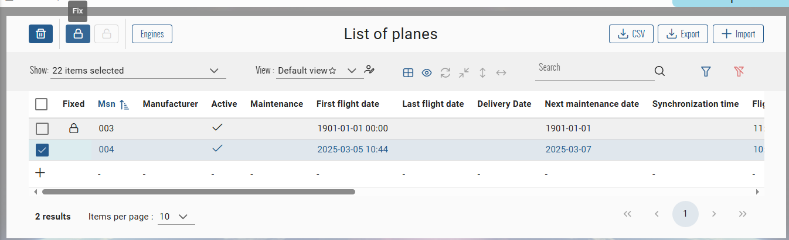

# Fixable CRUD
This page will explain how to configure a CRUD that can be fixed.

## Principles
- A fixable CRUD represents an entity with a fixed state.  
  This state indicates weither the entity is fixed or not and should not be edited anymore if true.  
- When an entity is fixed, only users with the required permission can change the fixable status or edit the entity.  
  For the others, the entities will be only available as read only.
- When an entity is fixed, his fixed date is automatically updated by the current date time.
- A fixed entity can not be updated, or deleted (can be bypassed, see [tip](#bypass-fixed-constraint))

## UI/UX
:::tip
UI/UX implementation is optionnal, just skip all the instructions on this page relative to front end
:::
### Users views
#### Index page
The user will see on the table a new **Fixed** column with the fixed status of the item.  
A lock icon will be displayed if the item is fixed :  

:::info
- User can not edit a fixed item in calc mode
- The **delete** button will be enable only if at least one of selected items is not fixed  
Even when multiple items with fixed status are selected, only the not fixed will be deleted
:::

#### Edit page
If the opened item is fixed, the form will be displayed as read-only with a fixed state button on the top right corner :  

### Users with rights views
#### Index page
The user will have access to the fixable buttons on the top left corner of the table header :  


User must select only one item to use these buttons :  

:::info
Fix button will be available if selected item is not fixed, and invert for unfix button
:::

#### Edit page
The fixable button of the page will be enable on top right corner :  


Clicking on it will invert the value :  


## Configuration
### Fixable entity
#### Entity Model
Inherits your entity from one of the following base class `BaseEntityFixable<TKey>`, `BaseEntityFixableArchivable<TKey>`, `BaseEntityVersionedFixableArchivable<TKey>` that implements the interface `IEntityFixable` :
``` csharp title="Feature.cs"
public class Feature : BaseEntityFixable<int>
{
  // [...]
}
```
``` csharp title="IEntityFixable.cs"
public interface IEntityFixable
{
  /// <summary>
  /// Gets or sets the is fixed.
  /// </summary>
  public bool IsFixed { get; set; }

  /// <summary>
  /// Gets or sets the fixed date.
  /// </summary>
  public DateTime? FixedDate { get; set; }
}
```

:::tip
Don't forget to create a database migration !
:::
:::info
**In case of new entity, you can generate with BIAToolkit the related DTO, then a CRUD based on your fixable entity, and go to the next chapter [Handle Children](#handle-children) !**
:::

#### DTO
Inherits your DTO from one of the following base class `BaseDtoFixable<TKey>`, `BaseDtoFixableArchivable<TKey>`, `BaseDtoVersionedFixableArchivable<TKey>` that implements the interface `IDtoFixable` :
``` csharp title="FeatureDto.cs"
public class FeatureDto : BaseDtoFixable<int>
{
  // [...]
}
```
``` csharp title="IDtoFixable.cs"
public interface IDtoFixable
{
  /// <summary>
  /// Gets or sets the is fixed.
  /// </summary>
  public bool IsFixed { get; set; }

  /// <summary>
  /// Gets or sets the fixed date.
  /// </summary>
  public DateTime? FixedDate { get; set; }
}
```

#### Front CRUD Configuration
Into your feature's constants file, set the property `isFixable` of the `CrudConfig` to `true` :
``` typescript title="feature.constants.ts"
export const featureCRUDConfiguration: CrudConfig<Feature> = new CrudConfig({
  // [...]

  isFixable: true,
});
```

Into your feature's model file, inherits your interface of `FixableDto` to use the fixable properties if needed :
``` typescript title="feature.ts"
export interface Feature extends BaseDto, FixableDto {
  // [...]
}
```

### Permissions
#### Back
Into `bianetconfig.json`, add the fix permission and associate roles :
``` json title="bianetconfig.json"
{
  "BiaNet": {
    "Permissions": [
      {
        "Names": [ "Feature_Fix" ],
        "Roles": [ "Role" ] 
      }
    ]
  }
}
```

Into `Rights.cs`, add the fix right :
``` csharp title="Rights.cs"
public static class Rights
{
  public static class Features 
  {
    // [...]

    /// <summary>
    /// The right to fixe features.
    /// </summary>
    public const string Fix = "Feature_Fix";
  }
}
```

#### Front
Into `permission.ts` add the fix permission :
``` typescript title="permission.ts"
export enum Permission {
  Feature_Fix = 'Feature_Fix',
}
```

### Services
#### Back
Ensure your feature application service inherits from `ICrudAppServiceBase` :
``` csharp title="IFeatureAppService"
public interface IFeatureAppService : ICrudAppServiceBase<FeatureDto, Feature, int, PagingFilterFormatDto>
```
``` csharp title="FeatureAppService"
public class FeatureAppService : CrudAppServiceBase<FeatureDto, Feature, int, PagingFilterFormatDto, FeatureMapper>, IFeatureAppService
```

Your application service will exposes the dedicated method `UpdateFixedAsync` :
``` csharp title="IFixableCrudAppServiceBase"
/// <summary>
/// Update the fixed status of an <see cref="IEntityFixable{TKey}"/>.
/// </summary>
/// <param name="id">ID of the entity.</param>
/// <param name="isFixed">Fixed status.</param>
/// <returns>Updated DTO.</returns>
Task<TDto> UpdateFixedAsync(TKey id, bool isFixed);
```
The base implementation of this method do following :
1. Find the entity to update by the `id` param value
2. Update the `isFixed` property by the param value
3. Update the `fixedDate` according to the `isFixed` status (`Date.now` if `true`, `null` if `false`)
4. Return the updated entity as DTO

#### Front
Into your feature store actions, add the `updateFixedStatus` action :
``` typescript title="features-action.ts"
export namespace FeatureFeaturesActions {
  // [...]

  export const updateFixedStatus = createAction(
    '[' + featureCRUDConfiguration.storeKey + '] Update fixed status',
    props<{ id: number; isFixed: boolean }>()
  );
}
```

Into your feature store effects, add the `updateFixedStatus$` effect :
``` typescript title="features-effects.ts"
export class FeaturesEffects {
  // [...]
   
  updateFixedStatus$ = createEffect(() =>
    this.actions$.pipe(
      ofType(FeatureFeaturesActions.updateFixedStatus),
      map(x => x),
      concatMap(x =>
        of(x).pipe(
          withLatestFrom(
            this.store.select(FeatureFeaturesStore.getLastLazyLoadEvent)
          )
        )
      ),
      switchMap(([x, event]) => {
        return this.featureDas
          .updateFixedStatus({ id: x.id, fixed: x.isFixed })
          .pipe(
            map(feature => {
              this.biaMessageService.showUpdateSuccess();
              this.store.dispatch(
                FeatureFeaturesActions.loadAllByPost({ event: event })
              );
              return FeatureFeaturesActions.loadSuccess({ feature });
            }),
            catchError(err => {
              this.biaMessageService.showErrorHttpResponse(err);
              return of(FeatureFeaturesActions.failure({ error: err }));
            })
          );
      })
    )
  );
}
```

Into your feature service, add the `updateFixedStatus()` method :
``` typescript title="feature.service.ts"
export class FeatureService extends CrudItemService<Feature> {
  // [...]

  public updateFixedStatus(id: any, isFixed: boolean): void {
    this.store.dispatch(
      FeatureFeaturesActions.updateFixedStatus({ id: id, isFixed: isFixed })
    );
  }
}
```

### Controller
Into your feature controller, add the endpoint to change fixed status of an entity :
``` csharp title="FeaturesController"
public class FeaturesController : BiaControllerBase
{
  // [...]

  /// <summary>
  /// Update the fixed status of an item by its id.
  /// </summary>
  /// <param name="id">ID of the item to update.</param>
  /// <param name="isFixed">Fixed status.</param>
  /// <returns>Updated item.</returns>
  [HttpPut("{id}/[action]")]
  [ProducesResponseType(StatusCodes.Status200OK)]
  [ProducesResponseType(StatusCodes.Status404NotFound)]
  [ProducesResponseType(StatusCodes.Status500InternalServerError)]
  [Authorize(Roles = Rights.Features.Fix)]
  public virtual async Task<IActionResult> Fix(int id, [FromBody] bool isFixed)
  {
      try
      {
          var dto = await this.featureService.UpdateFixedAsync(id, isFixed);
          return this.Ok(dto);
      }
      catch (ElementNotFoundException)
      {
          return this.NotFound();
      }
  }
}
```
:::tip
Don't forget to add and adapt the `Authorize` attribute based on your permission definition.
:::
### Index component
Into your feature index component, add the definition of `canFix` property into the `setPermissions()` method :
``` typescript title="feature-index.component.ts"
export class FeaturesIndexComponent extends CrudItemsIndexComponent<Feature> {
  // [...]

  protected setPermissions(): void {
    // [...]
    this.canFix = this.authService.hasPermission(Permission.Feature_Fix);
  }
}
```

Add into the HTML template these properties bindings for handling fixable state into `bia-table-header`, `bia-table`, `bia-calc-table` inherited or used components : 
``` html title="feature-index.component.html"
<div>
  <div>
    <!-- BiaTableHeaderComponent --->
    <bia-table-header
      [canFix]="canFix"
      [showFixedButtons]="crudConfiguration.isFixable"
      (crudItemFixedChanged)="crudItemService.updateFixedStatus($event.crudItemId, $event.fixed)">
    </bia-table-header>

    <!-- BiaTableComponent --->
    <bia-table
      [showFixableState]="crudConfiguration.isFixable">
    </bia-table>

    <!-- BiaCalcTableComponent --->
    <bia-calc-table
      [showFixableState]="crudConfiguration.isFixable">
    </bia-calc-table>
  </div>
</div>
```

### Edit component
Into your feature edit component, set the permissions into the `setPermissions()` method like following :
``` typescript title="feature-edit.component.ts"
export class FeaturesEditComponent extends CrudItemsEditComponent<Feature> {
  // [...]

  protected setPermissions(): void {
    // Always call this to unsubscribe existing permission subscription
    super.setPermissions();

    // Define if user can fix
    this.canFix = this.authService.hasPermission(Permission.Feature_Fix);

    // Add the subscription to dedicated permission subscription
    this.permissionSub.add(
      this.crudItemService.crudItem$
        .pipe(filter(feature => !!feature && Object.keys(feature).length > 0))
        .subscribe(feature => {
          // Define the read only mode
          this.formReadOnlyMode =
            this.crudConfiguration.isFixable === true && feature.isFixed === true
              ? FormReadOnlyMode.on
              : FormReadOnlyMode.off;
        })
    );
  }
}
```

Add into the HTML template these properties bindings for handling fixable state into `bia-form`, `crud-item-form` inherited or used components : 
``` html title="feature-edit.component.html"
<app-feature-form
  [showFixableState]="crudConfiguration.isFixable"
  [canFix]="canFix"
  (fixedChanged)="crudItemService.updateFixedStatus(crudItem.id, $event)">
</app-feature-form>
```
### Read component
:::info
Only applicable if you have set read only strategy on your CRUD.  
See **[Form Read Only](./70-FormConfiguration.md#form-read-only)** page.
:::

Into your feature read component, set the permissions into the `setPermissions()` method like following :
``` typescript title="feature-read.component.ts"
export class FeaturesReadComponent extends CrudItemsReadComponent<Feature> {
  // [...]

  protected setPermissions(): void {
    // Always call this to unsubscribe existing permission subscription
    super.setPermissions();

    // Define if user can fix
    this.canFix = this.authService.hasPermission(Permission.Feature_Fix);

    // Add the subscription to dedicated permission subscription
    this.permissionSub.add(
      this.crudItemService.crudItem$
        .pipe(filter(feature => !!feature && Object.keys(feature).length > 0))
        .subscribe(feature => {
          // Define if user can edit
          this.canEdit =
            this.crudConfiguration.isFixable === true && feature.isFixed === true
              ? false
              : this.authService.hasPermission(Permission.Feature_Update);

          // Define the read only mode
          this.formReadOnlyMode =
            this.canEdit === false &&
            this.crudConfiguration.isFixable === true &&
            feature.isFixed === true
              ? FormReadOnlyMode.on
              : this.initialFormReadOnlyMode;
        })
    );
  }
}
```

Add into the HTML template these properties bindings for handling fixable state into `bia-form`, `crud-item-form` inherited or used components : 
``` html title="feature-read.component.html"
<app-feature-form
  [showFixableState]="crudConfiguration.isFixable"
  [canFix]="canFix"
  (fixedChanged)="crudItemService.updateFixedStatus(crudItem.id, $event)">
</app-feature-form>
```

## Handle children
When setting an entity as fixed, you should fixed the direct children too. Because the direct children are only linked to the principal entity, no update or delete to the children should exists.  

You will must configure your feature's children to handle the fixable status of himself and of his parent.
### Configure child entity
Apply the same instructions as seen for the parent [here](#fixable-entity).
### Adapt the application services
Apply the same instructions **only for the back** as seen for the parent [here](#back-1). 

Then, edit the **parent feature application service** by overriding the `UpdateFixedAsync()` method and handling the update of the fixed status of the children :
``` csharp title="FeatureAppService.cs"
public class FeatureAppService : CrudAppServiceBase<FeatureDto, Feature, int, PagingFilterFormatDto, FeatureMapper>, IFeatureAppService
{
  private readonly ITGenericRepository<ChildFeature, int> childrenRepository;

  public FeatureAppService(ITGenericRepository<Feature, int> repository, ITGenericRepository<ChildFeature, int> repository childrenRepository)
    : base(repository)
  {
    // [...]

    this.childrenRepository = childrenRepository;
  }

  // [...]

  /// <inheritdoc/>
  public override async Task<PlaneDto> UpdateFixedAsync(int id, bool isFixed)
  {
      return await this.ExecuteWithFrontUserExceptionHandlingAsync(async () =>
      {
          // Update feature fixed status
          var entity = await this.Repository.GetEntityAsync(id) ?? throw new ElementNotFoundException();
          this.Repository.UpdateFixedAsync(entity, isFixed);

          // Update feature's children fixed status
          var children = await this.childrenRepository.GetAllEntityAsync(filter: x => x.FeatureParentId == id);
          foreach (var child in children)
          {
              this.childrenRepository.UpdateFixedAsync(child, isFixed);
          }

          // Commit all the changes
          await this.Repository.UnitOfWork.CommitAsync();
          // Return the updated feature DTO
          return await this.GetAsync(id);
      });
  }
}
``` 
:::tip
Don't forget to retrieve the injected instance of the children repository interface from the constructor.
:::

### Adapt the child components
#### Index component
Into your child feature read component, set the permissions into the `setPermissions()` method like following :
``` typescript title="child-feature-index.component.ts"
export class ChildFeaturesIndexComponent extends CrudItemsIndexComponent<ChildFeature> {
  // [...]

  // Add a boolean that indicates if the child is fixed or not by its parent
  isParentFixed = false;

  protected setPermissions(): void {
    // Always call this to unsubscribe existing permission subscription
    super.setPermissions();

    this.permissionSub.add(
      // Retrieve the parent current crud item
      this.childFeatureService.featureService.crudItem$
        .pipe(filter(feature => !!feature && Object.keys(feature).length > 0))
        .subscribe(feature => {
          // Assign the isFixed by the parent fixed status
          this.isParentFixed = feature.isFixed === true;

          // Adapt the standard permissions
          this.canEdit =
            feature.isFixed === false &&
            this.authService.hasPermission(Permission.ChildFeature_Update);
          this.canDelete =
            feature.isFixed === false &&
            this.authService.hasPermission(Permission.ChildFeature_Delete);
          this.canAdd =
            feature.isFixed === false &&
            this.authService.hasPermission(Permission.ChildFeature_Create);
          this.canSave =
            feature.isFixed === false &&
            this.authService.hasPermission(Permission.ChildFeature_Save);
          this.canSelect = this.canDelete;
        })
    );
  }
}
```

Add into the HTML template these adaptations for handling fixable state into `bia-table-header`, `bia-table`, `bia-calc-table` inherited or used components : 
``` html title="child-feature-index.component.html"
<div>
  <div>
    <!-- BiaTableHeaderComponent --->
    <bia-table-header>
      <!-- This will display disabled locked button with fixed label status at right of the table title --->
      <ng-template pTemplate="customControl">
        <button
          *ngIf="isParentFixed"
          pButton
          icon="pi pi-lock"
          label="{{ 'bia.fixed' | translate }}"
          type="button"
          [disabled]="true"></button> 
      </ng-template>
    </bia-table-header>

    <!-- BiaTableComponent --->
    <bia-table
      [readOnly]="isParentFixed">
    </bia-table>

    <!-- BiaCalcTableComponent --->
    <bia-calc-table
      [readOnly]="isParentFixed">
    </bia-calc-table>
  </div>
</div>
```
#### Edit/Read component
Into your child feature edit or read component, set the permissions into the `setPermissions()` method like following :
``` typescript title="child-feature-edit.component.ts"
export class ChildFeaturesEditComponent extends CrudItemsEditComponent<ChildFeature> {
  // [...]

  protected setPermissions(): void {
    // Always call this to unsubscribe existing permission subscription
    super.setPermissions();

    // Add the subscription to dedicated permission subscription
    this.permissionSub.add(
      // Retrive current child feature item
      this.crudItemService.crudItem$
        .pipe(filter(childFeature => !!childFeature && Object.keys(childFeature).length > 0))
        .subscribe(childFeature => {
          // Set current form read only mode to read only if item is fixed
          if (
            this.crudConfiguration.isFixable === true &&
            childFeature.isFixed === true
          ) {
            this.formReadOnlyMode = FormReadOnlyMode.on;
          }
        })
    );
  }
}
```

Add into the HTML template these properties bindings for handling fixable state into `bia-form`, `crud-item-form` inherited or used components : 
``` html title="child-feature-edit.component.html"
<app-children-feature-form
  [showFixableState]="crudConfiguration.isFixable"
  [formReadOnlyMode]="formReadOnlyMode">
</app-children-feature-form>
```
## Tips
### Bypass fixed constraint
You can bypass the fixed constraint that avoid the deletion of fixed item by calling the `RemoveAsync(int id)` method of your fixable feature application service, and setting the optionnal parameter `bypassFixed` to `true` :
``` csharp title="CustomService.cs"
public class CustomService
{
  private readonly IFeatureService featureService;

  public CustomService(IFeatureService featureService) 
  {
    this.featureService = featureService;
  }

  public async Task RemoveFeatureAsync(int featureId)
  {
    // Remove fixable entity even if its fixed
    await this.featureService.RemoveAsync(featureId, bypassFixed: true);
  }
}
```

### New child creation with fixed parent
In order to avoid new feature's child creation while the feature is fixed, you can override into the child service the `AddAsync()` method and raise into an exception if the parent is fixed : 
``` csharp title="ChildFeatureAppService.cs"
public class ChildFeatureAppService : CrudAppServiceBase<ChildFeatureDto, ChildFeature, int, PagingFilterFormatDto, ChildFeatureMapper>, IChildFeatureAppService
{
  private readonly ITGenericRepository<Feature, int> parentRepository;

  public ChildFeatureAppService(ITGenericRepository<Feature, int> repository, ITGenericRepository<Feature, int> repository parentRepository)
    : base(repository)
  {
    // [...]

    this.parentRepository = parentRepository;
  }

  // [...]

  /// <inheritdoc/>
  public override async Task<EngineDto> AddAsync(EngineDto dto, string mapperMode = null)
  {
      var featureParent = await this.parentRepository.GetEntityAsync(dto.FeatureParentId, isReadOnlyMode: true);
      if (featureParent.IsFixed)
      {
          throw new FrontUserException("Feature parent is fixed");
      }

      return await base.AddAsync(dto, mapperMode);
  }
}
```
