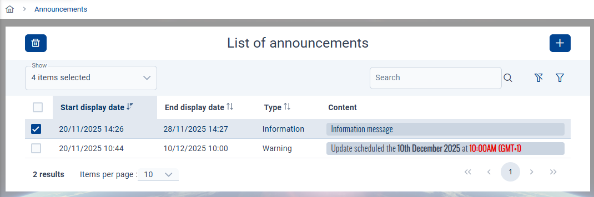

# Announcements

## Display
Announcements banner will be visible only if at least one announcement has to be displayed.  
If multiple announcements, they will be displayed by start display date.

:::info
The banner will automatically appears or disappears into the current page if announcements has to be displayed or not.  
The framework will automatically check **every minutes** the active announcements.
:::

## Administration
### Access
You can access to the announcements management interface from the `Administration` menu :  

:::info
By default, only administrators have access to the announcements management interface
:::

### Manage
Manage the announcements from this table :  

:::info
- **Delete** : select one or multiple announcements, then click the bin button on the top left
- **Add** : click on the add button on the top right
- **Edit** : click anywhere into an existing announcement row from the table
- **Search**
  - **Global** : search into all the fields by using the dedicated input `Search`
  - **Specific** : click on the filter button on the right at the top of the table to open the search interface for all fields
:::

### Creation/edition
The following interface will be displayed when creating or editing an announcement :  

:::info
- **Start diplay date** : the date and time the announcement will begin (**local time**)
- **End display date** : the date and time the announcement will stop (**local time**)
- **Type** : `Warning` or `Information` (changes the icon at the left of the content when displayed in the banner)
- **Content** : content to display. Use the available editor tools to customize your message.
:::
